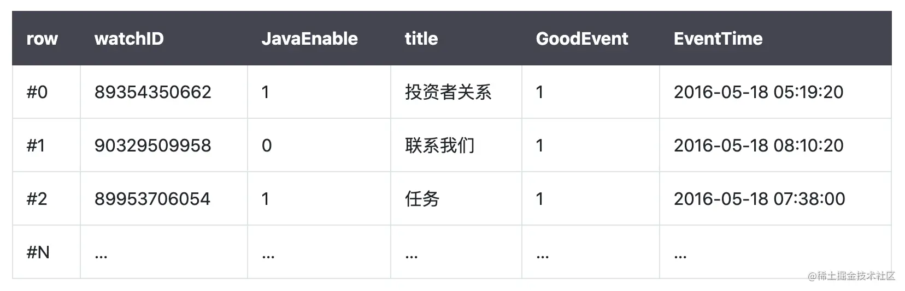
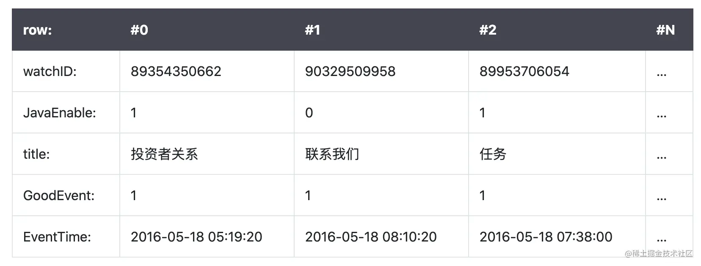
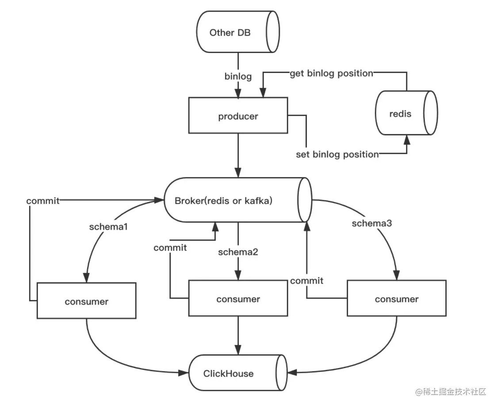

# 一个比传统数据库快 100-1000 倍的数据库

### 一、ClickHouse 是什么？

> ClickHouse：是一个用于联机分析(OLAP)的列式数据库管理系统(DBMS)

我们首先理清一些基础概念

- OLTP：是传统的关系型数据库，主要操作增删改查，强调事务一致性，比如银行系统、电商系统
- OLAP：是仓库型数据库，主要是读取数据，做复杂数据分析，侧重技术决策支持，提供直观简单的结果

接着我们用图示，来理解一下**列式数据库**和**行式数据库**区别

在传统的行式数据库系统中（MySQL、Postgres和MS SQL Server），数据按如下顺序存储：  

在列式数据库系统中（ClickHouse），数据按如下的顺序存储： 

两者在存储方式上对比： 


以上是ClickHouse基本介绍，更多可以查阅[官方手册](https://link.juejin.cn?target=https%3A%2F%2Fclickhouse.tech%2Fdocs%2Fzh%2F)

### 二、业务问题

业务端现有存储在Mysql中，5000万数据量的大表及两个辅表，单次联表查询开销在3min+，执行效率极低。经过索引优化、水平分表、逻辑优化，成效较低，因此决定借助ClickHouse来解决此问题

最终通过优化，**查询时间降低至1s内，查询效率提升200倍！**

希望通过本文，可以帮助大家快速掌握这一利器，并能在实践中少走弯路。

### 三、ClickHouse实践

##### 1.Mac下的Clickhouse安装

我是通过docker安装，[查看教程](https://link.juejin.cn?target=https%3A%2F%2Fblog.csdn.net%2Fqq_24993831%2Farticle%2Fdetails%2F103715194)。也可以下载CK编译安装，相对麻烦一些。

##### 2.数据迁移：从Mysql到ClickHouse

ClickHouse支持Mysql大多数语法，迁移成本低，目前有[五种迁移](https://link.juejin.cn?target=https%3A%2F%2Fanjia0532.github.io%2F2019%2F07%2F17%2Fmysql-to-clickhouse%2F)方案：

- create table engin mysql，映射方案数据还是在Mysql
- insert into select from，先建表，在导入
- create table as select from，建表同时导入
- csv离线导入
- streamsets

选择第三种方案做数据迁移：

```
CREATE TABLE [IF NOT EXISTS] [db.]table_name ENGINE = Mergetree AS SELECT * FROM mysql('host:port', 'db', 'database', 'user', 'password') 
```

##### 3.性能测试对比

| 类型       | 数据量 | 表大小 | 查询速度 |
| ---------- | ------ | ------ | -------- |
| Mysql      | 5000万 | 10G    | 205s     |
| ClickHouse | 5000万 | 600MB  | 1s内     |

##### 4.数据同步方案

**临时表** 

 

图片来源：[携程](https://link.juejin.cn?target=https%3A%2F%2Fcloud.tencent.com%2Fdeveloper%2Farticle%2F1462633) 新建temp中间表，将Mysql数据全量同步到ClickHouse内temp表，再替换原ClickHouse中的表，适用数据量适度，增量和变量频繁的场景

**synch** 



开源的同步软件推荐：[synch](https://link.juejin.cn?target=https%3A%2F%2Fgithub.com%2Flong2ice%2Fsynch%2Fblob%2Fdev%2FREADME-zh.md) 原理是通过Mysql的binlog日志，获取sql语句，再通过消息队列消费task

##### 5.ClickHouse为什么快？

- 只需要读取要计算的列数据，而非行式的整行数据读取，降低IO cost
- 同列同类型，有十倍压缩提升，进一步降低IO
- clickhouse根据不同存储场景，做个性化搜索算法

### 四、遇到的坑

##### 1.ClickHouse与mysql数据类型差异性

用Mysql的语句查询，发现报错：

  

**解决方案**：LEFT JOIN B b ON toUInt32(h.id) = toUInt32(ec.post_id)，中转一下，统一无符号类型关联

##### 2.删除或更新是异步执行，只保证最终一致性

查询CK手册发现，即便对数据一致性支持最好的Mergetree，也只是保证最终一致性：  

如果对数据一致性要求较高，推荐大家做全量同步来解决

### 五、总结

通过ClickHouse实践，完美的解决了Mysql查询瓶颈，20亿行以下数据量级查询，90%都可以在1s内给到结果，随着数据量增加，ClickHouse同样也支持集群，大家如果感兴趣，可以积极尝试 : )


