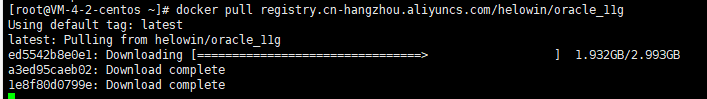
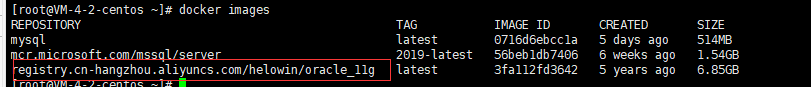
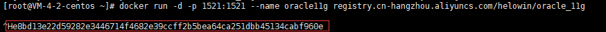

# Docker安装Oracle


## 前言

要先[安装Docker](https://blog.csdn.net/m0_57179014/article/details/120083146?spm=1001.2014.3001.5501)

需要使用root权限:
**root登录**

```shell
su root
```

## 一、获取镜像

```shell
docker pull registry.cn-hangzhou.aliyuncs.com/helowin/oracle_11g
```

**或者**

```shell
docker pull registry.aliyuncs.com/helowin/oracle_11g
```



## 二、查看镜像是否案件安装完成

```shell
docker images
```



## 三、创建并启动容器

### 默认启动方式

**//默认启动方式：**

```shell
docker run -itd -p 1521:1521 --name oracle --restart=always registry.aliyuncs.com/helowin/oracle_11g
```

### 持久化启动方式

**//持久化启动方式：**

```shell
docker run  -itd -p 1521:1521 --name oracle --restart=always --mount source=oracle_vol,target=/home/oracle/app/oracle/oradata registry.aliyuncs.com/helowin/oracle_11g
```



-p 1521:1521 映射容器服务的 1521端口到宿主机的 1521端口，外部主机可以直接通过 宿主机ip:1521访问到 oracle11g 的服务。

–name: 创建容器名称根据自己取名

## 四、查看已启动的进行

```powershell
netstat -antulp
```

## 五、进行环境变量配置配置

```shell
docker exec -it oracle bash
```


**切换到root用户**

```shell
su root
```

密码:**helowin**

**配置环境变量, 使用`vi /etc/profile`进行编辑, 末尾加上如下：**

```shell
export ORACLE_HOME=/home/oracle/app/oracle/product/11.2.0/dbhome_2
export ORACLE_SID=helowin
export PATH=$ORACLEHOME/bin:PATH
```

**：wq** 退出

:wq(保存编辑操作退出)

:wq!(保存编辑强制退出)

**保存后执行source /etc/profile 加载环境变量**

## 六、创建软连接

**# 创建软链接**

```shell
ln -s $ORACLE_HOME/bin/sqlplus /usr/bin
```

**# 切换到oracle用户(别忘了中间的 横杠)**

```shell
su - oracle
```

## 七、sqlplus修改sys、system用户密码

```shell
sqlplus /nolog   --登录
conn /as sysdba
alter user system identified by system ;--修改system用户账号密码；
alter user sys identified by sys ;--修改sys用户账号密码；
```

## 八、添加远程登录用户

```shell
create user test identified by test; -- 创建内部管理员账号密码；
grant connect,resource,dba to test; --将dba权限授权给内部管理员账号和密码；
ALTER PROFILE DEFAULT LIMIT PASSWORD_LIFE_TIME UNLIMITED; --设置密码永不过期：
alter system set processes=1000 scope=spfile; --修改数据库最大连接数据；
```

### 注意:

***远程登录时
登录时：SID:helowin
User: test
PassWord：test***

## 九、修改后

```shell
conn /as sysdba;--保存数据库
shutdown immediate; --关闭数据库
startup; --启动数据库
show user;
```

现在就可以使用了

## PS:

其中一个坑说明：
当执行修改密码的时候出现 ： `database not open`
提示数据库没有打开，不急按如下操作
输入：`alter database open;`
解决办法：
输入：`alter database mount;`
输入 ：`alter database open;`


