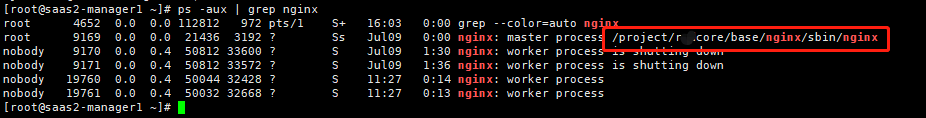

# Linux下查找Nginx配置文件位置

### 1、查看[Nginx](https://so.csdn.net/so/search?q=Nginx&spm=1001.2101.3001.7020)进程

> 命令: ps -aux | [grep](https://so.csdn.net/so/search?q=grep&spm=1001.2101.3001.7020) nginx


圈出的就是Nginx的二进制文件

### 2、测试Nginx配置文件

> 命令: /usr/sbin/nginx -t


　可以看到nginx配置文件位置

------

### 3、nginx的使用(启动、重启、关闭)

```bash
# nginx的使用(启动、重启、关闭)
1. 首先利用配置文件启动nginx。
命令: nginx -c /usr/local/nginx/conf/nginx.conf
重启服务： service nginx restart
2. 快速停止或关闭Nginx：nginx -s stop
3. 正常停止或关闭Nginx：nginx -s quit
4. 配置文件修改重装载命令：nginx -s reload


123456789
```

#### 从容停止

```bash
#从容停止
1、查看进程号
[root@LinuxServer ~]# ps -ef|grep nginx
2、杀死进程
[root@LinuxServer ~]# kill -QUIT 2072
12345
```

#### 强制停止

```bash
#强制停止
[root@LinuxServer ~]# pkill -9 nginx
#重启
1、验证nginx配置文件是否正确
方法一：进入nginx安装目录sbin下，输入命令./nginx -t
看到如下显示nginx.conf syntax is ok
nginx.conf test is successful
说明配置文件正确！

2、重启Nginx服务
方法一：进入nginx可执行目录sbin下，输入命令
./nginx -s reload 即可
方法二：查找当前nginx进程号，然后输入命令：
kill -HUP 
进程号 实现重启nginx服务
123456789101112131415
```