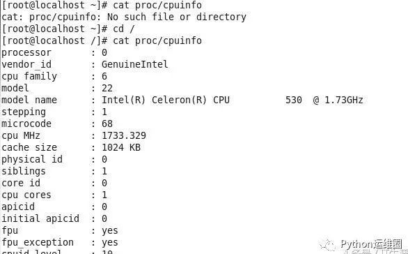
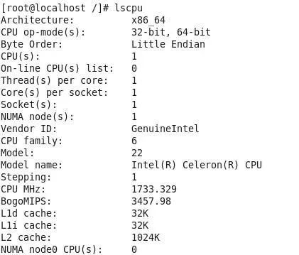
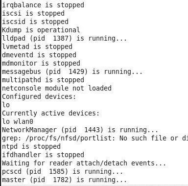
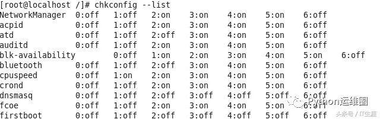
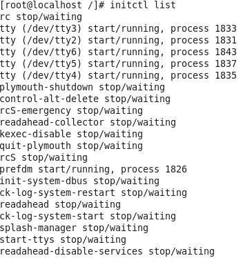
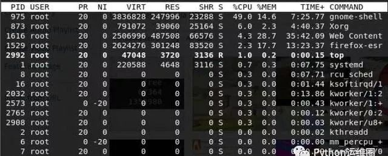
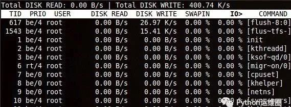
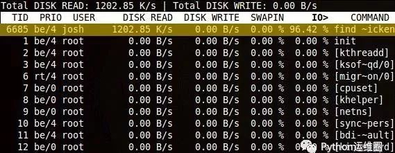

# Linux运行缓慢的原因,Linux 系统运行速度太慢的关键原因

我们在搞清楚如何加速Linux计算机之前，需要知道哪些方法可以帮助我们找到引导时启动的服务、以更高或更低优先级运行的进程、CPU运行状况、内存是否塞满了过多数据，还要检查交换内存区是否已满。最后，我们还要检查硬盘是否运行正常。

一、检查CPU信息

若想加快一台慢腾腾的Linux计算机，采取的第一步是检查CPU信息。你的计算机运行LibreOffice很耗费时间的主要原因可能是，CPU速度远不足以运行重量级应用程序。

打开终端，运行下列命令之一：

cat /proc/cpuinfo

lscpu

上述命令显示了有关CPU的详细信息，比如vendor_id、型号名称、CPU MHZ、缓存大小、微代码和bogomips。

不妨详细介绍关于CPU信息的几个重要细节。

bogomips：bogo是bogus(伪)的意思，MIPS是指每秒百万条指令。它是显示系统性能的独立程序。

model_name：表示CPU的制造商、型号和速度。在本文中，我们拥有速度为1.73GHz的英特尔(R)赛扬(R)CPU。

CPU MHZ(兆赫)：用于测量通道、总线和计算机内部时钟的传输速度。在本文中，传输速度是1733.329GHz。

你可能没意识到，英特尔赛扬1.73GHz CPU是一款处理能力很低的旧处理器。就这种情况而言，与采用多核2.8GHz CPU的计算机相比，这台计算机的CPU传输速度显然很低。这可能是我们的Linux计算机运行重量级应用程序时速度缓慢的原因。

解决办法

CPU又老又慢的话，唯一的解决办法是换个新的。这是购买新处理器时要留意的方面。

二、检查引导时启动的服务

有不同的方法来检查引导时启动的服务。你可以使用下列命令中的任何一个。

该命令列出了引导时启动的服务：

service--status-all

该命令列出了引导时启动的服务。它与CentOS、Fedora和Redhat兼容：

chkconfig --list

该命令也列出了引导时启动的服务：

initctl list

initctl是守护进程控制工具，它让系统管理员得以与Upstart守护进程进行通信和交互。

如果你的系统使用systemd，可以使用下列命令来找到引导时运行的服务：

sudo systemctl list-unit-files --state = enabled

解决办法

对于使用systemd的Linux发行版而言，可以使用systemctl命令来管理服务，以便服务不会在引导时运行。

三、检查CPU负载

除了检查引导时启动的服务外，还可以检查处理器/CPU是否因进程而过载。你可以使用命令top来检查CPU负载。

top命令将资源使用最高的进程排在上面。正如从下面的屏幕截图所见，你可以看清楚哪个进程/应用程序在滥用CPU，必要时使用kill命令终止它。

解决办法

如果你运行过多的应用程序(无论前台还是后台)，CPU又达不到标准，最好关闭未使用的应用程序。另外，禁止你未使用的任何应用程序在后台运行。

此外，可以使用preload来加载常用的应用程序。preload是在后台运行的守护进程，它分析经常运行的应用程序。

打开终端，运行下列命令：

sudo apt-get install preload

对于Fedora和CentOS用户而言，可以使用下列命令：

sudo yum install preload

preload在后台运行。因此，没必要调整它。preload将常用应用程序的一部分加载到内存中，确保更快地加载这些应用程序。

四、检查闲置内存空间

内存通常是用来存储常用应用程序的地方。你可以使用free命令来检查内存信息，比如内存可用的闲置空间。内存空间较少也会影响计算机的性能。

解决办法

要么升级内存，要么把耗费大量内存的应用程序换成轻量级应用程序。LibreOffice等应用程序相当耗费内存。你可以使用AbiWord，代替使用LibreOffice。

五、检查硬盘是否使用过度

硬盘指示灯一直在不停地闪烁，但你不知道它在干什么？神秘的输入/输出很可能是个问题，所以有一个类似top的工具：iotop，它专门用来帮助诊断这类问题。

打开终端，输入命令：

sudo apt install iotop

对于Fedora和CentOS用户而言，可以使用下列命令：

sudo yum install iotop

正常的闲置系统其值基本上是零，只是在数据写入时有几个小的尖峰，如下面屏幕截图所示：

然而，如果你运行find之类的磁盘密集型实用程序，可以看到iotop清楚列出的名称和吞吐量。

现在你可以轻松了解哪个程序在使用I/O、谁运行它、数据读取速度等更多信息。

结论

虽然有很多因素可能导致系统缓慢，但CPU、内存和磁盘I/O是导致绝大多数性能问题的原因。使用本文介绍的方法将帮助你查明性能问题的原因以及如何解决这些问题。