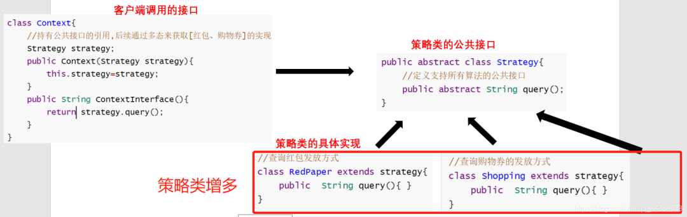
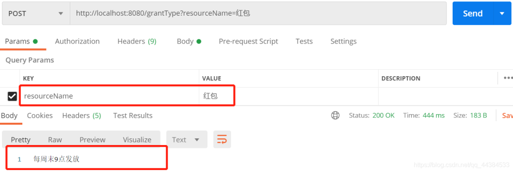

# Map+函数式接口方法解决 if-else

**目录**

- 需求
- 策略模式
- Map+函数式接口
- 总结

**需求**

最近写了一个服务：根据优惠券的类型resourceType和编码resourceId来 查询 发放方式grantType和领取规则

#### 实现方式：

- 根据优惠券类型resourceType -> 确定查询哪个数据表
- 根据编码resourceId -> 到对应的数据表里边查询优惠券的派发方式grantType和领取规则

优惠券有多种类型，分别对应了不同的数据库表：

- 红包 —— 红包发放规则表
- 购物券 —— 购物券表
- QQ会员
- 外卖会员

实际的优惠券远不止这些，这个需求是要我们写一个业务分派的逻辑

第一个能想到的思路就是if-else或者switch case：

```java
switch(resourceType){
 case "红包": 
  查询红包的派发方式 
  break;
 case "购物券": 
  查询购物券的派发方式
  break;
 case "QQ会员" :
  break;
 case "外卖会员" :
  break;
 ......
 default : logger.info("查找不到该优惠券类型resourceType以及对应的派发方式");
  break;
}
```

如果要这么写的话， 一个方法的代码可就太长了，影响了可读性。（别看着上面case里面只有一句话，但实际情况是有很多行的）

而且由于 整个 if-else的代码有很多行，也不方便修改，可维护性低。

**策略模式**

策略模式是把 if语句里面的逻辑抽出来写成一个类，如果要修改某个逻辑的话，仅修改一个具体的实现类的逻辑即可，可维护性会好不少。

以下是策略模式的具体结构



策略模式在业务逻辑分派的时候还是if-else，只是说比第一种思路的if-else 更好维护一点。

```java
switch(resourceType){
 case "红包": 
  String grantType=new Context(new RedPaper()).ContextInterface();
  break;
 case "购物券": 
  String grantType=new Context(new Shopping()).ContextInterface();
  break;
 
 ......
 default : logger.info("查找不到该优惠券类型resourceType以及对应的派发方式");
  break;

```

但缺点也明显：

- 如果 if-else的判断情况很多，那么对应的具体策略实现类也会很多，上边的具体的策略实现类还只是2个，查询红包发放方式写在类RedPaper里边，购物券写在另一个类Shopping里边；那资源类型多个QQ会员和外卖会员，不就得再多写两个类？有点麻烦了
- 没法俯视整个分派的业务逻辑

**Map+函数式接口**

用上了Java8的新特性lambda表达式

- 判断条件放在key中
- 对应的业务逻辑放在value中

这样子写的好处是非常直观，能直接看到判断条件对应的业务逻辑

> “
>
> 需求：根据优惠券(资源)类型resourceType和编码resourceId查询派发方式grantType

上代码：

```java
@Service
public class QueryGrantTypeService {
 
    @Autowired
    private GrantTypeSerive grantTypeSerive;
    private Map<String, Function<String,String>> grantTypeMap=new HashMap<>();

    /**
     *  初始化业务分派逻辑,代替了if-else部分
     *  key: 优惠券类型
     *  value: lambda表达式,最终会获得该优惠券的发放方式
     */
    @PostConstruct
    public void dispatcherInit(){
        grantTypeMap.put("红包",resourceId->grantTypeSerive.redPaper(resourceId));
        grantTypeMap.put("购物券",resourceId->grantTypeSerive.shopping(resourceId));
        grantTypeMap.put("qq会员",resourceId->grantTypeSerive.QQVip(resourceId));
    }
 
    public String getResult(String resourceType){
        //Controller根据 优惠券类型resourceType、编码resourceId 去查询 发放方式grantType
        Function<String,String> result=getGrantTypeMap.get(resourceType);
        if(result!=null){
         //传入resourceId 执行这段表达式获得String型的grantType
            return result.apply(resourceId);
        }
        return "查询不到该优惠券的发放方式";
    }
}
```

如果单个 if 语句块的业务逻辑有很多行的话，我们可以把这些 业务操作抽出来，写成一个单独的Service，即：

```java
//具体的逻辑操作

@Service
public class GrantTypeSerive {

    public String redPaper(String resourceId){
        //红包的发放方式
        return "每周末9点发放";
    }
    public String shopping(String resourceId){
        //购物券的发放方式
        return "每周三9点发放";
    }
    public String QQVip(String resourceId){
        //qq会员的发放方式
        return "每周一0点开始秒杀";
    }
}
```

入参String resourceId是用来查数据库的，这里简化了，传参之后不做处理。

用http调用的结果：

```java
@RestController
public class GrantTypeController {

    @Autowired
    private QueryGrantTypeService queryGrantTypeService;

    @PostMapping("/grantType")
    public String test(String resourceName){
        return queryGrantTypeService.getResult(resourceName);
    }
}
```



用Map+函数式接口也有弊端：

- 你的队友得会lambda表达式才行啊，他不会让他自己百度去

**总结**

策略模式通过接口、实现类、逻辑分派来完成，把 if语句块的逻辑抽出来写成一个类，更好维护。

Map+函数式接口通过Map.get(key)来代替 if-else的业务分派，能够避免策略模式带来的类增多、难以俯视整个业务逻辑的问题。

