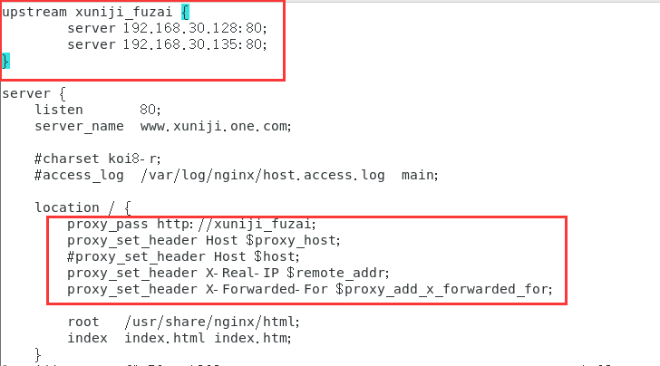
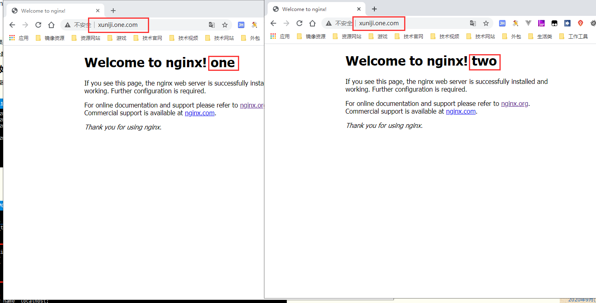

# Nginx 实现负载均衡

### 准备

- 虚拟机one：192.168.30.135:80
- 虚拟机two：192.168.30.128:80
- 两个虚拟机装的nginx都是：nginx version: nginx/1.18.0
- 官网参考地址： http://nginx.org/

### 配置代理

- 在各虚拟机上的conf.d文件夹下建立nginx配置文件，名字分别为：“xuniji_one.conf”、“xuniji_two.conf”
- 反向代理我写在了xuniji_one.conf中，如下图：
  - [](https://img2022.cnblogs.com/blog/786166/202207/786166-20220714172146324-102020601.png)
  - 图中参数介绍：
    - upstream后面的名称与proxy_pass后面的地址对应。（名称可以随意写）
    - upstream中的两个server地址就是两个服务器的地址。
    - proxy_pass：设置后端代理服务器的地址。这个地址(address)可以是一个域名或ip地址和端口，或者一个 unix-domain socket路径。
    - proxy_set_header：就是可设置请求头-并将头信息传递到服务器端。

### 测试

打开浏览器，访问设置代理的服务器（www.xuniji.one.com）。每次访问最终都是请求不同的服务器。

[](https://img2022.cnblogs.com/blog/786166/202207/786166-20220714172816807-1569859068.png)

### 知识点补充

nginx的负载均衡策略有六种：

1、轮询（默认策略，nginx自带策略）：我上面的例子就是轮询的方式，它是upstream模块默认的负载均衡默认策略。会将每个请求按时间顺序分配到不同的后端服务器。


```fsharp
http {
    upstream xuniji\_fuzai {
        server 192.168.30.128:80;
        server 192.168.30.135:80;
    }
 
    server {
        listen 81;
        server\_name www.xuniji.one.com;
 
        location / {
            proxy\_pass http://xuniji\_fuzai;
            proxy\_set\_header Host $proxy\_host;
        }
    }
}
```

2、weight（权重，nginx自带策略）：指定轮询的访问几率，用于后端服务器性能不均时调整访问比例。


```fsharp
http {
    upstream xuniji\_fuzai {
        server 192.168.30.128:80 weight=7;
        server 192.168.30.135:80 weight=2;
    }
 
    server {
        listen 81;
        server\_name www.xuniji.one.com;
 
        location / {
            proxy\_pass http://xuniji\_fuzai;
            proxy\_set\_header Host $proxy\_host;
        }
    }
}
```

3、ip_hash（依据ip分配，nginx自带策略）：指定负载均衡器按照基于客户端IP的分配方式，这个方法确保了相同的客户端的请求一直发送到相同的服务器，可以解决session不能跨服务器的问题。


```fsharp
http {
    upstream xuniji\_fuzai {
        ip\_hash;
        server 192.168.30.128:80;
        server 192.168.30.135:80;
    }
 
    server {
        listen 81;
        server\_name www.xuniji.one.com;
 
        location / {
            proxy\_pass http://xuniji\_fuzai;
            proxy\_set\_header Host $proxy\_host;
        }
    }
}
```

4、least_conn（最少连接，nginx自带策略）：把请求转发给连接数较少的后端服务器。


```perl
http {
    upstream xuniji\_fuzai {
        #把请求转发给连接数比较少的服务器
        least\_conn;
        server 192.168.30.128:80;
        server 192.168.30.135:80;
    }
 
    server {
        listen 81;
        server\_name www.xuniji.one.com;
 
        location / {
            proxy\_pass http://xuniji\_fuzai;
            proxy\_set\_header Host $proxy\_host;
        }
    }
}    
```

5、fair（第三方）：按照服务器端的响应时间来分配请求，响应时间短的优先分配。


```fsharp
http {
    upstream xuniji\_fuzai {
        fair;
        server 192.168.30.128:80;
        server 192.168.30.135:80;
    }
 
    server {
        listen 81;
        server\_name www.xuniji.one.com;
 
        location / {
            proxy\_pass http://xuniji\_fuzai;
            proxy\_set\_header Host $proxy\_host;
        }
    }
}   
```

6、url_hash（第三方）：该策略按访问url的hash结果来分配请求，使每个url定向到同一个后端服务器，需要配合缓存用。


```bash
http {
    upstream xuniji\_fuzai {
        hash $request\_uri;
        server 192.168.30.128:80;
        server 192.168.30.135:80;
    }
 
    server {
        listen 81;
        server\_name www.xuniji.one.com;
 
        location / {
            proxy\_pass http://xuniji\_fuzai;
            proxy\_set\_header Host $proxy\_host;
        }
    }
}  
```

