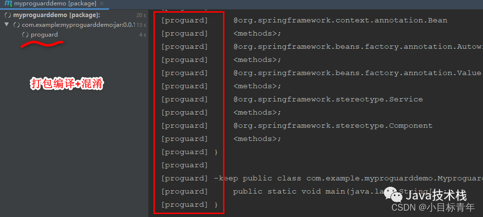

# Springboot 玩一玩代码混淆，防止反编译代码泄露

## 编译

简单就是把代码跑一哈，然后我们的代码 .java文件 就被编译成了 .class 文件


## 反编译

就是针对编译生成的 jar/war 包 里面的 .class 文件 逆向还原回来，可以看到你的代码写的啥。

比较常用的反编译工具 JD-GUI ，直接把编译好的jar丢进去，大部分都能反编译看到源码:


那如果不想给别人反编译看自己写的代码呢？

怎么做？

## 混淆

该篇玩的代码混淆 ，是其中一种手段。

我给你看，但你反编译看到的不是真正的代码。

先看一张效果示例图 ：


开搞

## 正文

先看一下我们混淆一个项目代码，要做啥？


### 一共就两步

推荐一个开源免费的 Spring Boot 最全教程：

> https://github.com/javastacks/spring-boot-best-practice

**第一步， 在项目路径下，新增一份文件 proguard.cfg ：**

proguard.cfg

```
#指定Java的版本
-target 1.8
#proguard会对代码进行优化压缩，他会删除从未使用的类或者类成员变量等
-dontshrink
#是否关闭字节码级别的优化，如果不开启则设置如下配置
-dontoptimize
#混淆时不生成大小写混合的类名，默认是可以大小写混合
-dontusemixedcaseclassnames
# 对于类成员的命名的混淆采取唯一策略
-useuniqueclassmembernames
#混淆时不生成大小写混合的类名，默认是可以大小写混合
-dontusemixedcaseclassnames
#混淆类名之后，对使用Class.forName('className')之类的地方进行相应替代
-adaptclassstrings

#对异常、注解信息予以保留
-keepattributes Exceptions,InnerClasses,Signature,Deprecated,SourceFile,LineNumberTable,*Annotation*,EnclosingMethod
# 此选项将保存接口中的所有原始名称（不混淆）-->
-keepnames interface ** { *; }
# 此选项将保存所有软件包中的所有原始接口文件（不进行混淆）
#-keep interface * extends * { *; }
#保留参数名，因为控制器，或者Mybatis等接口的参数如果混淆会导致无法接受参数，xml文件找不到参数
-keepparameternames
# 保留枚举成员及方法
-keepclassmembers enum * { *; }
# 不混淆所有类,保存原始定义的注释-
-keepclassmembers class * {
                        @org.springframework.context.annotation.Bean *;
                        @org.springframework.beans.factory.annotation.Autowired *;
                        @org.springframework.beans.factory.annotation.Value *;
                        @org.springframework.stereotype.Service *;
                        @org.springframework.stereotype.Component *;
                        }

#忽略warn消息
-ignorewarnings
#忽略note消息
-dontnote
#打印配置信息
-printconfiguration
-keep public class com.example.myproguarddemo.MyproguarddemoApplication {
        public static void main(java.lang.String[]);
    }
```

注意点：


其余的看注释，可以配置哪些类不参与混淆，哪些枚举保留，哪些方法名不混淆等等。另外，如果你近期准备面试跳槽，建议在[Java面试库](https://mp.weixin.qq.com/s/eFMVqn_SUekiuFEd9VMFuA)小程序在线刷题，涵盖 2000+ 道 Java 面试题，几乎覆盖了所有主流技术面试题。

**第二步，在pom文件上 加入proguard 混淆插件 ：**

build标签里面改动加入一下配置：

```xml
<build>
    <plugins>
        <plugin>
            <groupId>com.github.wvengen</groupId>
            <artifactId>proguard-maven-plugin</artifactId>
            <version>2.6.0</version>
            <executions>
                <!-- 以下配置说明执行mvn的package命令时候，会执行proguard-->
                <execution>
                    <phase>package</phase>
                    <goals>
                        <goal>proguard</goal>
                    </goals>
                </execution>
            </executions>
            <configuration>
                <!-- 就是输入Jar的名称，我们要知道，代码混淆其实是将一个原始的jar，生成一个混淆后的jar，那么就会有输入输出。 -->
                <injar>${project.build.finalName}.jar</injar>
                <!-- 输出jar名称，输入输出jar同名的时候就是覆盖，也是比较常用的配置。 -->
                <outjar>${project.build.finalName}.jar</outjar>
                <!-- 是否混淆 默认是true -->
                <obfuscate>true</obfuscate>
                <!-- 配置一个文件，通常叫做proguard.cfg,该文件主要是配置options选项，也就是说使用proguard.cfg那么options下的所有内容都可以移到proguard.cfg中 -->
                <proguardInclude>${project.basedir}/proguard.cfg</proguardInclude>
                <!-- 额外的jar包，通常是项目编译所需要的jar -->
                <libs>
                    <lib>${java.home}/lib/rt.jar</lib>
                    <lib>${java.home}/lib/jce.jar</lib>
                    <lib>${java.home}/lib/jsse.jar</lib>
                </libs>
                <!-- 对输入jar进行过滤比如，如下配置就是对META-INFO文件不处理。 -->
                <inLibsFilter>!META-INF/**,!META-INF/versions/9/**.class</inLibsFilter>
                <!-- 这是输出路径配置，但是要注意这个路径必须要包括injar标签填写的jar -->
                <outputDirectory>${project.basedir}/target</outputDirectory>
                <!--这里特别重要，此处主要是配置混淆的一些细节选项，比如哪些类不需要混淆，哪些需要混淆-->
                <options>
                    <!-- 可以在此处写option标签配置，不过我上面使用了proguardInclude，故而我更喜欢在proguard.cfg中配置 -->
                </options>
            </configuration>
        </plugin>
        <plugin>
            <groupId>org.springframework.boot</groupId>
            <artifactId>spring-boot-maven-plugin</artifactId>
            <executions>
                <execution>
                    <goals>
                        <goal>repackage</goal>
                    </goals>
                    <configuration>
                        <mainClass>com.example.myproguarddemo.MyproguarddemoApplication</mainClass>
                    </configuration>
                </execution>
            </executions>
        </plugin>
    </plugins>
</build>
```

注意点：


然后可以看到：


然后点击package，正常执行编译打包流程就可以 ：



然后可以看到jar的生成：


看看效果：


好了，该篇就到这。

*本文链接：https://blog.csdn.net/qq_35387940/article/details/127426354*

# 