# SpringBoot 整合 Canal + RabbitMQ 实现监听 MySQL 数据库同步更新 Redis 缓存

**Canal 简介**

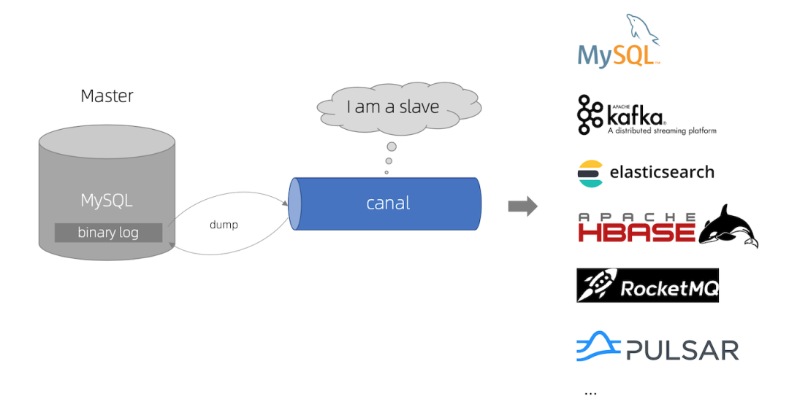

canal [kə'næl]，译意为水道/管道/沟渠，主要用途是基于 MySQL 数据库增量日志解析，提供增量数据订阅和消费。

早期阿里巴巴因为杭州和美国双机房部署，存在跨机房同步的业务需求，实现方式主要是基于业务 trigger 获取增量变更。从 2010 年开始，业务逐步尝试数据库日志解析获取增量变更进行同步，由此衍生出了大量的数据库增量订阅和消费业务。

**基于日志增量订阅和消费的业务包括：**

- 数据库镜像
- 数据库实时备份
- 索引构建和实时维护(拆分异构索引、倒排索引等)
- 业务 cache 刷新
- 带业务逻辑的增量数据处理

当前的 canal 支持源端 MySQL 版本包括 5.1.x , 5.5.x , 5.6.x , 5.7.x , 8.0.x

**Canal 工作原理**

**1. MySQL主备复制原理**

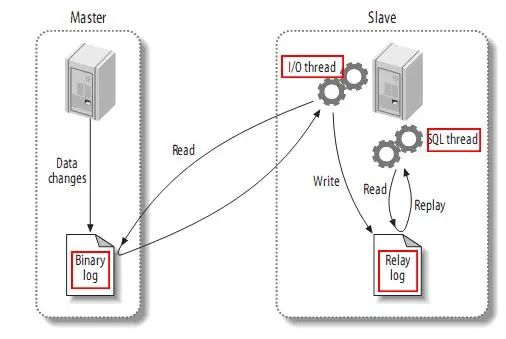

MySQL master 将数据变更写入二进制日志( binary log, 其中记录叫做二进制日志事件binary log events，可以通过 show binlog events 进行查看)

MySQL slave 将 master 的 binary log events 拷贝到它的中继日志(relay log)

MySQL slave 重放 relay log 中事件，将数据变更反映它自己的数据

**2. Canal 工作原理**

Canal 模拟 MySQL slave 的交互协议，伪装自己为 MySQL slave ，向 MySQL master 发送dump 协议

MySQL master 收到 dump 请求，开始推送 binary log 给 slave (即 canal )

Canal 解析 binary log 对象(原始为 byte 流)

**Canal 实战**

**1. 需求分析**

有来项目 youlai-mall 当前进度下使用Redis缓存MySQL数据库中的OAuth2客户端信息、角色权限映射关系、菜单路由，现在这样有两个很明显的问题：

- 在后台管理界面修改角色、菜单、权限和OAuth2客户端任何一方信息都需要让缓存失效或者更新缓存，代码耦合性高；
- 数据库直接修改上面相关信息，缓存无法失效或更新。

第一种情况至少有解决方案，无非就在代码层面上清缓存或者更新缓存，但是如果是直接修改数据库呢？实际工作可能经常会遇到直接修改数据库的场景，本篇通过SpringBoot 整合 Canal + RabbitMQ 实现对数据库的监听然后同步让缓存失效或者更新。

当然有来项目引入 Canal 中间件刷新缓存只是个开始，接下来还会使用 Canal 同步商品表至 ElasticSearch。

**2. MySQL开启 binlog 日志**

MySQL 部署：https://www.cnblogs.com/haoxianrui/p/15488810.html

开启 biglog 日志

```powershell
vim /etc/my.cnf
```

添加配置

```powershell
[mysqld]

log-bin=mysql-bin # 开启binlog

binlog-format=ROW # 选择ROW模式

server_id=1 # 配置MySQL replaction需要定义，不和Canal的slaveId重复即可

```

重启MySQL ，查看配置是否生效

```sql
show variables like 'log_bin';
```


**3. RabbitMQ 队列创建**

添加交换机 canal.exchange

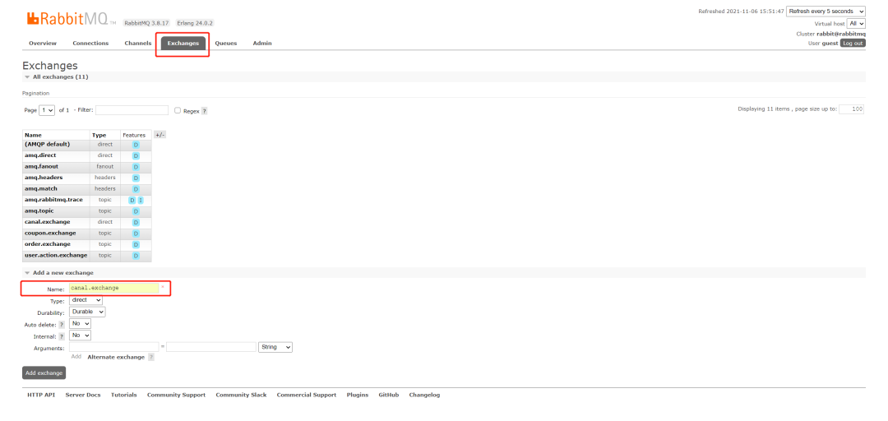

添加队列 canal.queue

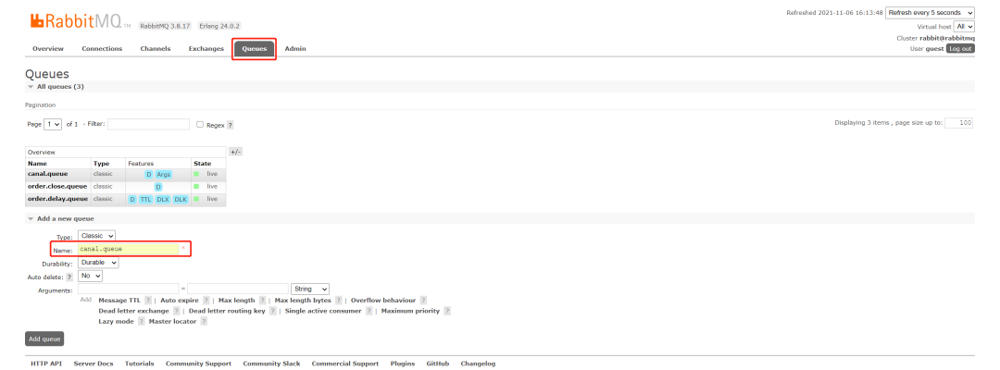

队列绑定交换机

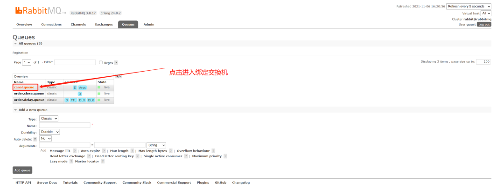

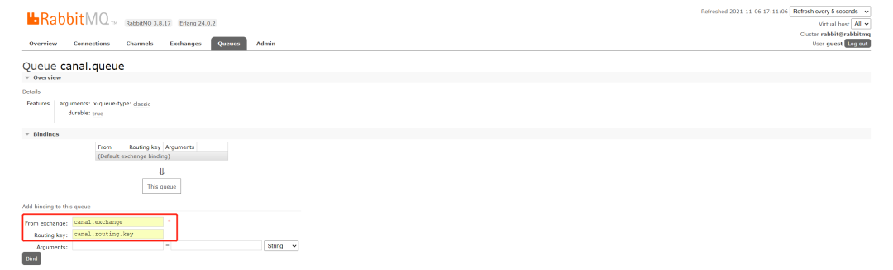

**4. Canal 配置和启动**

Canal Server下载

官方文档：https://github.com/alibaba/canal/wiki

项目地址：https://github.com/alibaba/canal

下载地址：https://github.com/alibaba/canal/releases

进入下载地址，选择 canal.deployer-1.1.5.tar.gz

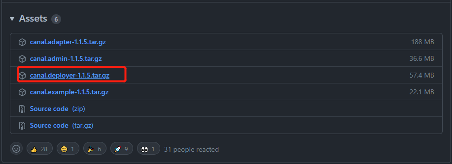

将压缩包解压，我这里把最后解压出来的文件放入 有来项目 的middleware中间件文件，和之前的 nacos 和 sentinel 同一个套路。

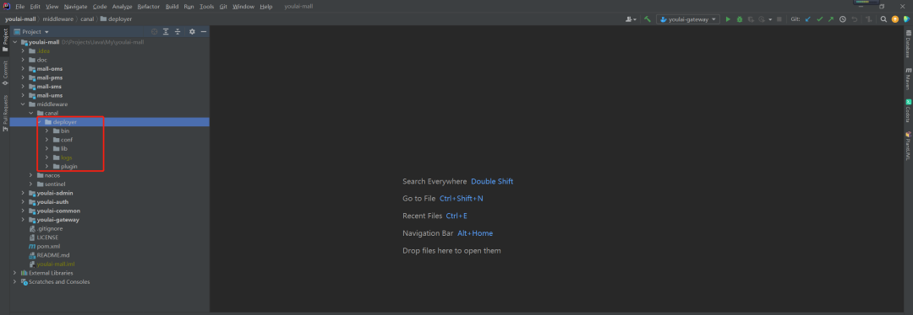

Canal Server配置

需要配置的东西就两项，一个是监听数据库配置，另一个是 RabbitMQ 连接配置。

改动的两个文件分别是 Canal 配置文件 canal.properties 和 实例配置文件 instance.properties

㊙️：一个 Server 可以配置多个实例监听 ，Canal 功能默认自带的有个 example 实例，本篇就用 example 实例 。如果增加实例，复制 example 文件夹内容到同级目录下，然后在 canal.properties 指定添加实例的名称

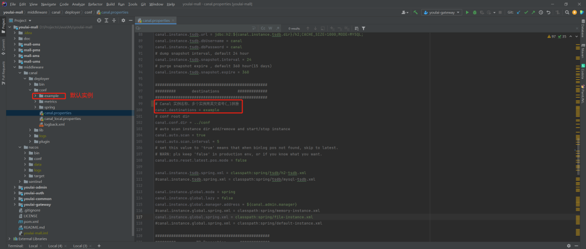

canal.properties

配置 Canal 服务方式为 RabbitMQ 和连接配置(🏷️ 只列出需要修改的地方)

```properties
# tcp, kafka, rocketMQ, rabbitMQ

canal.serverMode = rabbitMQ ################################################## ######### RabbitMQ ############# ##################################################

rabbitmq.host = x.youlai.tech

rabbitmq.virtual.host =/

rabbitmq.exchange =canal.exchange

rabbitmq.username =guest

rabbitmq.password =guest

rabbitmq.deliveryMode =


```

instance.properties

监听数据库配置(🏷️ 只列出需要修改的地方)

```properties
# position info

canal.instance.master.address=x.youlai.tech:3306

# username/password

canal.instance.dbUsername=root

canal.instance.dbPassword=root

# mq config

canal.mq.topic=canal.routing.key
```

**5. SpringBoot 整合 Canal + RabbitMQ**

🏠 完整源码：https://gitee.com/youlaitech/youlai-mall

引入依赖

```java
org.springframework.boot

spring-boot-starter-amqp
```

RabbitMQ连接配置

```yaml
spring:
	rabbitmq:
		host: x.youlai.tech
		port: 5672
		username: guest
		password: guest
```

RabbitMQ 监听同步缓存

```java
/**
* Canal + RabbitMQ 监听数据库数据变化
*
* @date 2021/11/4 23:14
*/
@Component
@Slf4j
@RequiredArgsConstructor
public class CanalListener {

    private final ISysPermissionService permissionService;

    private final ISysOauthClientService oauthClientService;

    private final ISysMenuService menuService;

    @RabbitListener(bindings = {
        @QueueBinding(
            value = @Queue(value = "canal.queue", durable = "true"),
            exchange = @Exchange(value = "canal.exchange"),
            key = "canal.routing.key"
        )
    })

    public void handleDataChange(String message) {
        CanalMessage canalMessage = JSONUtil.toBean(message, CanalMessage.class);
        String tableName = canalMessage.getTable();
        log.info("Canal 监听 {} 发生变化；明细：{}", tableName, message);
        if ("sys_oauth_client".equals(tableName)) {
            log.info("======== 清除客户端信息缓存 ========");
            oauthClientService.cleanCache();
        } else if (Arrays.asList("sys_permission", "sys_role", "sys_role_permission").contains(tableName)) {
            log.info("======== 刷新角色权限缓存 ========");
            permissionService.refreshPermRolesRules();
        } else if (Arrays.asList("sys_menu", "sys_role", "sys_role_menu").contains(tableName)) {
            log.info("======== 清理菜单路由缓存 ========");
            menuService.cleanCache();
        }
    }
}
```

**6. 实战测试**

🏷️ 如果使用有来项目线上 RabbitMQ 测试，记得需要新建队列，否者多人消费同一队列会让你觉得 Canal 监听数据有丢失的现象。

接下来模拟测试，当直接在数据库修改菜单数据，能否让 Redis 的菜单路由缓存失效。

启动 Canal

切换到项目的 cd ./middleware/canal/deployer/bin startup 目录下，输入 startup 启动 Canal

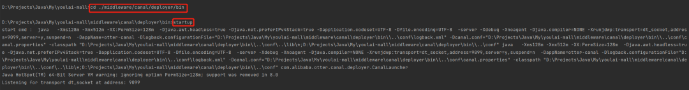

启动 youlai-admin 应用，测试效果如下，可见最后菜单路由缓存在直接在数据库修改菜单表数据时会失效，达到预期效果。

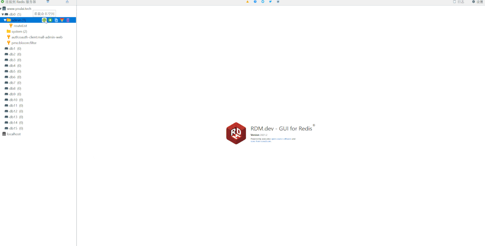


**总结**

本篇通过 Canal + RabbitMQ 实现对 MySQL 数据变动监听，能够应对实际工作直接修改数据库数据后让缓存失效或者刷新的场景。


有来项目引入 Canal 本篇只是个开始，因为 Canal 的应用场景太丰富了，接下来有来项目使用 Canal 同步 MySQL 数据库的商品数据至 ElasticSearch 索引库，个人感觉以后会越来越火，所以建议有必要深入了解这个 Canal 框架。


