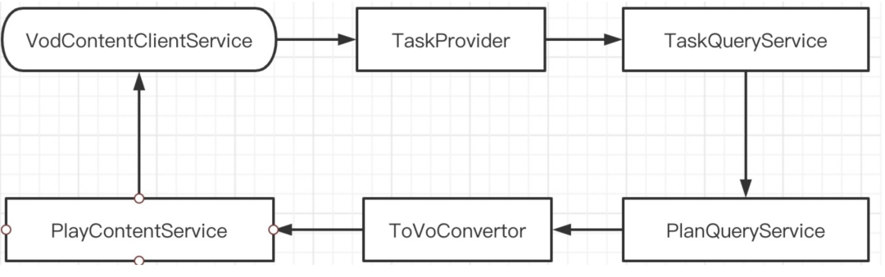
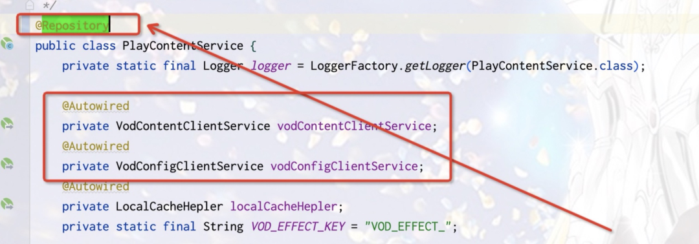
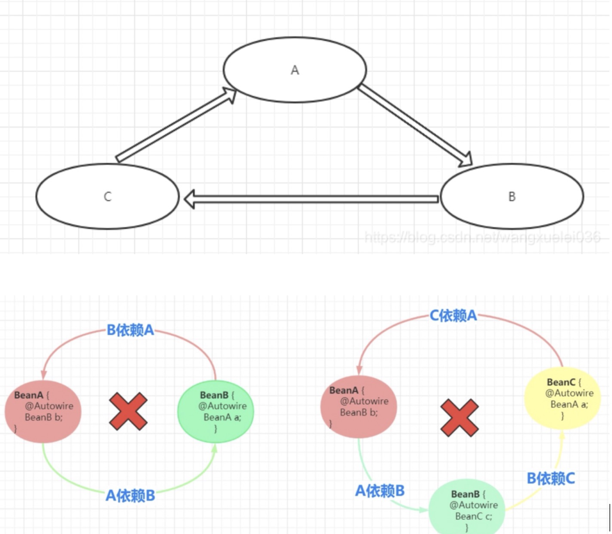
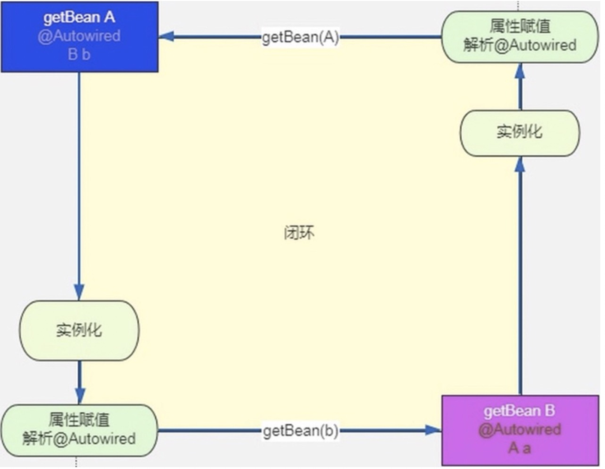
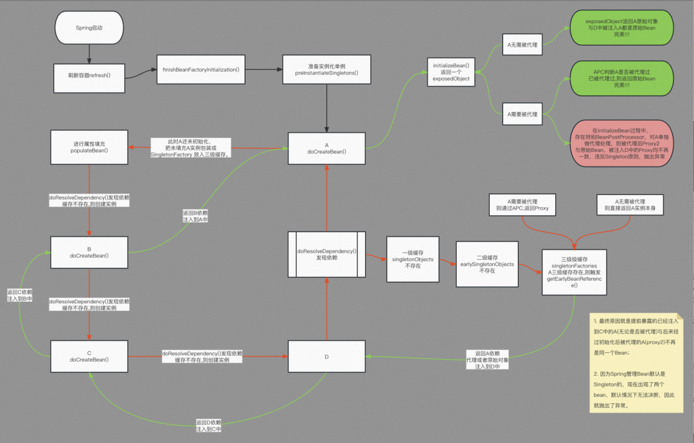
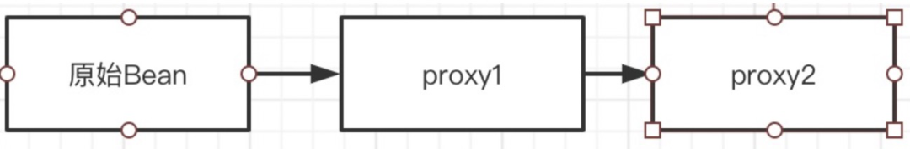
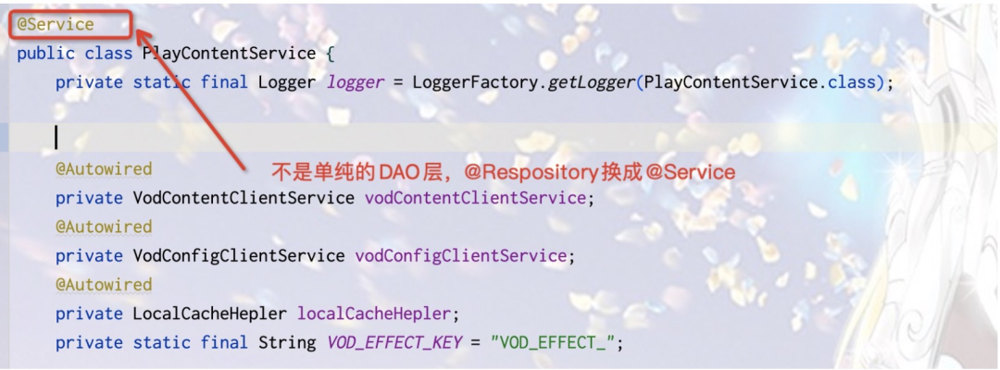
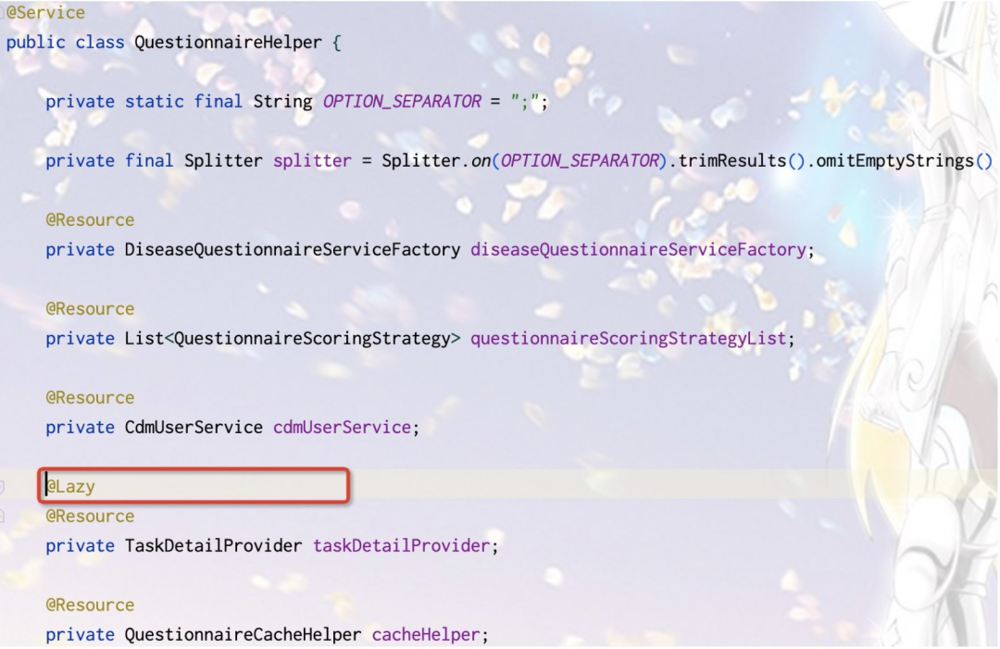
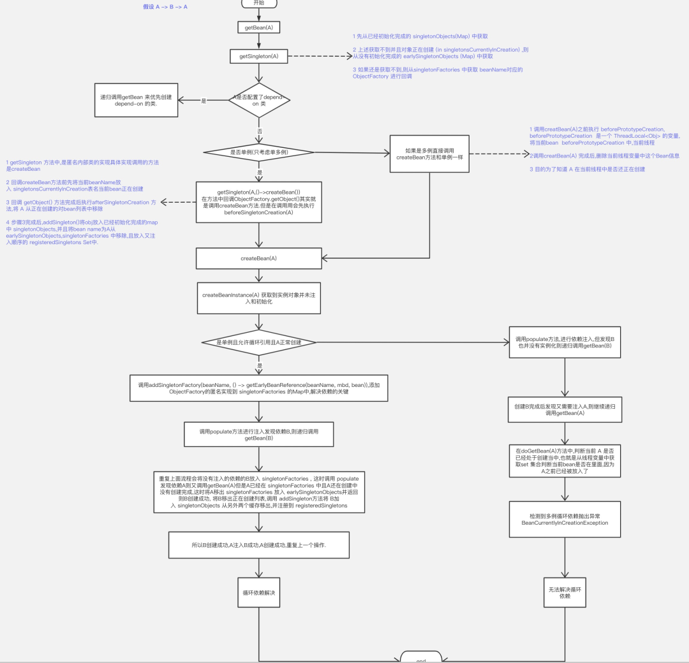
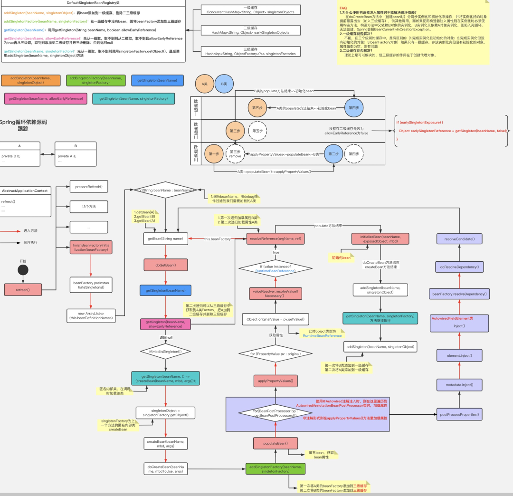

# Spring循环依赖那些事儿（含Spring详细流程图）

本篇不仅仅是介绍Spring循环依赖的原理，而且给出Spring不能支持的循环依赖场景与案例，对其进行详细解析，同时给出解决建议与方案，以后出现此问题可以少走弯路。

<div style="text-align: center;"><section style="padding: 3px;display: inline-block;border-bottom: 5px solid rgb(255, 129, 36);color: rgb(255, 129, 36);font-size: 17px; ">背景</section></div>

​	**1、循环依赖异常信息**

- 应用时间时间久
- 应用多人同时并行开发
- 应用保证迭代进度

经常出现启动时出现循环依赖异常

```shell
Caused by: org.springframework.beans.factory.BeanCreationException: Error creating bean with name 'taskPunchEvent': Injection of resource dependencies failed; nested exception is org.
springframework.beans.factory.BeanCurrentlyInCreationException: Error creating bean with name 'playContentService': Bean with name 'playContentService' has been injected into other be
ans [toVoConvertor] in its raw version as part of a circular reference, but has eventually been wrapped. This means that said other beans do not use the final version of the bean. Thi
s is often the result of over-eager type matching - consider using 'getBeanNamesOfType' with the 'allowEagerInit' flag turned off, for example.
  at org.springframework.context.annotation.CommonAnnotationBeanPostProcessor.postProcessProperties(CommonAnnotationBeanPostProcessor.java:325)
  at org.springframework.beans.factory.support.AbstractAutowireCapableBeanFactory.populateBean(AbstractAutowireCapableBeanFactory.java:1404)
  at org.springframework.beans.factory.support.AbstractAutowireCapableBeanFactory.doCreateBean(AbstractAutowireCapableBeanFactory.java:592)
  at org.springframework.beans.factory.support.AbstractAutowireCapableBeanFactory.createBean(AbstractAutowireCapableBeanFactory.java:515)
  at org.springframework.beans.factory.support.AbstractBeanFactory.lambda$doGetBean$0(AbstractBeanFactory.java:320)
  at org.springframework.beans.factory.support.DefaultSingletonBeanRegistry.getSingleton(DefaultSingletonBeanRegistry.java:222)
  at org.springframework.beans.factory.support.AbstractBeanFactory.doGetBean(AbstractBeanFactory.java:318)
  at org.springframework.beans.factory.support.AbstractBeanFactory.getBean(AbstractBeanFactory.java:199)
  at org.springframework.beans.factory.config.DependencyDescriptor.resolveCandidate(DependencyDescriptor.java:277)
  at org.springframework.beans.factory.support.DefaultListableBeanFactory.doResolveDependency(DefaultListableBeanFactory.java:1255)
  at org.springframework.beans.factory.support.DefaultListableBeanFactory.resolveDependency(DefaultListableBeanFactory.java:1175)
  at org.springframework.beans.factory.annotation.AutowiredAnnotationBeanPostProcessor$AutowiredFieldElement.inject(AutowiredAnnotationBeanPostProcessor.java:595)
  ... 40 more
Caused by: org.springframework.beans.factory.BeanCurrentlyInCreationException: Error creating bean with name 'playContentService': Bean with name 'playContentService' has been injecte
d into other beans [toVoConvertor] in its raw version as part of a circular reference, but has eventually been wrapped. This means that said other beans do not use the final version o
f the bean. This is often the result of over-eager type matching - consider using 'getBeanNamesOfType' with the 'allowEagerInit' flag turned off, for example.
  at org.springframework.beans.factory.support.AbstractAutowireCapableBeanFactory.doCreateBean(AbstractAutowireCapableBeanFactory.java:622)
  at org.springframework.beans.factory.support.AbstractAutowireCapableBeanFactory.createBean(AbstractAutowireCapableBeanFactory.java:515)
  at org.springframework.beans.factory.support.AbstractBeanFactory.lambda$doGetBean$0(AbstractBeanFactory.java:320)
  at org.springframework.beans.factory.support.DefaultSingletonBeanRegistry.getSingleton(DefaultSingletonBeanRegistry.java:222)
  at org.springframework.beans.factory.support.AbstractBeanFactory.doGetBean(AbstractBeanFactory.java:318)
  at org.springframework.beans.factory.support.AbstractBeanFactory.getBean(AbstractBeanFactory.java:204)
  at org.springframework.beans.factory.support.AbstractAutowireCapableBeanFactory.resolveBeanByName(AbstractAutowireCapableBeanFactory.java:452)
  at org.springframework.context.annotation.CommonAnnotationBeanPostProcessor.autowireResource(CommonAnnotationBeanPostProcessor.java:527)
  at org.springframework.context.annotation.CommonAnnotationBeanPostProcessor.getResource(CommonAnnotationBeanPostProcessor.java:497)
  at org.springframework.context.annotation.CommonAnnotationBeanPostProcessor$ResourceElement.getResourceToInject(CommonAnnotationBeanPostProcessor.java:637)
  at org.springframework.beans.factory.annotation.InjectionMetadata$InjectedElement.inject(InjectionMetadata.java:180)
  at org.springframework.beans.factory.annotation.InjectionMetadata.inject(InjectionMetadata.java:90)
  at org.springframework.context.annotation.CommonAnnotationBeanPostProcessor.postProcessProperties(CommonAnnotationBeanPostProcessor.java:322)
  ... 51 more
```

​	**2、依赖关系**

先不关注其他不规范问题，看现象





**3、涉及基础知识**

- Spring bean 创建流程
- Dynamic Proxy 动态代理
- Spring-AOP 原理

<div style="text-align: center;"><section style="padding: 3px;display: inline-block;border-bottom: 5px solid rgb(255, 129, 36);color: rgb(255, 129, 36);font-size: 17px; ">问题</section></div>

1、什么是循环依赖？
2、为什么会产生循环依赖？
3、循环依赖有哪些场景？
4、Spring如何解决循环依赖的？
5、Spring为什么使用三级缓存？
6、Spring支持AOP循环依赖，为何还存在循环依赖异常？
7、Spring不支持的循环依赖场景及如何解决？

注：Spring启动流程与Bean创建初始化流程如不熟悉，自行补习，篇幅原因此处不做介绍

<div style="text-align: center;"><section style="padding: 3px;display: inline-block;border-bottom: 5px solid rgb(255, 129, 36);color: rgb(255, 129, 36);font-size: 17px; ">Spring循环依赖</section></div>

**1、什么是循环依赖**



**2、核心概念**


- BeanDefinition：spring核心bean的配置信息

- Spring Bean：spring管理的已经初始化好以后的可使用的实例

- - 首先，通过spring通过扫描各种注解 @Compoent、@Service、@Configuration等等把需要交给spring管理的bean初始化成 BeanDefinition 的列表
  - 然后，根据 BeanDefinition 创建spring bean的实例

- Java Bean：Java简单通过构造函数创建的对象

- - Spring通过推断构造方法后，通过反射调用构造函数创建的对象

**1、什么情况下出现循环依赖**



并非使用者手动去getBean才会加载并初始化，而是框架启动时进行加载

 ```java
 Spring创建Bean - #DefaultListableBeanFactory#preInstantiateSingletons
 
 @Override
 public void preInstantiateSingletons() throws BeansException {
     
     //......
     
     List<String> beanNames = new ArrayList<>(this.beanDefinitionNames);
 
     // Trigger initialization of all non-lazy singleton beans...
     for (String beanName : beanNames) {
         RootBeanDefinition bd = getMergedLocalBeanDefinition(beanName);
         if (!bd.isAbstract() && bd.isSingleton() && !bd.isLazyInit()) {
             if (isFactoryBean(beanName)) {
                 //FactoryBean接口处理
                 ......
             }
             else {
                 //正常Bean的加载入口
                 getBean(beanName);
             }
         }
     }
     
     //......
 }
 ```

**4、循环依赖场景**

- 构造器内的循环依赖

- - 注入的好处很明显，如果容器中不存在或者存在多个实现时，可以从容处理。
  - 强依赖，先有鸡还是先有蛋问题暂无解，此依赖方式Spring不支持，除非自身实现代理加延迟注入，这种方式很难解决，除非实现类似于lazy生成代理方式进行解耦来实现注入，Spring没有支持可能因为此种注入场景都可以用其他方式代替且场景极少。
  - 弱依赖，spring 4.3之后增加 ObjectProvider 来处理

```java

//构造器循环依赖示例

public class StudentA {
 
    private StudentB studentB ; 

    public StudentA(StudentB studentB) {
        this.studentB = studentB;
    }
}

public class StudentB {
 
    private StudentA studentA ;
    
    public StudentB(StudentA studentA) {
        this.studentA = studentA;
    }
}

```

- setter方式单例，默认方式
- setter方式原型，prototype
  对于“prototype”作用域Bean，Spring容器不进行缓存，因此无法提前暴露一个创建中的Bean。
- field属性循环依赖
  最常用，此场景是通过反射注入，以下为@Autowire 注入代码，@Resource省略
  AutowiredAnnotationBeanPostProcessor#postProcessProperties

 ```java
 @Override
 public PropertyValues postProcessProperties(PropertyValues pvs, Object bean, String beanName) {
     InjectionMetadata metadata = findAutowiringMetadata(beanName, bean.getClass(), pvs);
     try {
         //属性注入
         metadata.inject(bean, beanName, pvs);
     }
     catch (BeanCreationException ex) {
         throw ex;
     }
     catch (Throwable ex) {
         throw new BeanCreationException(beanName, "Injection of autowired dependencies failed", ex);
     }
     return pvs;
 }
 ```

**5、三级缓存解决循环依赖**

(1)、一级缓存

DefaultSingletonBeanRegistry

```java
private final Map<String, Object> singletonObjects = new ConcurrentHashMap<>(256);
```

- 最基础的单例缓存
- 限制 bean 在 beanFactory 中只存一份，即实现 singleton scope

(2)、二级缓存

二级缓存(未初始化未填充属性提前暴露的Bean)

```java
private final Map<String, Object> earlySingletonObjects = new HashMap<>(16);
```

- 看名字应该就能猜到，缓存earlySingletonBean，与三级缓存配合使用的

- 需要注意：

- - 在没有AOP场景时是可以的，每次earlySingletonObjects.get()换成去三级缓存取就可以，存在问题
  - 存在AOP场景时
  - 因此，让使用者去做重复性判断是不可控的，很容易出现问题，于是引入了第二级缓存，当调用三级缓存里的对象工厂的getObject方法之后，getEarlyBeanReference 就会把返回值放入二级缓存，删除三级缓存，后续其他依赖该对象的Bean获取的都是同一个earlyBean，保证singleton原则。
  - 每次都调用 getEarlyBeanReference，即使返回对象都一致，也浪费不必要时间
  - 如果使用者在 getEarlyBeanReference 时直接 new XXX()，则对象又不一致，无法保证 singleton，所以需要使用者熟悉这块原理，并且自身维护，并且暴露内部实现细节
  - 每次都调用 getEarlyBeanReference 返回代理对象都不一致，无法保证 singleton
  - 如果没有此缓存，可不可以解决循环依赖问题？

(3)、三级缓存

三级缓存(Bean创建时提供代理机会的Bean工厂缓存)

```java
private final Map<String, ObjectFactory<?>> singletonFactories = new HashMap<>(16);
```

- 所以二级缓存和三级缓存是组合，不要拆成两个独立的东西去理解
- 基于这种设计，没有发生循环依赖的bean就是正常的创建流程
- 相互引用的bean 会触发链路中最初结点放入三级缓存内容，调用 getEarlyBeanReference 返回相应对象

**6、Spring为何不使用一级、二级缓存解决循环依赖**

循环依赖产生在Bean创建时

 ```java
 protected Object doCreateBean(final String beanName, final RootBeanDefinition mbd, final Object[] args) {
     
     BeanWrapper instanceWrapper = null;
 
     if (instanceWrapper == null) {
         //创建Bean
         instanceWrapper = createBeanInstance(beanName, mbd, args);
     }
         
     .....
     
     boolean earlySingletonExposure = (mbd.isSingleton() && this.allowCircularReferences &&
                 isSingletonCurrentlyInCreation(beanName));
     if (earlySingletonExposure) {
         if (logger.isTraceEnabled()) {
             logger.trace("Eagerly caching bean '" + beanName +
                     "' to allow for resolving potential circular references");
         }
         addSingletonFactory(beanName, () -> getEarlyBeanReference(beanName, mbd, bean));
     }
 
     //填充Bean依赖与Bean的初始化
     Object exposedObject = bean;
     try {
         //填充依赖的bean实例
         populateBean(beanName, mbd, instanceWrapper);
         //初始化---注意！注意！注意！此方法中可能调用 BeanPostProcessor
         //的applyBeanPostProcessorsAfterInitialization时可能会返回代理对象，如果代理途径与创建时代理方式不同则也会产生不同代理对象
         //从而产生循环依赖中对象不一致情况
         exposedObject = initializeBean(beanName, exposedObject, mbd);
     }
 
     //如果存在循环依赖，则保证最开始创建的Bean需要是循环依赖 getEarlyBeanReference触发生成的bean
     //因为getEarlyBeanReference 可能返回的是代理类，因为singleton必须全局唯一
     if (earlySingletonExposure) {
         Object earlySingletonReference = getSingleton(beanName, false);
         //只有真正存在循环依赖时，才会触发 getEarlyBeanReference调用产生EarlyBean
         //未存在循环依赖，则getEarlyBeanReference不触发，earlySingletonReference为null，返回exposedObject即可
         if (earlySingletonReference != null) {
             if (exposedObject == bean) {
                 exposedObject = earlySingletonReference;
             }
             else if (!this.allowRawInjectionDespiteWrapping && hasDependentBean(beanName)) {
                 ......
                 if (!actualDependentBeans.isEmpty()) {
                     throw new BeanCurrentlyInCreationException(beanName,
                             "Bean with name '" + beanName + "' has been injected into other beans [" +
                             StringUtils.collectionToCommaDelimitedString(actualDependentBeans) +
                             "] in its raw version as part of a circular reference, but has eventually been " +
                             "wrapped. This means that said other beans do not use the final version of the " +
                             "bean. This is often the result of over-eager type matching - consider using " +
                             "'getBeanNamesForType' with the 'allowEagerInit' flag turned off, for example.");
                 }
             }
         }
     }
     return exposedObject;
 }
 ```

三级缓存获取Bean

 ```java
 protected Object getSingleton(String beanName, boolean allowEarlyReference) {
     //一级缓存(单例池)获取Bean
     Object singletonObject = this.singletonObjects.get(beanName);
     if (singletonObject == null && isSingletonCurrentlyInCreation(beanName)) {
         synchronized (this.singletonObjects) {
             //二级缓存获取(提前暴露不完全)Bean
             singletonObject = this.earlySingletonObjects.get(beanName);
             if (singletonObject == null && allowEarlyReference) {
                 ObjectFactory<?> singletonFactory = this.singletonFactories.get(beanName);
                 if (singletonFactory != null) {
                     //三级缓存Bean的创建工厂获取bean(可提前被代理)
                     singletonObject = singletonFactory.getObject();
                     this.earlySingletonObjects.put(beanName, singletonObject);
                     this.singletonFactories.remove(beanName);
                 }
             }
         }
     }
     return singletonObject;
 }
 
 ```

SmartInstantiationAwareBeanPostProcessor重点 -> APC之父

 ```java
 //提供提前创建并返回代理的工厂singletonFactory.getObject()执行的是个回调
 //addSingletonFactory(beanName, () -> getEarlyBeanReference(beanName, mbd, bean));
 
 protected Object getEarlyBeanReference(String beanName, RootBeanDefinition mbd, Object bean) {
     Object exposedObject = bean;
     if (!mbd.isSynthetic() && hasInstantiationAwareBeanPostProcessors()) {
         for (BeanPostProcessor bp : getBeanPostProcessors()) {
             //getEarlyBeanReference是SmartInstantiationAwareBeanPostProcessor接口定义方法，
             //此方法很关键(构造函数推断也在此定义)
             if (bp instanceof SmartInstantiationAwareBeanPostProcessor) {
                 SmartInstantiationAwareBeanPostProcessor ibp = (SmartInstantiationAwareBeanPostProcessor) bp;
                 exposedObject = ibp.getEarlyBeanReference(exposedObject, beanName);
             }
         }
     }
     return exposedObject;
 }
 ```

**7、Spring支持动态代理循环依赖，为何还会出循环依赖异常？**

(1)、相互依赖的Bean只有需要AOP或者动态代理时才有可能出现循环依赖异常

- 正常情况原始Spring Bean无论怎样相互依赖都没有问题，Spring完全可以处理这种场景
- 绝大多数存在AOP场景也都是支持的，Spring支持的
- 只有相互依赖场景下某些Bean需要被动态代理时偶尔会出现循环依赖异常问题，以下解释异常场景：

通俗解释(省略很多细节)：A -> B -> C -> A

1. Spring 启动开始创建 A，doCreateBean()中对A进行属性填充populateBean()时需要发现依赖B对象，此时A还没有进行初始化，把A原始对象包装成SingletonFactory 放入三级缓存。

2. A依赖B，因此doCreateBean()会创建B，并对B进行属性填空populateBean()时需要发现依赖C对象。

3. C依赖A，因此doCreateBean()会创建C，并对C进行属性填空populateBean()时需要发现依赖A对象。
   3.1. 此时去一级缓存获取A，因为A前边并没有填充与初始化完成，因此在一级缓存中不存在；
   3.2. 去二级缓存取A，因为A前边并没有填充与初始化完成，因此在二级缓存中不存在；
   3.3. 去三级缓存取A，第一步中把A封装成SingletonFactory放入三级缓存的，因此三级缓存中可以获取到A的对象
   3.3.1. 此时获取的A如果有必要会对A进行动态代理，返回代理对象；
   3.3.2. 否则不需要代理则返回未填充、未初始化的原始对象A；

   3.4. 获取到A对象，注入到C中，接着初始化C，返回C对象；

4. C对象返回，注入到B中，接着初始化B，返回B对象；

5. B对象返回，注入到A中，接着初始化A，问题就在这儿：
   5.1. 如接下来初始化A无需被代理
   5.1.1. exposedObject返回是A原始对象，此时与C中被注入A都是原始Bean，完美；

   5.2. 如接下来初始化A需要被代理：
   5.2.1. APC根据缓存检查之前创建A时是否被代理过，如已被代理，直接返回原始对象，与A原始一致，完美；
   5.2.2. 但是，如此时A初始化过程中有独特的其他BeanPostProcessor，对A的代理方式有单独处理，则被代理后的proxy2与原始Bean、被注入到C中的A的Proxy均不再一致，抛出异常；

6. 总结重点：
   6.1. 最终原因就是提前暴露的已经注入到C中的A(无论是否被代理)与后来经过初始化后被代理的A(proxy2)不再是同一个Bean；
   6.2. 因为Spring管理Bean默认是Singleton的，现在出现了两个bean，默认情况下无法决断，因此就抛出了异常。



(2)、个别注解使用不当

- @Respository 

- - 处理器 PersistenceExceptionTranslationPostProcessor#postProcessAfterInitialization
  - 被 @Respository注解的类在Spring启动初始化时存在循环依赖链路中，如果此时Spring中开启了AOP，则必抛出循环依赖异常
  - 所以DAO层使用时，最好不要引入外部业务逻辑，业务逻辑可以提取到Manager、Service层等中，保持DAO纯净
  - 案例分析：见第四节

- @Asyn

- - 处理器 AsyncAnnotationBeanPostProcessor#postProcessAfterInitialization
  - 被 @Asyn注解的类在Spring启动初始化时存在循环依赖链路中，如果此时Spring中开启了AOP，则必抛出循环依赖异常

- 以上等注解的类使用不当都比较容易出现循环依赖，这两个注解同一个父类，造成循环依赖原理一样 
  AbstractAdvisingBeanPostProcessor#postProcessAfterInitialization

(3)、存在多个AutoProxyCreator(APC)，出现多层代理

spring默认保证一个容器中只能有一个Aop的APC，如过手动添加或者自定义会出现多个APC情况

- InfrastructureAdvisorAutoProxyCreator
- AspectJAwareAdvisorAutoProxyCreator
- AnnotationAwareAspectJAutoProxyCreator

三者有就按照优先级覆盖，否则就注册一个，因此始终就只会有一个APC

AopConfigUtils

```java
static {
    APC_PRIORITY_LIST.add(InfrastructureAdvisorAutoProxyCreator.class);
    APC_PRIORITY_LIST.add(AspectJAwareAdvisorAutoProxyCreator.class);
    APC_PRIORITY_LIST.add(AnnotationAwareAspectJAutoProxyCreator.class);
}

private static BeanDefinition registerOrEscalateApcAsRequired(
            Class<?> cls, BeanDefinitionRegistry registry, @Nullable Object source) {

    
    if (registry.containsBeanDefinition(AUTO_PROXY_CREATOR_BEAN_NAME)) {
        BeanDefinition apcDefinition = registry.getBeanDefinition(AUTO_PROXY_CREATOR_BEAN_NAME);
        if (!cls.getName().equals(apcDefinition.getBeanClassName())) {
            //因为三个APC存在能力父子关系，按照指定注册的APC自动调整优先级，从而保证只存在一个APC
            //如未指定APC，则默认为InfrastructureAdvisorAutoProxyCreator
            int currentPriority = findPriorityForClass(apcDefinition.getBeanClassName());
            int requiredPriority = findPriorityForClass(cls);
            if (currentPriority < requiredPriority) {
                apcDefinition.setBeanClassName(cls.getName());
            }
        }
        return null;
    }

    RootBeanDefinition beanDefinition = new RootBeanDefinition(cls);
    beanDefinition.setSource(source);
    beanDefinition.getPropertyValues().add("order", Ordered.HIGHEST_PRECEDENCE);
    beanDefinition.setRole(BeanDefinition.ROLE_INFRASTRUCTURE);
    registry.registerBeanDefinition(AUTO_PROXY_CREATOR_BEAN_NAME, beanDefinition);
    return beanDefinition;
}

```

存在多个APC时，如存在循环依赖，此时触发之前放入三级缓存逻辑

```java
addSingletonFactory(beanName, () -> getEarlyBeanReference(beanName, mbd, bean));
```

从而触发多个APC的 getEarlyBeanReference

```java

protected Object getEarlyBeanReference(String beanName, RootBeanDefinition mbd, Object bean) {
    Object exposedObject = bean;
    if (!mbd.isSynthetic() && hasInstantiationAwareBeanPostProcessors()) {
        //此时如存在多个APC,则依次执行 getEarlyBeanReference 返回多层代理对象
        for (SmartInstantiationAwareBeanPostProcessor bp : getBeanPostProcessorCache().smartInstantiationAware) {
            exposedObject = bp.getEarlyBeanReference(exposedObject, beanName);
        }
    }
    return exposedObject;
}
```



最终proxy2会被注入到依赖的Bean中，即例如：A-proxy2 注入到 B中

存在多个多层代理情况，getEarlyBeanReference 没有问题，但是执行到初始化时

```java
@Override
public Object postProcessAfterInitialization(@Nullable Object bean, String beanName) {
    if (bean != null) {
        //注意这个Bean可是原始对象，每个APC都缓存自身代理过的类，但是存在多个APC时，后续的APC缓存的确是代理类的代理
        //即如第二个APC是BeanNameAutoProxyCreator，其缓存的可是 proxy1的class，原始类在此APC是没被代理过的，
        //因此此时会对原始类进行二次代理，产生Proxy3
        Object cacheKey = getCacheKey(bean.getClass(), beanName);
        if (this.earlyProxyReferences.remove(cacheKey) != bean) {
            return wrapIfNecessary(bean, beanName, cacheKey);
        }
    }
    return bean;
}


//视线返回本次循环依赖最初实例化的结点:A->B->C->A，则此处为A的创建流程
//此时A 通过 getEarlyBeanReference生成A ->proxy2注入到C中，
//C直接实例创建不会触发getEarlyBeanReference，注入到B中
//B直接实例创建不会触发getEarlyBeanReference，注入到A中
//A依赖处理完毕，继续初始化 initializeBean流程 -> postProcessAfterInitialization，返回 proxy3
if (earlySingletonExposure) {
    //此时获取到的代理类是 proxy2，即已经注入到依赖类C中的代理，因此不为null
    Object earlySingletonReference = getSingleton(beanName, false);
    if (earlySingletonReference != null) {
        //多APC时,exposedObject 在之前initializeBean -> postProcessAfterInitialization作用下返回proxy3
        //proxy3 != bean 不一致，违反了singletion原则，因此会抛出循环依赖异常
        if (exposedObject == bean) {
            exposedObject = earlySingletonReference;
        }
        else if (!this.allowRawInjectionDespiteWrapping && hasDependentBean(beanName)) {
            ......
            if (!actualDependentBeans.isEmpty()) {
                throw new BeanCurrentlyInCreationException(beanName,
                                                           "Bean with name '" + beanName + "' has been injected into other beans [" +
                                                           StringUtils.collectionToCommaDelimitedString(actualDependentBeans) +
                                                           "] in its raw version as part of a circular reference, but has eventually been " +
                                                           "wrapped. This means that said other beans do not use the final version of the " +
                                                           "bean. This is often the result of over-eager type matching - consider using " +
                                                           "'getBeanNamesOfType' with the 'allowEagerInit' flag turned off, for example.");
            }
        }
    }
}
```

**8、正常AOP代理为何没问**

SmartInstantiationAwareBeanPostProcessor

```java
@Override
public Object getEarlyBeanReference(Object bean, String beanName) {
    Object cacheKey = getCacheKey(bean.getClass(), beanName);
    this.earlyProxyReferences.put(cacheKey, bean);
    return wrapIfNecessary(bean, beanName, cacheKey);
}


//提前通过singletonFactory.getObject()创建的代理缓存起来以后，这里如果再次判断需要代理，
//缓存中存在已被代理则直接返回原始bean，无需再次代理，后续直接获取earlySingletonReference，
//因此前后代理出来的对象是一致的
@Override
public Object postProcessAfterInitialization(@Nullable Object bean, String beanName) {
    if (bean != null) {
        Object cacheKey = getCacheKey(bean.getClass(), beanName);
        if (this.earlyProxyReferences.remove(cacheKey) != bean) {
            return wrapIfNecessary(bean, beanName, cacheKey);
        }
    }
    return bean;
}
```

<div style="text-align: center;"><section style="padding: 3px;display: inline-block;border-bottom: 5px solid rgb(255, 129, 36);color: rgb(255, 129, 36);font-size: 17px; ">解决方案</section></div>

**1、无需代理场景使用原始对象**

- 原始对象相互注入没有问题，检查不许要生成代理的类



**2、@lazy解耦**

- 原理是发现有@lazy注解的依赖为其生成代理类，依赖代理类，从而实现了解耦
- @Lazy 用来标识类是否需要延迟加载；
- @Lazy 可以作用在类上、方法上、构造器上、方法参数上、成员变量中；
- @Lazy 作用于类上时，通常与 @Component 及其衍生注解配合使用；
- @Lazy 注解作用于方法上时，通常与 @Bean 注解配合使用；



DefaultListableBeanFactory#resolveDependency

 ```java
 public Object resolveDependency(DependencyDescriptor descriptor, @Nullable String requestingBeanName,
                                 @Nullable Set<String> autowiredBeanNames, @Nullable TypeConverter typeConverter) throws BeansException {
 
     descriptor.initParameterNameDiscovery(getParameterNameDiscoverer());
     if (Optional.class == descriptor.getDependencyType()) {
         return createOptionalDependency(descriptor, requestingBeanName);
     }
     ......
     else {
         //处理@lazy
         Object result = getAutowireCandidateResolver().getLazyResolutionProxyIfNecessary(
             descriptor, requestingBeanName);
         if (result == null) {
             result = doResolveDependency(descriptor, requestingBeanName, autowiredBeanNames, typeConverter);
         }
         return result;
     }
 }
 
 ContextAnnotationAutowireCandidateResolver#getLazyResolutionProxyIfNecessary
 public Object getLazyResolutionProxyIfNecessary(DependencyDescriptor descriptor, @Nullable String beanName) {
     return (isLazy(descriptor) ? buildLazyResolutionProxy(descriptor, beanName) : null);
 }
 
 ContextAnnotationAutowireCandidateResolver#isLazy
 //是否为@lazy，如果为@lazy则创建依赖代理
 protected boolean isLazy(DependencyDescriptor descriptor) {
     for (Annotation ann : descriptor.getAnnotations()) {
         Lazy lazy = AnnotationUtils.getAnnotation(ann, Lazy.class);
         if (lazy != null && lazy.value()) {
             return true;
         }
     }
     .......
 }
 ```

**3、抽取公共逻辑**

- 业务层面重构，不再相互依赖而是依赖公共模块，并且各个对外业务与内部接口拆分

<div style="text-align: center;"><section style="padding: 3px;display: inline-block;border-bottom: 5px solid rgb(255, 129, 36);color: rgb(255, 129, 36);font-size: 17px; ">案例（可直接运行）</section></div>

**1、@Repository案例分析**


```java
import org.junit.Test;
import org.springframework.boot.autoconfigure.condition.ConditionalOnClass;
import org.springframework.boot.autoconfigure.condition.ConditionalOnMissingBean;
import org.springframework.boot.autoconfigure.condition.ConditionalOnProperty;
import org.springframework.context.annotation.AnnotationConfigApplicationContext;
import org.springframework.context.annotation.Bean;
import org.springframework.context.annotation.ComponentScan;
import org.springframework.context.annotation.Configuration;
import org.springframework.context.annotation.EnableAspectJAutoProxy;
import org.springframework.core.env.Environment;
import org.springframework.dao.annotation.PersistenceExceptionTranslationPostProcessor;
import org.springframework.stereotype.Component;
import org.springframework.stereotype.Repository;
import javax.annotation.Resource;
/**
 * @author: Superizer
 */
@Component
public class MainSpringCircularDependencyTester
{
    @Test
    public void springCircularDependencyTest()
    {
        AnnotationConfigApplicationContext ac = new AnnotationConfigApplicationContext(SpringCircularDependencyConfig.class);
        X x = ac.getBean(X.class);
        System.out.println("Spring bean X =" + x.getClass().getName());
        x.display();
        Y y = ac.getBean(Y.class);
        System.out.println("Spring bean Y =" + y.getClass().getName());
        y.display();
        Z z = ac.getBean(Z.class);
        System.out.println("Spring bean Z =" + z.getClass().getName());
        z.display();
        System.out.println("******************Main********************");
    }
    @Configuration
    @ComponentScan("com.myself.demo.spring.v5.circular.dependency")
//  @EnableAspectJAutoProxy
    @ConditionalOnClass(PersistenceExceptionTranslationPostProcessor.class)
    static class SpringCircularDependencyConfig{
        @Bean
        @ConditionalOnMissingBean
        @ConditionalOnProperty(prefix = "spring.dao.exceptiontranslation", name = "enabled",
                matchIfMissing = true)
        public static PersistenceExceptionTranslationPostProcessor
        persistenceExceptionTranslationPostProcessor(Environment environment) {
            PersistenceExceptionTranslationPostProcessor postProcessor = new PersistenceExceptionTranslationPostProcessor();
            boolean proxyTargetClass = environment.getProperty(
                    "spring.aop.proxy-target-class", Boolean.class, Boolean.TRUE);
            postProcessor.setProxyTargetClass(proxyTargetClass);
            return postProcessor;
        }
    }
    abstract static class A {
        public abstract A injectSources();
        public abstract A self();
        public void display(){
            System.out.println("injectSources:" + injectSources().getClass().getName());
            System.out.println("*******************************************************");
        }
    }
    //X、Y、Z 只要循环依赖中第一个类X有注解@Repository，就会出现循环依赖异常
    //执行X的singletonFactory.getObject()返回的原对象，但是后边初始化时
    //执行到PersistenceExceptionTranslationPostProcessor时单独创建代理逻辑返回的是代理类
    //exposedObject = initializeBean(beanName, exposedObject, mbd);
    @Repository
//  @Component
    static class X  extends A{
        @Resource
        private Y y;
        @Override
        public Y injectSources()
        {
            return y;
        }
        @Override
        public X self() {
            return this;
        }
    }
    @Component
//  @Repository
    static class Y extends A{
        @Resource
        private Z z;
        @Override
        public Z injectSources() {
            return z;
        }
        @Override
        public Y self()
        {
            return this;
        }
    }
    @Component
//  @Repository
    static class Z extends A{
        @Resource
        private X x;
        @Override
        public X injectSources()
        {
            return x;
        }
        @Override
        public Z self()
        {
            return this;
        }
    }
}
```

**2、多AutoProxyCreator场景**

```java
import org.aopalliance.intercept.MethodInterceptor;
import org.aopalliance.intercept.MethodInvocation;
import org.junit.Test;
import org.springframework.aop.ClassFilter;
import org.springframework.aop.MethodMatcher;
import org.springframework.aop.Pointcut;
import org.springframework.aop.framework.autoproxy.BeanNameAutoProxyCreator;
import org.springframework.aop.support.AbstractExpressionPointcut;
import org.springframework.aop.support.DefaultPointcutAdvisor;
import org.springframework.context.annotation.AnnotationConfigApplicationContext;
import org.springframework.context.annotation.Bean;
import org.springframework.context.annotation.ComponentScan;
import org.springframework.context.annotation.Configuration;
import org.springframework.context.annotation.EnableAspectJAutoProxy;
import org.springframework.stereotype.Component;
import javax.annotation.Resource;
import java.util.Arrays;
/**
 * @author: Superizer
 * Copyright (C) 2021
 * All rights reserved
 */
@Component
public class MainSpringCircularDependencyV2Tester
{
    @Test
    public void circularDependencyV2Tester()
    {
        AnnotationConfigApplicationContext ac = new AnnotationConfigApplicationContext(SpringCircularDependencyConfig.class);
        A a = ac.getBean(A.class);
        System.out.println("Spring bean A =" + a.getClass().getName());
        a.display();
        B y = ac.getBean(B.class);
        System.out.println("Spring bean B =" + y.getClass().getName());
        y.display();
        C z = ac.getBean(C.class);
        System.out.println("Spring bean C =" + z.getClass().getName());
        z.display();
        System.out.println("******************Main********************");
    }
    @Configuration
    @ComponentScan("com.myself.demo.spring.v5.circular.dependency.v2")
    @EnableAspectJAutoProxy
    static class SpringCircularDependencyConfig {
        @Bean
        public DefaultPointcutAdvisor defaultPointcutAdvisor() {
            DefaultPointcutAdvisor advisor = new DefaultPointcutAdvisor();
            Pointcut pointcut = new AbstractExpressionPointcut() {
                @Override
                public ClassFilter getClassFilter() {
                    return (tmp) -> {
                        String name = tmp.getName();
                        if(name.equals(A.class.getName())) {
                            return true;
                        }
                        return false;
                    };
                }
                @Override
                public MethodMatcher getMethodMatcher() {
                    return MethodMatcher.TRUE;
                }
            };
            advisor.setPointcut(pointcut);
            advisor.setAdvice(new SpringAopAroundMethod());
            advisor.setOrder(0);
            return advisor;
        }
        @Bean
        public BeanNameAutoProxyCreator beanNameAutoProxyCreator() {
            BeanNameAutoProxyCreator apc = new BeanNameAutoProxyCreator();
            apc.setBeanNames("a");
            apc.setOrder(-1);
            apc.setProxyTargetClass(true);
            return apc;
        }
    }
    abstract static class G {
        public abstract G injectSources();
        public abstract G self();
        public void display(){
            System.out.println("injectSources:" + injectSources().getClass().getName());
            System.out.println("*******************************************************");
        }
    }
    @Component(value = "a")
    static class A  extends G {
        @Resource
        private B b;
        @Override
        public B injectSources()
        {
            return b;
        }
        @Override
        public A self() {
            return this;
        }
    }
    @Component
    static class B extends G {
        @Resource
        private C c;
        @Override
        public C injectSources() {
            return c;
        }
        @Override
        public B self()
        {
            return this;
        }
    }
    @Component
    static class C extends G {
        @Resource
        private A a;
        @Override
        public A injectSources()
        {
            return a;
        }
        @Override
        public C self()
        {
            return this;
        }
    }
    static class SpringAopAroundMethod implements MethodInterceptor {
        @Override
        public Object invoke(MethodInvocation methodInvocation) throws Throwable {
            System.out.println("Aop Before method!");
            try {
                Object result = methodInvocation.proceed();
                System.out.println("Aop after method!");
                return result;
            } catch (IllegalArgumentException e) {
                System.out.println("Aop throw exception!");
                throw e;
            }
        }
    }
}

```

<div style="text-align: center;"><section style="padding: 3px;display: inline-block;border-bottom: 5px solid rgb(255, 129, 36);color: rgb(255, 129, 36);font-size: 17px; ">总结</section></div>

 出现循环依赖其实反映代码结构设计上的问题，理论上应当将循环依赖进行分层，抽取公共部分，然后由各个功能类再去依赖公共部分。

但是在复杂代码中，各个service、manager类互相调用太多，总会一不小心出现一些类之间的循环依赖的问题。可有时候我们又发现在用Spring进行依赖注入时，虽然Bean之间有循环依赖，但是代码本身却大概率能很正常的work，似乎也没有任何bug。

很多敏感的同学心里肯定有些犯嘀咕，循环依赖这种触犯因果律的事情怎么能发生呢？没错，这一切其实都并不是那么理所当然。Spring已经为我们背负了太多，但绝不是偷懒的借口，还是应该规范设计，规范代码，尽量做到从根本上避免这种循环依赖的发生。

<div style="text-align: center;"><section style="padding: 3px;display: inline-block;border-bottom: 5px solid rgb(255, 129, 36);color: rgb(255, 129, 36);font-size: 17px; ">Spring流程图</section></div>






