## mac pro M1(ARM)安装：VMWare Fusion及linux(centos7/ubuntu)

# 0.引言

mac发布了m1芯片，其强悍的性能收到很多开发者的追捧，但是也因为其架构的更换，导致很多软件或环境的安装成了问题，今天就来谈谈如何在m1中安装linux虚拟机

# 1.下载

## 1.1 安装VMware Fusion

我选择在VMware上运行虚拟机，所以需要下载VMware Fusion 

 下载地址：[VMware Fusion for M1](https://customerconnect.vmware.com/downloads/get-download?downloadGroup=FUS-PUBTP-2021H1) 

| COMPONENT                           | EXPIRATION DATE | LICENSE KEYS                  |
| ----------------------------------- | --------------- | ----------------------------- |
| VMware Fusion Player – Personal Use |                 | 41412-0H3EM-48DJA-0V920-35064 |

 选择ARM版本下载，目前是官方推出的针对M1的试用版本，无需激活，后续是否收费还未可知 

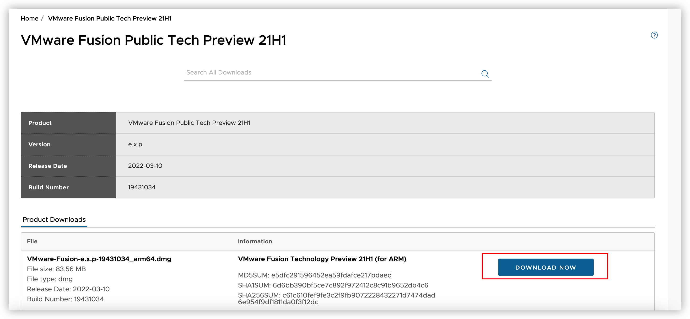

 下载后双击安装即可

## 1.2 下载centos

centos for m1下载地址：[centos for m1](https://www.centos.org/download/) 

 北京外国语大学镜像地址（ `注意`下载下来的镜像文件不能直接使用，有很多同学没有仔细看我下面的解释，导致安装不成功，特此提示！！！往下看）：[centos for m1 国内镜像](https://mirrors.bfsu.edu.cn/centos-altarch/7.9.2009/isos/aarch64/) 

推荐：镜像已上传到网盘（想直接安装的话请使用这个镜像！！！）：

[天翼网盘地址：centos7 for m1](https://cloud.189.cn/t/nyQfIrVbEjEj（访问码：s8xw）)

百度网盘：[centos7 for m1](https://pan.baidu.com/s/1-ToTP8kY3BZRRWuKcDzZDA) 

 密码: c81n 

 文件：CentOS-7-aarch64-08191738.iso（注意因为百度网盘限制，安装包被拆分成三份，选择001或者三个文件全选解压即可（mac默认的解压工具不能解压，提前下载好fastZip等解压工具）。阿里网盘暂不支持压缩包格式文件分享）

# 2. 安装centos

1、打开VMware，点击新建虚拟机 

 2、将下载的镜像拖入到窗口中，我这里因为之前安装过其他镜像所以会有历史显示 

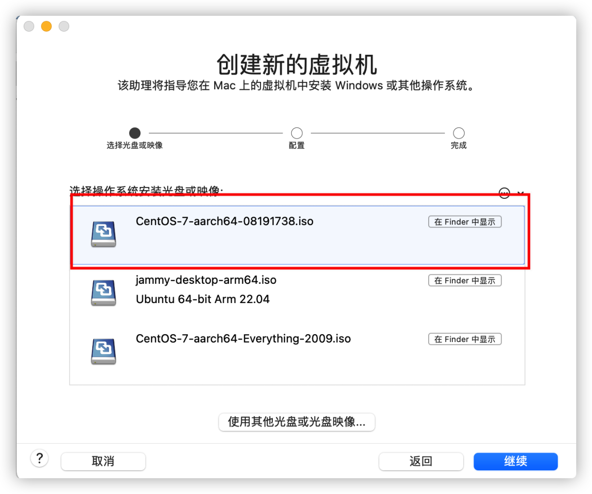

3、选择任意一个操作系统即可，因为镜像内部已经设置过了 

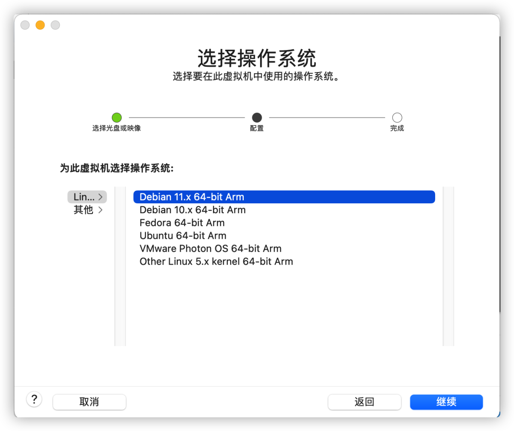

 4、这里你可以选择自定义调整配置，或者直接点击完成进行安装。我这里点击自定义修改下配置 

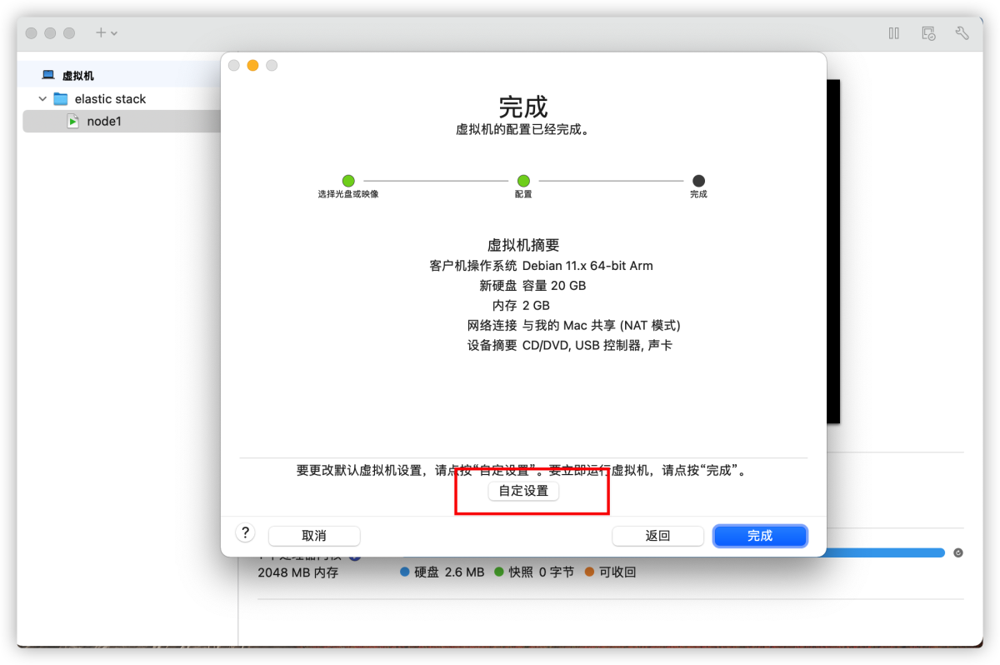

 4、修改下虚拟机文件名称 

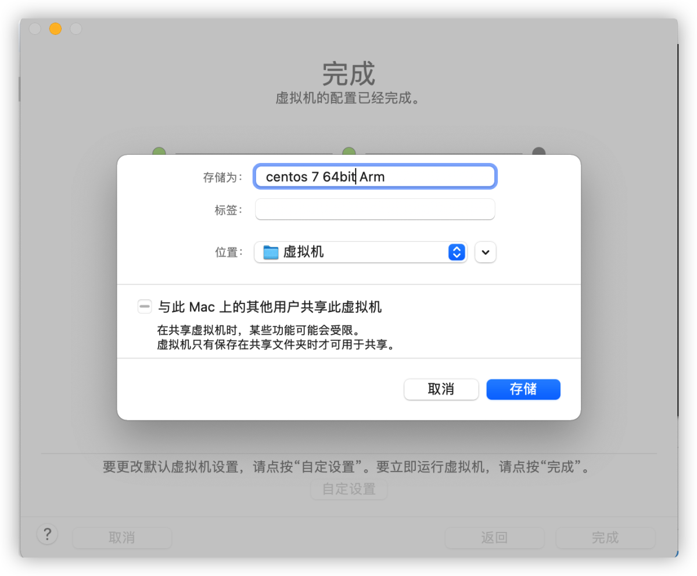

 5、因为我不需要声卡和摄像头，所以将声卡和摄像头都移除了 

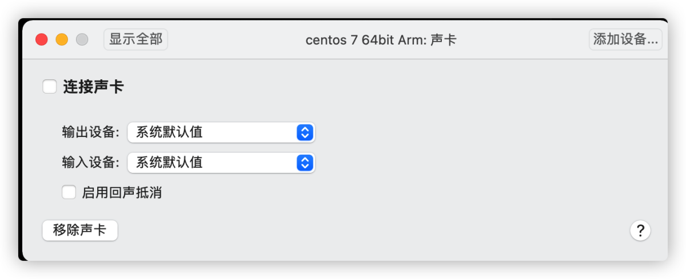

 6、点击播放按钮开始安装 

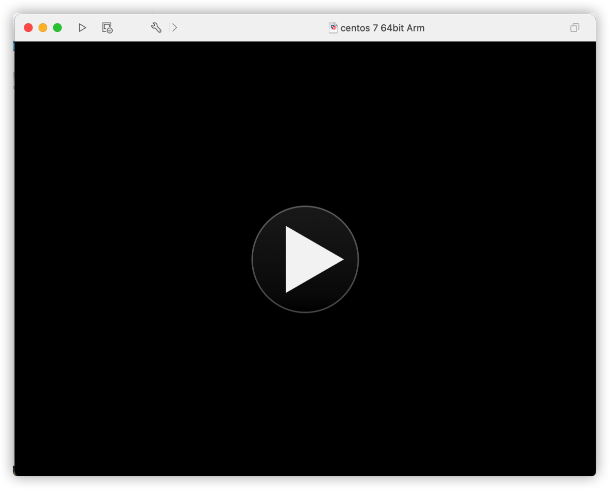

 `如果这里点击没有反应，可按以下步骤排错`： 

 （1）确保你使用的是arm架构的centos镜像，如果不清楚就用我网盘中提供的镜像文件 

 （2）确保VMware是适配了m1芯片的版本，安装包也可在我网盘中提供的地址下载 

 （3）如果上述还是不能解决，那就使用`App Cleaner & Uninstaller`等软件将VMware彻底卸载干净，可能因为你之前安装过并且没有成功，但配置文件已经被影响，导致再次安装使用了之前的配置文件，所以需要彻底卸载干净，注意直接删除VM并不生效，请使用深度卸载软件卸载。安装包也放到网盘中了，可自行下载

7、 选择Install centos 7，剩下的步骤如果安装过centos的同学应该很清楚了，但为了满足第一次接触的同学，这里继续给出步骤，安装过的可直接跳过 

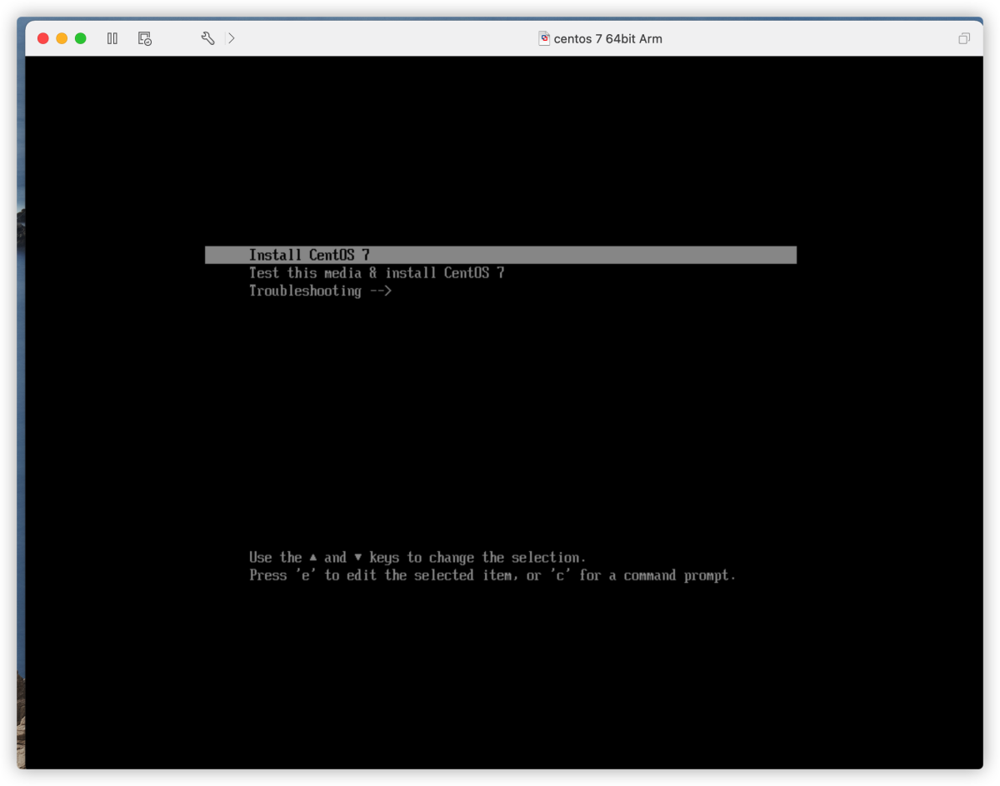

 8、语言是用英文就好，不要改成中文

 9、点击system，点击done 

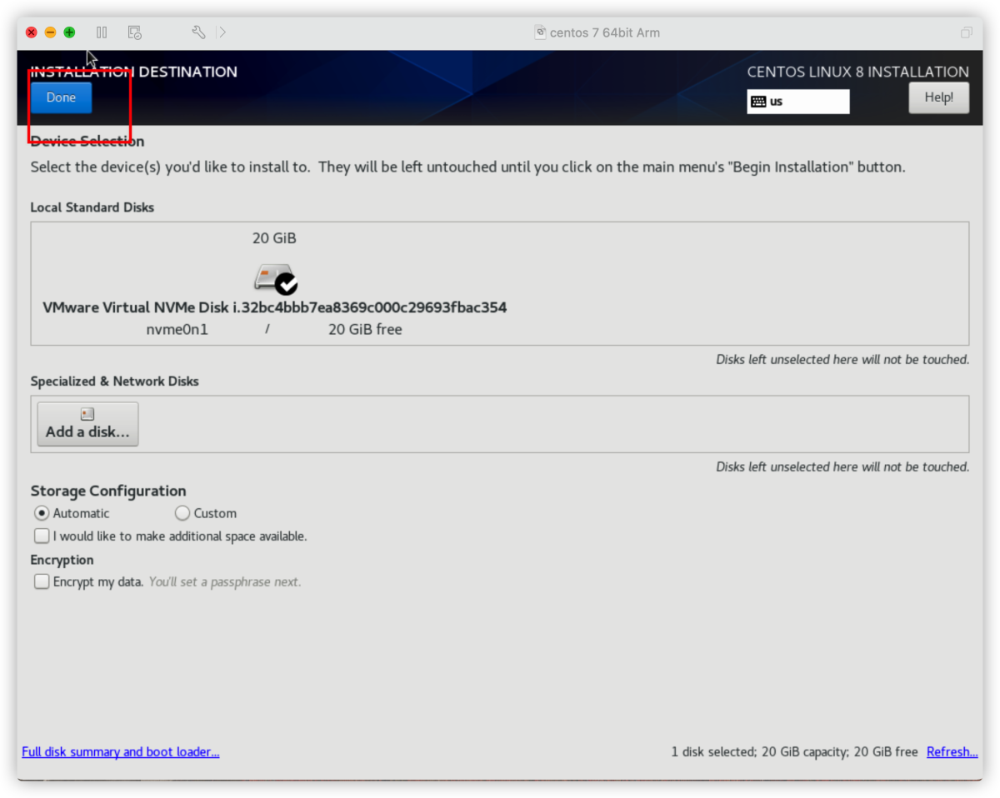

 10、默认是最小化安装，是没有vim等工具的， 但是目前这个版本通过yum下载又是有问题的，所以我这里选择web application安装，这样可以自带上vim等工具 

 点击Software Selection 

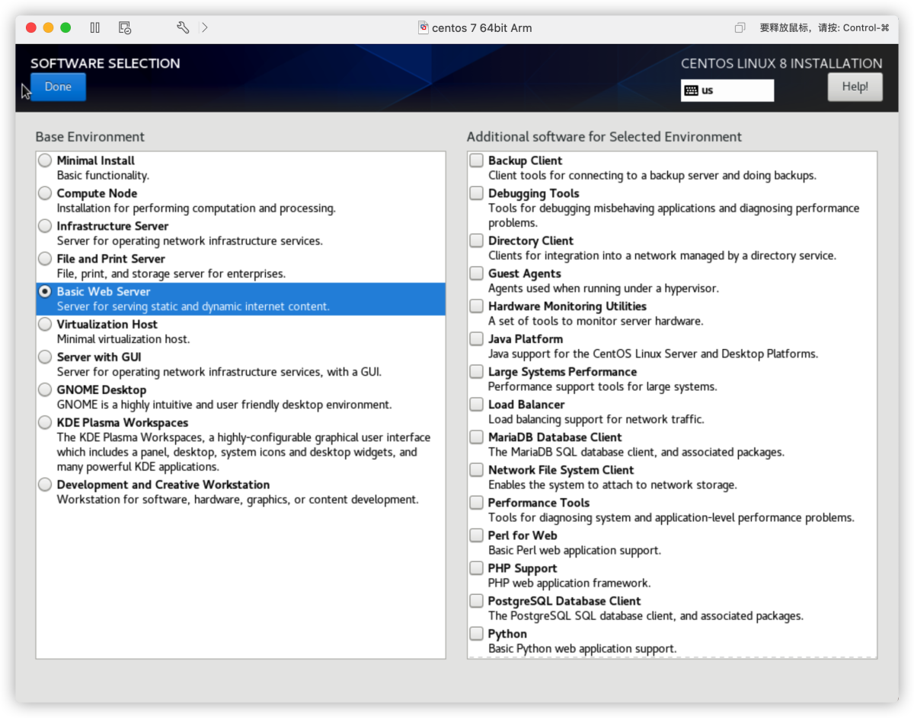

 11、点击Time & Date，选择时区为上海 


12、点击root password，给root账号设置密码，设置完成后点击done，注意要点击两次 

 另外我这里因为安装的环境需要一个非root账号，所以我再创建了一个elastic账号，如果有需要可以点击User creation创建

完成后点击begin install开启安装 

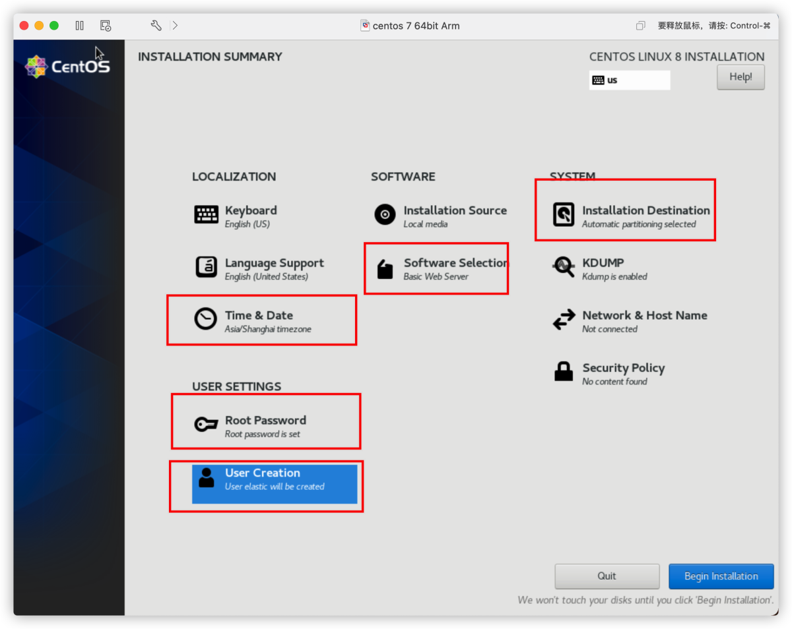

13、等待一段时间后，安装结束，点击reboo重启系统 

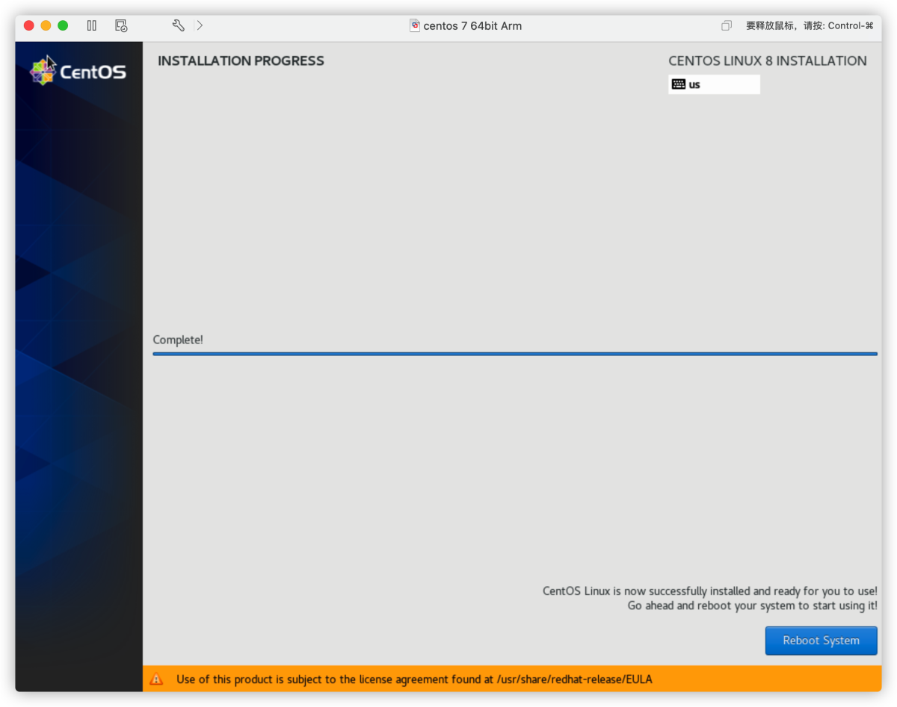

 14、输入账户密码，登录成功 

 到这里centos就安装成功了

```
如果本文对你有用的话，不妨点个赞，点个收藏，你的鼓励是我创作的动力
```

15、如果安装后虚拟机ip与[宿主机](https://cloud.tencent.com/product/cdh?from=20065&from_column=20065)ip不一致，将网络类型该为“自动检测”即可

```shell
# 查看ip
ip addr
```

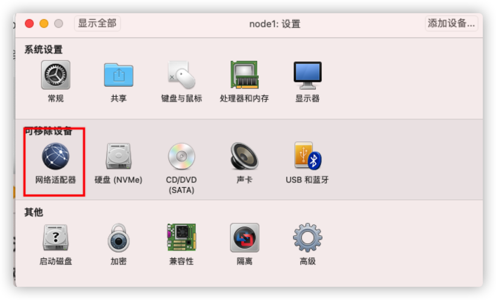

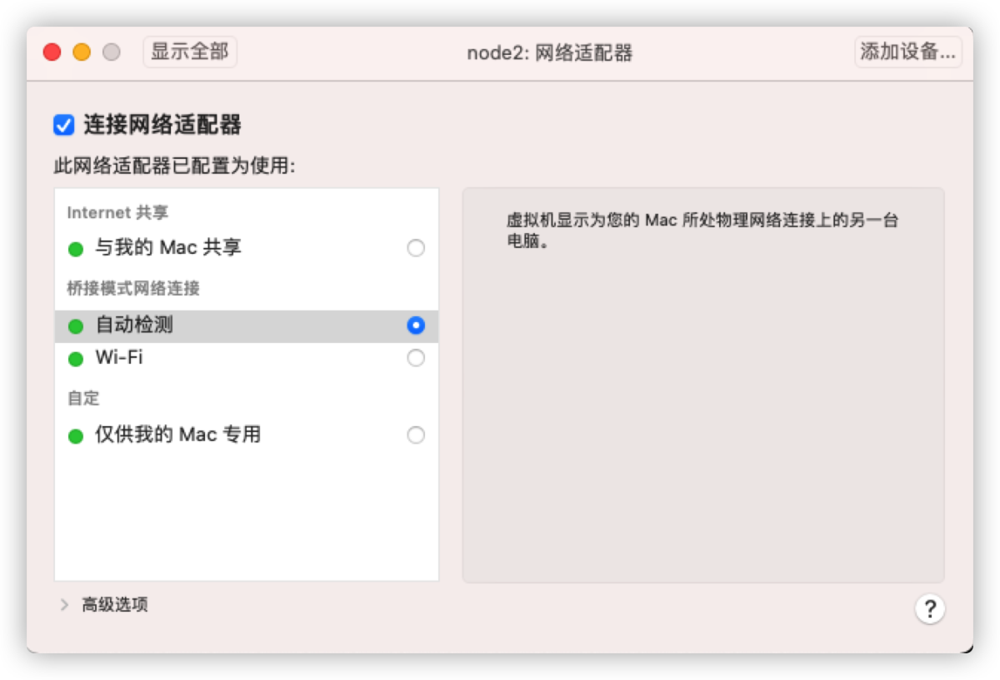

# 3 开启网卡，修改ip，开启ssh服务

## 3.1 开启网卡

因为centos7默认是关闭网卡的，所以需要手动开启 

 1、修改网卡配置文件

```shell
# 之前安装都是ens33，这个版本是ens160。如果没有安装vim的话，可以使用vi命令替代
vim /etc/sysconfig/network-scripts/ifcfg-ens160
```

2、将ONBOOT设置为yes即可开启网卡 

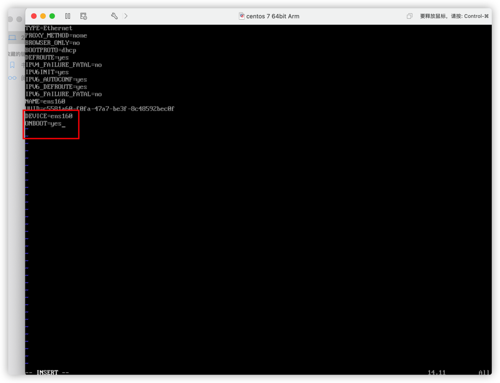

 3、重启网卡

```shell
service network restart
```

输入ip addr查询ip。出现ip即说明开启成功 

## 3.2 修改IP

1、修改网卡配置文件

```shell
vim /etc/sysconfig/network-scripts/ifcfg-ens160
```

2、在配置文件中添加：

```shell
IPADDR=192.168.244.12 #静态IP，你要修改的ip
GATEWAY=192.168.244.1 #默认网关
NETMASK=255.255.255.0 #子网掩码 
```

3、重启网卡

```shell
service network restart
```

4、查询ip，发现配置的ip已经出现

```shell
ip addr
```

 5、如果出现虚拟机无法ping同主机的情况，说明主机与虚拟机不在一个网段上，将虚拟机的网段与主机的保持一致即可。 

 比如主机为192.168.0.2 

 那么虚拟机就要为192.168.0.x

## 3.3 开启ssh服务

通过ssh服务，我们可以使用ssh指令来远程操作虚拟机，非常的方便

centos7默认安装ssh服务，该服务通过22端口传输，所以需要开启22端口或者关闭防火墙。但在生产环境中不允许关闭防火墙 

 1、如果未开启ssh服务，可以通过以下指令开启

```shell
service sshd start
# 重启sshd
service sshd restart
# 关闭sshd
service sshd stop
```

如果上述方式不管用，可以尝试这种方式重启ssh

```shell
systemctl restart sshd
```

2、开启22端口

```shell
# 查询22端口是否开放
firewall-cmd --query-port=22/tcp
#查询所有已开放的端口
netstat -anp
# 开启端口
firewall-cmd --add-port=22/tcp --permanent
# 开启后重新加载
firewall-cmd --reload
```

关闭端口指令

```shell
# 关闭指定端口
firewall-cmd --permanent --remove-port=22/tcp
```

如需关闭/开启防火墙，操作如下

```shell
查看防火墙状态 systemctl status firewalld
开启防火墙 systemctl start firewalld  
关闭防火墙 systemctl stop firewalld 
若遇到无法开启
先用：systemctl unmask firewalld.service 
然后：systemctl start firewalld.service 
```

3、连接测试

```shell
# 在mac中运行
ssh root@192.168.11.82
```

如果仍然报错22端口关闭，可以重启下虚拟机再试 

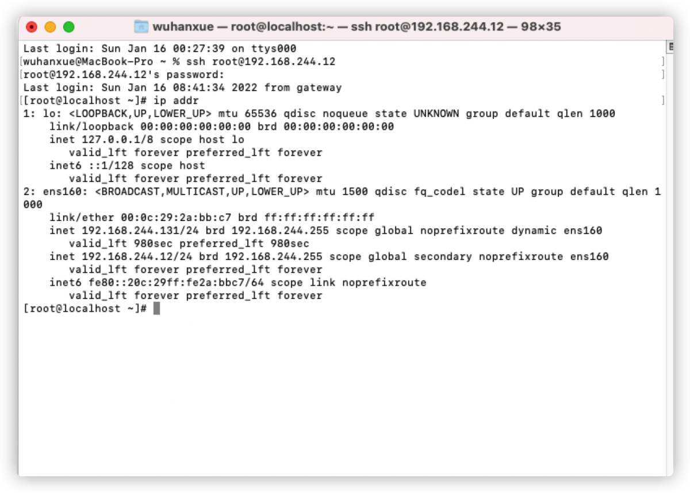

 4、如果发现ssh连接慢或者传输慢，可以通过以下指令关闭DNS

```shell
sudo vim /etc/ssh/sshd_config
```

修改内容，大概在115行

```shell
UseDNS no
```

重启ssh

```shell
systemctl restart sshd
```

## 3.4 无法连接外网问题解决

./解决mac m1环境下centos虚拟机无法连接网络.md

[解决mac m1环境下centos虚拟机无法连接网络](./解决mac m1环境下centos虚拟机无法连接网络.md)


