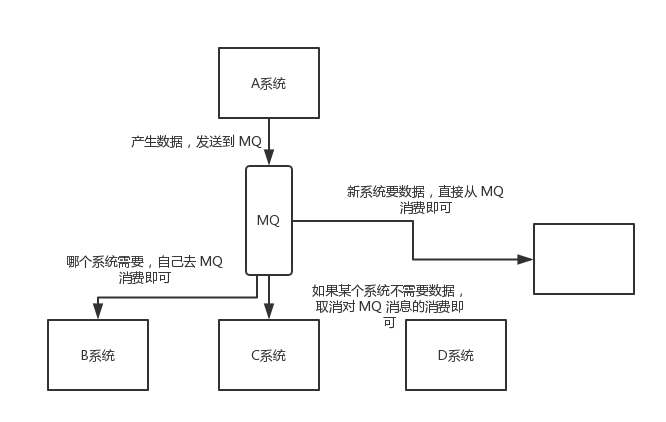

# 中华石杉Java笔记一（消息队列）

分析一下自己所处在的水平：

(1)自己在技术广度上做的x？你现在主流技术栈哪些技术都有一定的了解，包括核心原理和常见技术方案

(2)自己在项目经验和生产经验上做的如何？你会的这些技术，自己在项目里到底用过多少？用的有多复杂？用的时候考虑了哪些项目细节和生产细节？

(3)技术深度，你现在对哪些技术是除了核心原理以及基础知识之外，对一些技术的底层的概念和原理有一定的了解

(4)系统设计，你目前自己独立负责过设计的系统和架构有多复杂？如果让你来独立设计秒杀系统、红包系统、12306系统，或者是一些其他大型的架构，你会如何来设计呢？

# **Spring Cloud**


Eureka：服务注册中心

Feign：服务调用

Ribbon：负载均衡

Zuul/Spring Cloud Gatway:网关。灰度发布、统一熔断、统一降级、统一缓存、统一限流、统一授权认证

**Hystrix：** **链路追踪**、s限流方案、熔断方案、资源隔离、降级机制

# Dubbo


动态代理：Proxy

负载均衡：Cluster，负载均衡，故障转移

注册中心：Registry

通信协议：Protocol，filter机制，http、rmi、dubbo等协议

信息交换：Exchange，Request和Response

网络通信：Transport，netty、mina

序列化：封装好的请求如何序列化成二进制数组，通过netty/mina发送出去

# [消息队列](https://so.csdn.net/so/search?q=消息队列&spm=1001.2101.3001.7020)

- 用过消息队列么？
- 说说你们项目里是怎么用消息队列的？

- 为什么使用消息队列？

- 消息队列有什么优点和缺点？

- Kafka、ActiveMQ、RabbitMQ、RocketMQ 都有什么区别，以及适合哪些场景？

- 如何保证消息队列的高可用？

- 如何保证消息不被重复消费？如何保证消息消费时的幂等性？

- 如何保证消息的可靠性传输，要是消息丢失了怎么办？

- 如何保证消息的顺序性？

- 如何解决消息队列的延时以及过期失效问题？消息队列满了以后该怎么处理？有几百万消息持续积压几小时，说说怎么解决？

- 如果让你写一个消息队列，该如何进行架构设计，说一下你的思路？

## 为什么使用消息队列

消息队列都有哪些使用场景，然后你项目里具体是什么场景，说说你在这个场景里用消息队列是什么？

消息队列常见的使用场景有 3 个：**解耦**、**异步**、**削峰**。

### 解耦

供应商商品信息变更了，供应商A系统发送数据到 商品服务B、货架服务C、活动服务D 三个系统，通过接口调用发送。

如果现在新增了一个搜索服务E也需要保存商品信息，供应商服务A就需要新增代码去调用。如果现在活动服务D不需要商品的变更信息，供应商A就需要删除调用D的代码。

在这个场景中，供应商A 系统跟其它各种业务系统严重耦合


如果使用 MQ，供应商A 系统产生一条数据，发送到 MQ 里面去，哪个服务需要数据自己去 MQ 里面消费，哪个服务不需要这条数据就取消对 MQ 消息的消费即可。这样下来，A 系统压根儿不需要去考虑要给谁发送数据，不需要维护这个代码，也不需要考虑人家是否调用成功、失败超时等情况。



**总结**：通过一个 MQ，Pub/Sub 发布订阅消息这么一个模型，A 系统就跟其它系统彻底解耦了。

### 异步

现在供应商通过接口修改了商品信息，A 系统接收一个请求，需要在自己本地写库，还需要在 BCD 三个系统写库，如果是同步去请求，需要花费很长的时间。


如果**使用 MQ**，那么 A 系统处理完成并推送到MQ后，就可以直接返回响应给到用户，然后其它系统各自在MQ中进行消费。


### 削峰

每天凌晨或者是大型节假日活动的时候，供应商会频繁推送大量的商品信息变更请求。大量的请求打在数据库上，可能直接就把MySQL打死了，然后会导致整个系统就崩溃无法使用。

但是高峰期一过，正常情况下对整个系统几乎没有任何的压力。


如果使用 MQ，A 系统从 MQ 中慢慢拉取请求，不会超过自己每秒能处理的最大请求数量，从而保证了A 系统的稳定运行。


## 消息队列有什么优点和缺点？

除了上面说的优点：解耦、异步、削峰。缺点有以下几点

- 系统可用性降低：如果MQ挂了会导致整给流程无法进行下去。
- 系统复杂性提高：技术要求提高，需要考虑消息重复消费、消息丢失、消息传递的顺序性等问题。
- 一致性问题：A系统处理完直接返回成功，如果后续的步骤中，BD两个系统写库成功了，结果C系统写库失败了，这样就会存在数据不一致的问题。

## 有什么区别，以及适用场景？

主流MQ包括：kafka、ActiveMQ、RabbitMQ和RocketMQ

常见的MQ其实就上面的四种

| 特性       | ActiveMQ                                                     | RabbitMQ                                                     | RocketMQ                                                     | Kafka                                                        |
| :--------- | :----------------------------------------------------------- | :----------------------------------------------------------- | :----------------------------------------------------------- | :----------------------------------------------------------- |
| 单机吞吐量 | 万级，吞吐量比RocketMQ和Kafka要低一个数量级                  | 万级，吞吐量比RocketMQ和Kafka要低一个数量级                  | 10万级，RocketMQ也是可以支撑高吞吐的一种MQ                   | 10万级1这是kafka最大的优点，就是吞吐量高。一般配置和数据类的系统进行实时数据计算、日志采集等场景 |
| 时效性     | ms级                                                         | 微妙级，这是RabbitMQ的一大特点，就是延迟最低                 | ms级                                                         | 延迟在ms级内                                                 |
| 可用性     | 基于主从架构实现高可用                                       | 高，基于主从架构实现高可用                                   | 非常高，分布式架构                                           | 非常高，kafka是分布式的，一个数据多个副本，少数机器宕机后，不会丢失数据，不会导致不可用 |
| 消息可靠性 | 有较低的概率丢失数据                                         | 消息不丢失                                                   | 经过参数优化配置，可以做到0丢失                              | 经过参数优化配置可以做到0丢失                                |
| 核心特点   | MQ领域的功能及其完备                                         | 基于Erlang开发，所以并发能力强，性能及其好，延时很低         | MQ功能较为完善，还是分布式的，扩展性好                       | 功能较为简单，主要支持简单的MQ功能，在大数据领域的实时计算以及日志采集被大规模使用，是实时上的标准。 |
|            | 非常成熟，功能强大，在业内大量公司以及项目都有应用。 但是偶尔消息丢失的概率，并且现在社区以及国内应用都越来越少，官方社区对ActiveMQ5.X维护越来越少，而且确实主要是基于解耦和异步来用的，较少在大规模吞吐场景中使用 | erlang语言开发的，性能及其好，延时很低。而且开源的版本，就提供的管理界面非常棒。缺点就是吞吐量会低一些，且因为使用erlang开发，针对源码的定制非常困难，只能依赖于开源社区的维护。 | 接口简单易用，在阿里大规模应用过，日处理消息上 百亿之多，可以做到大规模吞吐，性能也非常好，分布式扩展也很方便，社区维护还可以，可靠性和可用性都是OK的，还可以支撑大规模的topic数量，支持复杂MQ业务场景。 | 仅仅提供较少的核心功能，但是提供超高的吞吐量，ms级别的延迟，极高的可用性以及可靠性，分布式可以任意扩展。 同时kafka最好是支撑较少的topic数量即可，保证其超高的吞吐量。 |

## 如何保证消息队列的高可用？

### RabbitMQ高可用性

RabbitMQ是基于主从做高可用性的。RabbitMQ 三种模式：单机模式，普通集群模式，镜像集群模式

**普通集群模式**是每台机器启动一个RabbitMQ实例，但是创建的Queue，只会放在一个RabbitMQ实例上（该节点宕机会导致消息丢失，持久化解决）。每个实例都同步queue元数据，在消费的时候，随机连接的实例会从queue所在实例上拉取数据过来，此时会在RabbitMQ中存在大量的数据传输。这个方案主要就是为了解决吐吞量，相当于集群中的多个节点来服务于某个queue的读写操作。


这里没有什么所谓的高可用

**集群镜像模式**中，创建的queue包含元数据和消息，每次写消息时都会自动把消息推送到多个实例的queue中。

保证可用性的同时增加了性能开销，消息需要同步到所有的机器，导致网络带宽压力和消耗增加，同时如果queue负载很重，新增的机器也包含queue的所有数据，无法线性扩展，缺乏扩展性。

在RabbitMQ的管理控制台，新增一个镜像集群模式下的策略，可以要求数据同步到所有的节点，也可以要求就同步到指定数量的节点。再次创建queue的时候，应用这个策略，就会自动将数据同步到其它节点上去了。


### kafka实现高可用


kafka的每个broker是一个节点，每个topic可以划分成多个partition，每个partition存放部分数据保存在不同的broker上。也就是说一个topic的数据，是分散在多个机器上的，每个机器上就放一部分数据。

kafka在0.8版本后，提供了HA机制，就是replica副本机制，每个partition的数据都会同步到其它机器上，形成自己的多个replica副本，也就是follower。

写的时候，leader会负责数据都同步到所有的follower上，读的时候就直接读取leader上的数据。只能读写leader就保证了数据一致性的问题，kafka会均匀的将一个partition的所有replica分布在不同的机器上，这样就提高了容错性。

假设一个leader宕机了，但是因为每个leader下还有多个follower，并且每个follower都进行了数据的备份，kafka会自动感知leader已经宕机，同时将其它的follower给选举出来，作为新的leader，并向外提供服务支持。


## 如何保证消息不被重复消费？如何保证消息消费的幂等性？

kafka有offset的概念，每个消息写进去，都有一个offset，代表他的序号，每隔一段时间，consumer会把自己消费过的消息offset提交一下。如果consumer有些消息处理了没来得及提交offset，就会造成少数消息重复消费的问题。

解决思路

- 数据写库前，根据主键查，存在更新，不存在才新增
- 通过redis加锁
- 基于数据库唯一键来保证重复数据不会重复插入多条


## 如何保证消息传输不丢失？

### 为什么会丢数据

RabbitMQ分三种，生产者发送失败、MQ保存失败、消费者处理失败


**生产者丢失消息**

为了避免生产者弄丢了数据，可以开启RabbitMQ事务（channel.txSelect），发送消息失败会回滚事务（channel.txRollback），然后重试发送消息。如果MQ收到了消息，那么可以提交事务。但是事务机制是同步的，会导致吞吐量会下来。

```java
// 开启事务
try {
 // 发送消息
} catch(Exception e) {
 // 重试发送消息
}
//  提交
```

针对于上述事务造成性能下降的问题，下面的方法是开启confirm模式

- 首先把生产者channel设置成confirm模式
- 生产者发送完消息之后，可以处理后续流程或者结束
- RabbitMQ如果接收到这个消息的话，会回传一个ack消息表示已经消费
- RabbitMQ如果在接收消息的时候出错了，就会回调接口，告诉你消息接收失败，然后可以进行重试


**MQ丢失消息**

为了避免RabbitMQ自己丢失数据，这个时候就必须开启RabbitMQ的持久化，就是消息写入之后，同时需要持久化到磁盘中。

设置持久化的两个步骤，第一个是创建queue的时候，将其持久化的，这样就保证了RabbitMQ持久化queue的元数据，但是不会持久化queue中的数据，第二个就是发送消息的时候，将消息的deliveryMode设置为2，就是将消息设置为持久化的，此时RabbitMQ将会将消息持久化到磁盘上。

**消费者丢失数据**

如果打开了AutoAck的机制，消费者会自动通知RabbitMQ，表明自己已经消费完这条数据了。但是此时消费者还在处理消息，如果刚好消费者系统宕机了，这条消息就会丢失。解决办法是将AutoAck给关闭，在每次处理完了消息后，再手动发送ack给RabbitMQ

## 如何保证消息的顺序性？

在消息队列中，一个queue中的数据，一次只会被一个消费者消费掉。但因为不同消费者的执行速度不一致，在存入数据库后，会造成顺序不一致的问题。比如增改删3条消息，如果顺序错了，可能导致本来要删除的数据没有删除。

- RabbitMQ：一个queue，多个consumer，会出现
- Kafka：一个topic，一个partition，一个consumer，内部多线程，同样会出现


### RabbitMQ保证消息顺序性

RabbitMQ：拆分多个queue，每个queue一个consumer，或者每个consumer内部用内存队列做排队，然后分发给底层不同的worker来处理。

下图为：一个consumer 对应 一个 queue，这样就保证了消息消费的顺序性。


### Kafka保证消息消息顺序性

一个topic，一个partition，一个consumer，内部单线程消费，写N个内存，然后N个线程分别消费一个内存queu即可。注意，kafka中，写入一个partition中的数据，一定是有顺序的。


但是在一个消费者的内部，假设有多个线程并发的进行数据的消费，那么这个消息又会乱掉


这样时候，我们需要引入内存队列，然后我们通过消息的key，然后我们通过hash算法，进行hash分发，将相同订单key的散列到我们的同一个内存队列中，然后每一个线程从这个Queue中拉数据，同一个内存Queue也是有顺序的。


## 百万消息积压在队列中如何处理？

如何解决消息队列的延时以及过期失效问题？消息队列满了以后该怎么处理？

### 场景1：积压大量消息

紧急的扩容操作，具体操作步骤和思路如下所示：

- 先修复consumer的问题，确保其恢复消费速度，然后将现有consumer都停止
- 临时建立好原先10倍或者20倍的queue数量

- 然后写一个临时的分发数据的consumer程序，这个程序部署上去消费积压的数据，消费之后不做耗时的处理，直接均匀轮询写入临时建立好的10倍数量的queue

- 接着临时征用10倍机器来部署consumer，每一批consumer消费一个临时queue的数据

- 这种做法相当于临时将queue资源和consumer资源扩大了10倍，以正常的10倍速度

  

也就是让消费者把消息，重新写入MQ中，然后在用 10倍的消费者来进行消费。


### 场景2：大量消息积压，并且设置了过期时间

如果RabbitMQ设置了过期时间（TTL），那么消息在queue中积压超过一定的时间，就会被RabbitMQ给清理掉，这个数据就没了。

这种情况下，我们可以采取的一个方案就是，批量重导，等高峰期过了之后，将丢失的那批数据查询出来，然后重新添加MQ里面。

假设1万个订单积压在MQ里面，没有处理，其中1000个订单都丢了，你只能手动写程序把那1000个订单查询出来，然后手动发到MQ里面去再补一次。

### 场景3：大量消息积压，导致MQ磁盘满了

写一个临时程序，接入数据来消费，然后消费到消息后不作处理直接丢弃，快速消费掉所有的消息。然后等高峰期过后，再把消息填入MQ中进行消费。

## 如何设计一个消息中间件架构？

- 首先MQ得支持可伸缩性，需要支持快速扩容，方便增加吞吐量和容量，方法就是设计一个分布式的系统，参考kafka的设计理念，broker - > topic -> partition，每个partition将部分数据存放在一台机器，，如果资源不够就可以给topic增加partition，然后增加机器做数据迁移，提高更高的吞吐量。

- 其次为了保证数据的不丢失，得考虑一下MQ的数据要不要持久化到磁盘。如何持久化呢？顺序写入可以避免磁盘随机读写的寻址开销，这也是kafka的思路。

- 其次需要考虑MQ的可用性？这个可以具体到我们上面提到的消息队列保证高可用，提出了多副本 ，leader 和follower模式，当一个leader宕机的时候，马上选取一个follower作为新的leader对外提供服务。
- 需不需要支持数据0丢失？可以参考kafka零丢失方案


