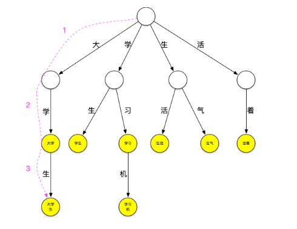
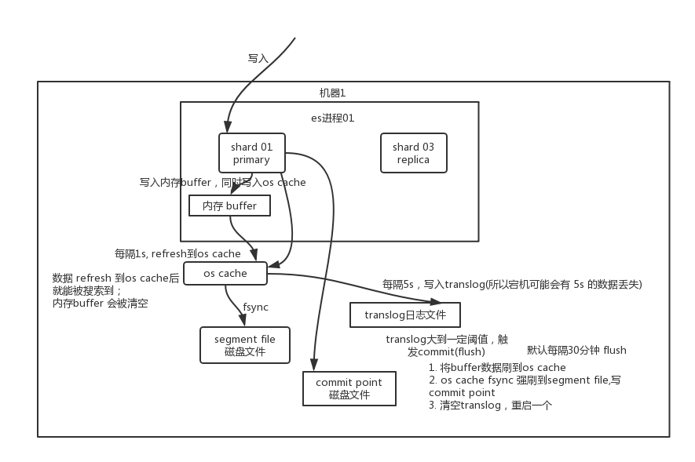

# 中华石杉Java笔记二（分布式搜索引擎）

# 分布式搜索引擎的底层原理

业内分布式搜索引擎一般大家都是用ElasticSearch（原来的话使用的是Solr），elasticsearch 基于 lucene，隐藏了 lucene 的复杂性，提供了简单易用的 restful api / Java api 接口（另外还有其他语言的 api 接口）。

- 分布式的文档存储引擎
- 分布式的搜索引擎和分析引擎
- 分布式，支持 PB 级数据

ElasticSearch 和 Solr 底层都是基于Lucene，而Lucene的底层原理是 **倒排索引**

### 底层 lucene

简单来说，lucene 就是一个 jar 包，里面包含了封装好的各种建立倒排索引的算法代码。我们用 Java 开发的时候，引入 lucene jar，然后基于 lucene 的 api 去开发就可以了。

通过 lucene，我们可以将已有的数据建立索引，lucene 会在本地磁盘上面，给我们组织索引的数据结构。

### 倒排索引

在搜索引擎中，每个文档都有一个对应的文档 ID，文档内容被表示为一系列关键词的集合。例如，文档 1 经过分词，提取了 20 个关键词，每个关键词都会记录它在文档中出现的次数和出现位置。

那么，倒排索引就是**关键词到文档** ID 的映射，每个关键词都对应着一系列的文件，这些文件中都出现了关键词。

举个栗子。

有以下文档：

| DocId | Doc                                            |
| :---- | :--------------------------------------------- |
| 1     | 谷歌地图之父跳槽 Facebook                      |
| 2     | 谷歌地图之父加盟 Facebook                      |
| 3     | 谷歌地图创始人拉斯离开谷歌加盟 Facebook        |
| 4     | 谷歌地图之父跳槽 Facebook 与 Wave 项目取消有关 |
| 5     | 谷歌地图之父拉斯加盟社交网站 Facebook          |

对文档进行分词之后，得到以下**倒排索引**。

| WordId | Word     | DocIds    |
| :----- | :------- | :-------- |
| 1      | 谷歌     | 1,2,3,4,5 |
| 2      | 地图     | 1,2,3,4,5 |
| 3      | 之父     | 1,2,4,5   |
| 4      | 跳槽     | 1,4       |
| 5      | Facebook | 1,2,3,4,5 |
| 6      | 加盟     | 2,3,5     |
| 7      | 创始人   | 3         |
| 8      | 拉斯     | 3,5       |
| 9      | 离开     | 3         |
| 10     | 与       | 4         |
| ..     | ..       | ..        |

另外，实用的倒排索引还可以记录更多的信息，比如文档频率信息，表示在文档集合中有多少个文档包含某个单词。

那么，有了倒排索引，搜索引擎可以很方便地响应用户的查询。比如用户输入查询 `Facebook`，搜索系统查找倒排索引，从中读出包含这个单词的文档，这些文档就是提供给用户的搜索结果。

要注意倒排索引的两个重要细节：

- 倒排索引中的所有词项对应一个或多个文档；

- 倒排索引中的词项**根据字典顺序升序排列**

  > 上面只是一个简单的栗子，并没有严格按照字典顺序升序排列。

## 倒排索引是什么

倒排索引适用于快速的全文检索，一个倒排索引由文档中所有不重复词的列表构成，对于其中每个词，有一个包含它的文档列表

例如：

假设文档集合中包含五个文档，每个文档的内容如下所示，在图中最左端一栏是每个文档对应的编号，我们的任务就是对这个文档集合建立倒排索引


中文和英文等语言不通，单词之间没有明确分割符号，所以首先要用分词系统将文档自动切分成单词序列，这样每个文档就转换为由单词序列构成的数据流，为了系统后续处理方便，需要对每个不同的单词赋予唯一的单词编号，同时记录下哪些文档包含这个单词，在如此处理结束后，我们就可以得到最简单的倒排索引了。


索引系统还可以记录除此之外的更多信息，下图是记录了单词出现的频率（TF）即这个单词在文档中出现的次数，之所以要记录这个信息，是因为词频信息在搜索结果排序时，计算查询和文档相似度是很重要的一个计算因子，所以将其记录在倒排列表中，以便后续排序时进行分值计算。


倒排列表还可以记录单词在某个文档出现的位置信息

```java
(1, <11>, 1), (2, <7>, 1), (3, <3, 9>, 2)
```

有了这个索引系统，搜索引擎可以很方便地响应用户的查询，比如用户输入查询词 "Facebook"，搜索系统查找倒排索引，从中可以读出包含这个单词的文档，这些文档就是提供给用户的搜索结果，而利用单词频率信息，文档频率信息即可以对这些候选搜索结果进行排序，计算文档和查询的相似性，按照相似性得分由高到低排序输出，此即为搜索系统的部分内部流程。

## 中文分词器原理

**方法1 词典分词**

分词器的原理本质上是词典分词。在现有内存中初始化一个词典，然后在分词过程中挨个读取字符和字典中的字符相匹配，把文档中所有词语拆分出来的过程。

**方法2 字典树**

Trie树是一种树形结构，哈希树的变种。典型应用是用于统计，排序和保存大量的字符串（但不仅限于字符串），所以经常被搜索引擎系统用于文本词频统计。它的优点是：利用字符串的公共前缀来减少查询时间，最大限度地减少无谓的字符串比较，查询效率比哈希树高。

下面一个存放了[大学、大学生、学习、学习机、学生、生气、生活、活着]这个词典的trie树：


它可以看作是用每个词第n个字做第n到第n+1层节点间路径哈希值的哈希树，每个节点是实际要存放的词。

现在用这个树来进行“大学生活”的匹配。依然从“大”字开始匹配，如下图所示：从根节点开始，沿最左边的路径匹配到了大字，沿着“大”节点可以匹配到“大学”,继续匹配则可以匹配到“大学生”，之后字典中再没有以“大”字开头的词，至此已经匹配到了[大学、大学生]第一轮匹配结束



继续匹配“学”字开头的词，方法同上步，可匹配出[学生]


继续匹配“生”和“活”字开头的词，这样“大学生活”在词典中的词全部被查出来。

可以看到，以匹配“大”字开头的词为例，第一种匹配方式需要在词典中查询是否包含“大”、“大学”、“大学”、“大学生活”，共4次查询，而使用trie树查询时当找到“大学生”这个词之后就停止了该轮匹配，减少了匹配的次数，当要匹配的句子越长，这种性能优势就越明显。

**失败指针**

再来看一下上面的匹配过程，在匹配“大学生”这个词之后，由于词典中不存在其它以“大”字开头的词，本轮结束，将继续匹配以“学”字开头的词，这时，需要再回到根节点继续匹配，如果这个时候“大学生”节点有个指针可以直指向“学生”节点，就可以减少一次查询，类似地，当匹配完“学生”之后如果“学生”节点有个指针可以指向“生活”节点，就又可以减少一次查询。这种当下一层节点无法匹配需要进行跳转的指针就是失败指针，创建好失败指针的树看起来如下图：


图上红色的线就是失败指针，指向的是当下层节点无法匹配时应该跳转到哪个节点继续进行匹配失败指针的创建过程通常为：

- 创建好trie树。
- BFS每一个节点(不能使用DFS，因为每一层节点的失败指针在创建时要确保上一层节点的失败指针全部创建完成)。
- 根节点的子节点的失败指针指向根节点。
- 其它节点查找其父节点的失败指针指向的节点的子节点是否有和该节点字相同的节点，如果有则失败指针指向该节点，如果没有则重复刚才的过程直至找到字相同的节点或根节点。

查询过程如下：


# ES的分布式架构原理能说一下么？


## es 的核心概念

### Near Realtime

es是准实时的，从写入数据到数据可以被搜索到有一个小延迟（大概是 1s）。所以基于 es 执行搜索和分析可以达到秒级响应。

### Index

索引包含了一堆有相似结构的文档数据，比如商品索引。一个索引下面包含很多 document，一类相似或者相同的 ducument都归到这个索引中。索引Index相当于是mysql里的一张表。index -> type -> mapping -> document -> field

### Type

每个索引里可以有一个或者多个 类型type，type 是 index 的一个逻辑分类，可以认为index是一种类型的表，具体的每个type代表了具体的一个mysql中的表。比如商品 index 下有多个 type：日化商品 type、电器商品 type、生鲜商品 type。每个 type 下的 document 的 field 大致一样，但是有一些略微的差别。比如都有商品名称等字段，但是电器商品还有瓦数字段。

### mapping

每个type有一个mapping，mapping就是这个type的表结构定义，定义了这个type中每个字段名称、字段类型，还有字段的各种配置

### Document & field

文档是 es 中最小的数据单元，通常用 json 数据结构来表示。往index里的一个type里面写的一条数据，就叫做一条document，一条document就代表了mysql中某个表里的一行数据。每个 index 下的 type，都可以存储多条 document。一个 document 里面有多个 field，每个 field 就是一个数据字段，代表了这个document中的一个字段的值。

```java
{
    "product_id": "1",
    "product_name": "iPhone X",
    "product_desc": "苹果手机",
    "category_id": "2",
    "category_name": "电子产品"
}
```

### shard

单台机器无法存储大量数据，es 可以将一个索引中的数据切分为多个 shard，每个shard存储部分数据，分布在多台服务器上存储。

有了 shard 就可以横向扩展，存储更多数据，让搜索和分析等操作分布到多台服务器上去执行，提升吞吐量和性能。每个 shard 都是一个 lucene index。

### replica shard

每个shard都有一个primary shard负责写入数据，之后会将数据同步多个备份replica shard。与只能从leader读取的kafka不同，es写请求是写入 primary shard，然后同步给所有的 replica shard；读请求可以从 primary shard 或 replica shard 读取，采用的是随机轮询算法。

replica 可以在 shard 故障时提供备用服务，保证数据不丢失，多个 replica 还可以提升搜索操作的吞吐量和性能。

primary shard（建立索引时一次设置，不能修改，默认 5 个），replica shard（随时修改数量，默认 1 个），默认每个索引 10 个 shard，5 个 primary shard，5个 replica shard，最小的高可用配置，是 2 台服务器。

### Cluster 集群

elasticsearch设计的理念就是分布式搜索引擎，底层是基于lucene的。

核心思想就是在多台机器上启动多个es进程实例，组成了一个es集群。集群包含多个节点，通过配置来决定每个节点属于哪个集群。

### Node 节点

Node 是集群中的一个节点，节点也有一个名称，默认是随机分配的。默认节点会去加入一个名称为 `elasticsearch` 的集群。一个节点也可以组成 elasticsearch 集群。

es集群会自动选举一个节点为master节点，master节点负责管理工作，比如维护索引元数据，切换primary shard和replica shard身份等。

如果master节点宕机了，那么会重新选举一个节点为master节点。如果是非master节点宕机了，master节点会将宕机节点上的primary shard的身份转移到其他机器上的replica shard。修复了宕机机器后，master节点会重新将缺失的replica shard分配过去，同步后续修改的数据，让集群恢复正常。


**es 核心概念 vs. db 核心概念**

| es       | db       |
| :------- | :------- |
| index    | 数据库   |
| type     | 数据表   |
| docuemnt | 一行数据 |

# ES查询和读取数据的工作原理是什么？


## es写数据过程

1）客户端选择一个node发送请求过去，这个node就是coordinating node（协调节点）

2）协调节点对document进行路由，将请求转发给对应有primary shard的node

3）实际的node上的primary shard处理请求，并将数据同步到replica node

4）协调节点如果发现primary node和所有replica node都完成之后，返回响应结果给客户端


## es读数据过程

根据dos id GET查询某一条已知的数据，当写入document时会自动分配一个全局唯一的doc id，同时根据doc id进行hash路由到对应的primary shard上面去。也可以手动指定doc id，比如用订单id，用户id。

通过doc id来查询时，会根据doc id进行hash，判断出对应保存的shard并发起查询请求.

1）客户端发送请求到任意一个node，成为coordinate node（协调节点）

2）协调节点对document进行hash路由，将请求转发到对应的node，此时会使用round-robin随机轮询算法，在primary shard以及其所有replica中随机选择一个，让读请求负载均衡

3）接收请求的node返回document给协调节点，最终再返回给客户端

## es搜索数据过程

es最强大的全文检索，会根据所给的关键词来搜索，将包含关键字的document给搜索出来

1）客户端发送请求到一个coordinate node（协调节点）

2）协调节点将搜索请求转发到所有的shard（primary shard或replica shard）

3）query phase：每个shard将自己的搜索结果（其实就是一些doc id），返回给协调节点，由协调节点进行数据的合并、排序、分页等操作，产出最终结果

4）fetch phase：接着由协调节点，根据doc id去各个节点上拉取实际的document数据，最终返回给客户端

## 写数据底层原理

### **refresh**

**buffer -> os cache/translog -> segment file**

1）数据写入buffer，在buffer里的时候数据是搜索不到的，每隔1s会将buffer数据refresh刷入os cache中；同时每隔5s将数据写入translog日志文件，防止数据丢失。

buffer数据写入磁盘文件之前，会先进入操作系统级别的内存缓存os cache中去。只要buffer中的数据被刷入os cache中，就代表这个数据就可以被搜索到了，同时buffer就会被清空了，数据会在translog里面持久化到磁盘。可以通过es的restful api或者java api，手动执行refresh操作，让数据立马就可以被搜索到。为什么叫es是准实时的？NRT，near real-time，默认是每隔1秒refresh一次的，因为写入的数据1秒之后才能被看到。

在执行commit操作之前，数据停留在buffer或者os cache的内存中，一旦机器宕机，内存中的数据就全丢了。所以需要将数据对应的操作写入一个专门的日志文件，机器重启时es会自动读取translog日志文件中的数据，恢复到内存buffer和os cache中去。每5s写一次translog，就会有5秒的数据不在磁盘上，此时如果宕机，会导致5秒的数据丢失。配置每次写入buffer同时写入translog可以保证数据不丢失，但是会导致性能下级。

2）如果buffer快满了，或者到一定时间（每隔1秒钟且buffer必须有数据），从buffer数据刷入os cache中的数据，将refresh到一个新的segment file的磁盘文件中。每秒钟会产生一个新的磁盘文件，segment file，这个segment file中就存储最近1秒内buffer中写入的数据。这个过程就是refresh。

3）重复以上步骤，新的数据不断进入buffer和translog，不断将buffer数据写入新的segment file中。buffer中的数据每隔1秒就被刷到os cache中去，然后这个buffer就被清空了。每次refresh完buffer清空，translog保留。随着这个过程推进，buffer的数据始终不会填满es进程的内存，但translog会变得越来越大。当translog达到一定长度的时候，就会触发commit操作。

### **commit /flush**

**写commit point -> os cache数据fsync到segment file -> 清空translog**

1）将一个commit point写入磁盘文件，里面标识着这个commit point对应的所有segment file

2）强行将os cache中目前所有的数据都fsync到磁盘文件中去

3）将现有的translog清空，然后再次重启启用一个translog，此时commit操作完成。

默认每隔30分钟或者translog过大时，会自动执行一次commit。整个commit的过程，叫做flush操作。也可以通过 es api，手动执行 flush 操作，手动将 os cache 中的数据 fsync 强刷到磁盘上去。



**总结一下**，数据先写入内存 buffer，然后每隔 1s，将数据 refresh 到 os cache，到了 os cache 数据就能被搜索到（准实时：写入到能被搜索到有 1s 延迟）。每隔 5s将数据写入 translog 文件（如果宕机会将数据恢复到内存，最多会有 5s 的数据丢失），每隔 30mins或translog 过大时，会触发 commit 操作，将缓冲区的数据都 flush 到 segment file 磁盘文件中。

## 删除/更新数据底层原理

如果是删除操作，commit 的时候会生成一个 `.del` 文件，里面将某个 doc 标识为 `deleted` 状态，那么搜索的时候根据 `.del` 文件就知道这个 doc 是否被删除了。

如果是更新操作，就是将原来的 doc 标识为 `deleted` 状态，然后新写入一条数据。

buffer 每 refresh 一次，就会产生一个 segment file，所以默认情况下是 1 秒钟一个 segment file，这样下来 segment file 会越来越多，此时会定期执行 merge。每次 merge 的时候，会将多个 segment file 合并成一个，同时这里会将标识为 deleted 的 doc 给**物理删除掉**，然后将新的 `segment file` 写入磁盘，这里会写一个 `commit point`，标识所有新的 `segment file`，然后打开 `segment file` 供搜索使用，同时删除旧的 `segment file`。

# ES在数据量很大的情况下（数十亿级别）如何提高查询性能？

## 性能优化的杀手锏——filesystem cache

往 es 里写的数据，实际上都写到磁盘文件里去了，**查询的时候**，操作系统会将磁盘文件里的数据自动缓存到 `filesystem cache` 里面去。

es 的搜索引擎严重依赖于底层的 `filesystem cache`，你如果给 `filesystem cache` 更多的内存，尽量让内存可以容纳所有的 `idx segment file `索引数据文件，那么你搜索的时候就基本都是走内存的，性能会非常高。


最佳的情况下，机器的内存至少可以容纳ES总数据量的一半以上。

除此之外，ES只保存要用来检索的字段，可以把其他的字段数据存在hbase/mysql里面。单条数据的数据量越大，就会导致filesystem cahce能缓存的数据就越少。

hbase的特点是适用于海量数据的在线存储，就是对hbase可以写入海量数据，不要做复杂的搜索，就是做很简单的一些根据id或者范围进行查询的这么一个操作就可以了

从es中根据name和age去搜索，拿到的结果doc id，然后根据doc id到hbase里去查询每个doc id对应的完整的数据。

## 数据预热

把热门数据每隔一会儿刷到filesystem cache里去，后面用户实际上请求热数据的时候，就是直接从内存里搜索。

## 冷热分离

数据拆分，将大量不搜索的字段拆分到别的存储中去，类似于mysql分库分表的垂直拆分。

es可以做类似于mysql的水平拆分，将大量的访问很少频率很低的数据，单独写一个索引，然后将访问很频繁的热数据单独写一个索引

这样可以确保热数据在被预热之后，尽量都留在filesystem os cache里，不会被冷数据给冲刷掉。

假设有6台机器，2个索引，一个放冷数据，一个放热数据，每个索引3个shard。3台机器放热数据index；另外3台机器放冷数据index

大量的时候是在访问热数据index，热数据可能就占总数据量的10%，此时数据量很少，几乎全都保留在filesystem cache里面了，就可以确保热数据的访问性能是很高的。

## document模型设计

对于 MySQL，我们经常有一些复杂的关联查询。在 es 里面的复杂的关联查询尽量别用，一旦用了性能一般都不太好。

document 模型设计是非常重要的，很多操作，不要在搜索的时候才想去执行各种复杂的乱七八糟的操作。es 能支持的操作就那么多，不要考虑用 es 做一些它不好操作的事情。如果真的有那种操作，尽量在 document 模型设计的时候，写入的时候就完成。另外对于一些太复杂的操作，比如 join/nested/parent-child 搜索都要尽量避免，性能都很差的。

最好是先在 Java 系统里就完成关联，将关联好的数据直接写入 es 中。搜索的时候，就不需要利用 es 的搜索语法来完成 join 之类的关联搜索了：

1）在写入数据的时候，就设计好模型，加几个字段，把处理好的数据写入加的字段里面。例如关联订单表和订单明细表查出来的数据，保存订单明细index的时候，同时把对应的订单表信息也冗余保存在明细index中。

2）自己用java程序封装，es能做的，用es来做，搜索出来的数据，在java程序里面去做，比如说我们，基于es，用java封装一些特别复杂的操作

## 分页性能优化

假如你每页是10条数据，你现在要查询第100页，实际上是会把每个shard上存储的前1000条数据都查到一个协调节点上，如果你有个5个shard，那么就有5000条数据，接着协调节点对这5000条数据进行一些合并、处理，再获取到最终第100页的10条数据。

翻页的时候，翻的越深，每个shard返回的数据就越多，而且协调节点处理的时间越长。所以用es做分页的时候，你会发现越翻到后面，就越是慢。

1）不允许深度分页/默认深度分页性能很惨

你系统不允许他翻那么深的页，pm，默认翻的越深，性能就越差

2）类似于app里的推荐商品不断下拉出来一页一页的

适合于那种类似微博下拉翻页的，不能随意跳到任何一页的场景。同时这个scroll是要保留一段时间内的数据快照的，你需要确保用户不会持续不断翻页翻几个小时。

scroll会一次性给你生成所有数据的一个快照，然后每次翻页就是通过游标移动，在一定时间内，你如果不断的滑动往后翻页的时候，那么就用scroll不断通过游标获取下一页数据，这个性能是比es实际翻页要好的多。

# ES生产集群的部署架构是什么？每个索引的数据量大概是多少？么给索引大概有多少分片？

如果确实干过es，那你肯定了解你们生产es集群的实际情况，部署了几台机器？有多少个索引？每个索引有多大数据量？每个索引给了多少个分片？

（1）es生产集群我们部署了5台机器，每台机器是6核64G的，集群总内存是320G

（2）我们es集群的日增量数据大概是2000万条，每天日增量数据大概是500MB，每月增量数据大概是6亿，15G。目前系统已经运行了几个月，现在es集群里数据总量大概是100G左右。

（3）目前线上有5个索引（这个结合你们自己业务来，看看自己有哪些数据可以放es的），每个索引的数据量大概是20G，所以这个数据量之内，我们每个索引分配的是8个shard，比默认的5个shard多了3个shard。


