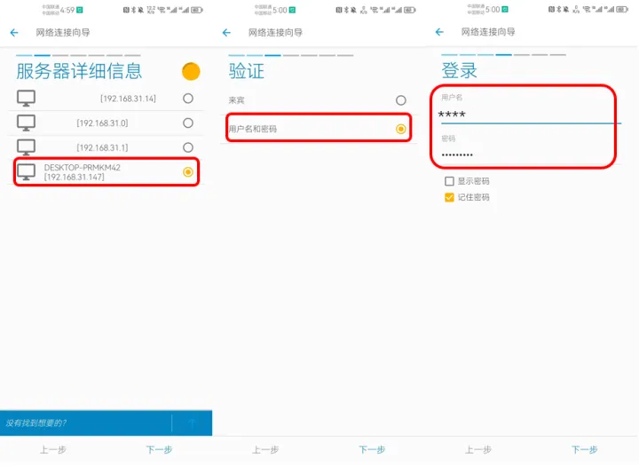
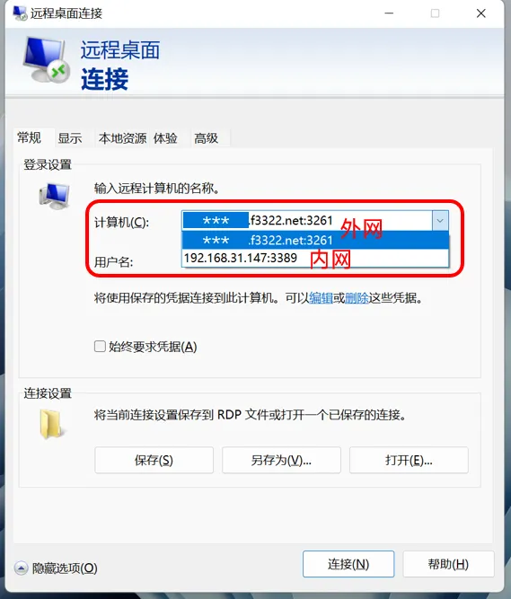
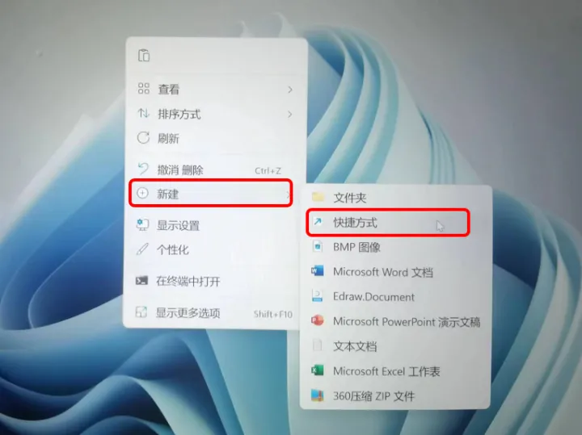

# 教你不花一分钱，用十分钟把旧电脑打造成自己的Windows版NAS系统

## 0、Win-NAS方案最适合的两类用户群体：

1. 有家庭文件储存/共享需求，但又不想投入太多预算。
2. 计划入手成品NAS，但又不清楚自己的真正需求，担心大几千块钱买回来后吃灰。

这两种情况下，**强烈建议大家都可以先尝试一下Win-NAS方案**。如果能够满足需求，就继续用下去。如果确实需要更多功能，再花钱购买成品NAS更进一步。

## 1、 什么是NAS

NAS(Network Attached Storage)即网络附属储存设备。**简单来说，就是接在网络上的硬盘。**拥有自己的NAS，相当于把网络云盘放在自己家里，不仅使用起来更加方便，安全，也不受非会员限速影响，还能在服务器上部署更多的功能，如远程下载，远程桌面，自动备份等。

**在智能家居时代，大家对数据共享及储存的需求也越来越高。因此一台属于自己的NAS设备，能为日常生活和工作都带来极大便利。**

## 2、 NAS搭建方案

目前主流NAS搭建方案有以下几种：

### 第一、**购买品牌成品NAS主机**

如群晖，威联通，铁威马等，基本上属于买软件送硬件。优点是稳定性高，功能强大。缺点则是价格很贵，入门版双盘位X86型号也要2000-3000元(不含硬盘)左右，使用起来也需要一定的门槛和学习能力。

### 第二、**自己DIY动手打造NAS系统**

一般是用旧电脑或者配一个功率较低的主机，安装黑群晖等系统。优点是能获得和正版系统相似的使用体验，但缺点是部署门槛极高，需要一定的网络知识并熟悉Linux系统，同时使用盗版软件总归会有一些风险(包括法律风险和安全风险)及不稳定因素存在。

### 第三、就是我今天要告诉大家的方法

同样也是使用一台旧电脑，但不使用专业的NAS系统，而是基于**我们日常再熟悉不过的Windows 10打造**，在不安装第三方软件，仅使用Windows自带的SMB，WebDav等网络共享协议情况下，也能满足一般的家庭NAS需求。

这种方法的好处是**不用额外花钱**就能享受NAS带来的便捷和乐趣，并且**过程十分简单**，会用Windows就能完成。相比Linux下的繁琐操作，**Win-NAS所有的搭建都在我们日常所熟悉的桌面环境中完成，对电脑小白来说极度友好，并且即便系统崩溃，也可以非常轻松的将硬盘插入任何其他一台Win系统电脑读取。**

如果要说缺点的话，可能就是功耗会稍高于专业的NAS主机。但如果使用低电压CPU的话，其实也高不了太多，另外系统长期开启的稳定性也会略逊于专业设备，但可以采用定时自动开关机，或仅需要时开机等方式来加强。接下来，我们就正式开始！

## 3、Windows 10系统NAS搭建所需硬件

1. 装有Windows 10专业版系统的台式电脑或笔记本电脑一台，配置方面只要能够流畅运行Win10即可。配有低功耗CPU和大容量硬盘的机型更好，但不强求。
2. 有大容量储存需求或资料冷备份需要的，可以备1-2个移动硬盘或硬盘柜，看个人需求。
3. 家里有网，有路由器。


目前我自己使用的是一台9年前的Acer笔记本，配备4代i5-4210H和4G内存+5400转机械硬盘，能满足日常使用

## 4、在开始之前需要先了解的一些事情

虽然搭建的过程并不复杂，但在正式开始之前，了解一些相关的知识和名词，可以让我们更快的理解每一个步骤，也**方便在使用过程中，系统万一出现问题时，自己能够有能力进行故障排查和修复。**

### **4.1 公网IP/内网穿透**

在IPv4协议下，公网IP数量非常有限。互联网运营商(电信/移动/联通等)不可能为每个用户分配独立公网IP地址。目前99%的国内家庭网络，默认都是运营商内网IP，也就是说一个单元，一个小区，甚至一片区域才能够拥有一个公网IP作为共同的出口。

这种情况下，想从外部网络访问家中的服务器是很困难的，因为终端根本找不到你家的具体地址(真正的IP地址)。因此，**在搭建家庭NAS服务器并且想要从外部网络访问的话，最好的办法就是从运营商处要到公网IP。**

如何才能要到公网IP呢？其实也简单，打电话给运营商客服，说“我想要公网IP”即可，一般都是免费的。如果被问到具体原因，就说家里

需要安装监控或NAS。但具体是否能够要到，取决于你所在地区和运营商。根据我的了解和自身经验，如果用的是电信网络且身处较发达地区，如江苏，广东，上海，北京等，是非常容易的，比如我自己申请的整个流程就是打了个不超过3分钟的电话而已。而联通和移动整体上拿到公网IP的可能性相对较低。至于广电，长城等小运营商，则几乎没有任何希望。

**总体来说，现在随着时间的推移，申请公网IP越来越困难。因此强烈建议有这方面需求的小伙伴趁早下手。**

**如何识别自己家是内网IP还是公网IP**

识别自己家中IP地址类型，方法非常简单。进入光猫管理页面，查看**WAN IP**。如果WAN IP是192，172，10或100开头，那么你就是内网IP。


> 光猫管理页面的进入方法：通常是在浏览器地址栏中输入192.168.0.1或192.168.1.1。登录账号和密码可以在光猫背面的贴纸上找到。

如果不是这四个开头的话，那么再去百度搜索框中输入“ip”两个字母。若光猫中的WAN IP和百度显示的IP一致，恭喜你已经拥有公网IP了。


再次强调一下，只有在有公网IP的情况下，才能够获得最好的外网访问体验。如果实在无法获得公网IP，又有外网访问NAS服务器的需求，那么只能退而求其次，采用一些第三方内网穿透方案(工具)，如FRP，花生壳之类，缺点是需要一定的技术门槛，同时有些需要付费，并且稳定性和速度也都不尽如人意。**因此这篇文章中的外网访问方式，都是基于有公网IP的情况下进行的。**

### **4.2 光猫桥接/路由器拨号**

在获得公网IP后，需要立刻做的第二件事情，就是**将光猫由拨号模式改为桥接模式，**然后使用路由器代替光猫进行PPPoE拨号上网。当改为桥接模式后，光猫唯一负责的事情就是光——电信号转换，其他工作均由路由器来完成。由于路由器的性能通常比运营商“免费赠送”的光猫强大许多，因此在修改完毕之后，理论上来说网络也会更加稳定，质量更高 。

光猫改桥接的方法也非常简单，和获取公网IP一样，打电话给运营商客服，然后告诉小姐姐“我要把光猫改成桥接模式”。运营商会从后台直接下发配置到光猫，我们唯一需要做的事情就是把光猫重启一次(拔掉电源再插上)。

当桥接模式修改成功后，你肯定会发现无法正常上网了。当然，因为我们需要使用路由器代替光猫进行拨号。进入路由器设置页面，在“上网方式”中，将原来的DHCP改为PPPoE，然后填入自己的宽带账号和密码，其他项目选择“自动配置”即可。如果不知道自己家的宽带账号密码，还是打电话去运营商客服询问小姐姐即可。


网上有很多教程教大家如何不通过运营商自行更改光猫桥接，但袋鼠叔叔非常不建议大家这样做，因为自己修改不仅过程非常繁琐，而且还可能搞到上不了网。即便改好了，运营商在发现后也可以重新下发配置改回默认状态。**只要运营商愿意提供公网IP，就一定能够帮你把路由改成桥接模式，所以还是通过运营商修改最好。**

### 4.3 DDNS(动态域名解析)

虽然已经获取了公网IP，但运营商提供的公网IP都是动态的，也就是说在我们重启路由器或运营商重启服务端之后，家里的公网IP地址就会变化，比如从58.214.253.109变成213.298.65.104。这样一来，**如果我们的IP变动之后，外网设备仍然使用之前的IP，肯定无法访问**。

解决问题的方法，就是使用**DDNS(动态域名解析)**，**将我们不断变化的公网IP映射到一个固定的域名上**。每次连接网络时，DDNS服务商负责提供域名解析服务，用户**只需要输入一个固定的域名即可访问家中的服务器**，无论IP地址本身如何变动，都是一样的。

目前**几乎所有的家用路由器本身都内置DDNS功能**，只是支持的服务商略有不同。这里就以我自己的小米AX9000为例进行教学，其他品牌/型号路由器的设置方法大同小异。


进入路由器后，找到DDNS设置页面，点击“添加服务”按钮后，在下拉菜单中可以看到此路由器支持的服务提供商。小米AX9000支持花生壳，公云，Dyndns和No-ip四家，有些路由器还支持阿里云等。经过一段时间的使用，我个人感觉公云的稳定性比较好，因此教程以公云为例，当然，如果你想用其他家的服务，整个设置流程都是大同小异的：

进入公云网站后，首先注册一个账号，过程非常简单，填写用户名，邮箱地址，密码和手机即可。


注册完成后，直接登陆，然后在左侧的“域名列表”中，点击“创建动态域名”。


对于一般家庭用户来说，我们选择免费的域名后缀及解析服务即可，前面的域名可以随意编写，只要自己记得住，并且尚未被别人占用就行。


创建完成后，我们就可以使用这个DDNS服务了！回到路由器管理页面的DDNS设置中，我们将刚刚注册的用户名，密码以及主机名称(也就是刚刚我们注册的域名)填入，然后状态检查时间(每隔多长时间检查DDNS)和强制更新时间(每隔多次时间强制更新DDNS)按需填入(我这里为了保险起见，填的是5分钟和5小时)。


点击确定后，这条DDNS规则就会被创建。只要在状态中显示“连接成功”，就可以了！


现在开始，如果需要外网访问我们的NAS主机，就不再需要IP地址了，而是使用“******.f3322net:端口号”即可。**无论公网IP如何变化，都不会造成影响。**

### 4.4 DHCP静态IP分配

当家里有设备联网时，路由器会自动分配给当前设备一个内网IP地址，比如192.168.31.109。但这个地址一般是动态的，也就是说，即使同一台笔记本电脑，在重新启动(重新连接路由器)之后，内网IP就会变化。所以我们如果还使用之前的IP进行连接，就会失败。

因此，对于家用NAS服务器来说，我们需要将它的内网IP通过路由器的“静态IP分配”功能，捆绑在一个固定的IP地址上，确保每次重启开机后，服务器的内网IP都不变。**当我们将IP地址和某一个设备绑定时，本质上绑定的是此设备的网卡MAC地址，通常是AA:BB:CC:11:22:33这种形势。**

**需要特别注意的是，台式机和一部分笔记本都具有无线及有线双网卡，两个网卡是互相独立且MAC地址不同的。如果你用作NAS服务器的电脑本身有RJ45网口，那么强烈建议使用有线方式连接路由器。有两个重要原因：**

1. 相比无线连接，网线连接速度更快，同时稳定性也更高。
2. 只有网线连接的情况下，才可以使用WOL(Wake-On-Lan)远程唤醒功能(我们后面会讲)。

那么，如何找到我们电脑网卡的MAC地址呢？很简单。同时按下键盘左下角的windows键+字母R，然后在跳出的运行框中输入“cmd”后回车，然后在跳出的命令行中敲入ipconfig/all，然后回车即可。

在出现的信息中，找到“以太网适配器 以太网”下面的“物理地址”，：后面显示的一组12位编码就是该网卡的MAC地址。如果你的电脑本身没有有线网卡，使用无线连接的话，那么就去看无线网络适配器中的物理地址。


拿到MAC地址后，将MAC地址和下面对应的IPv4地址填入路由器的“静态IP分配”表格中。绑定成功后，这台电脑无论以后重启多少次，哪怕重新安装Windows系统，内网IP地址都将保持不变。


### 4.5 端口转发

如果将IP地址理解为我们电脑的“大楼地址”，那么端口则相当于电脑中每个独立服务的“门牌号”。因此我们在外网访问时，如果只知道IP地址的话，也仍然无法进入某具体服务(功能)。另外，出于安全考量，用户从网络运营商处获得的公网IP，都是被封掉常用端口的，如80和443等。所以**我们需要为NAS服务器中的每一项服务(功能)设置一个内网端口号，并且将这个内网端口号转发到外网，才能实现远程访问。**


同前面的DDNS和静态IP分配一样，**基本上所有路由器都自带端口转发功能**，我们只要在路由器中，**将内网IP+内部端口号和公网IP+外部端口号一一对应**即可。需要特别注意的是，在Windows系统中，有一些服务的内部端口号是规定好的如，如Wake On Lan是7或9，RDP(远程桌面)是3389。而另一些服务，如WebDav等，可以由用户自行定义。


无论内部端口号是系统默认还是用户自定义，都强烈建议大家使用不同的外部端口号来映射内部端口号，比如远程桌面的内部端口号为3389，我将对应的外部端口号设置为3261(或者其他任意数字)，以提升网络安全性。另外在协议选择方面，如果你不能十分确定此服务的具体协议类型，可以同时选择TCP和UDP两种。

**当我们做完上面这五个步骤之后，外网——内网就被完全打通，我们可以顺利从世界上任何一台联网的电脑，访问自己家中的NAS服务器了！整条链路的原理如下：**


### 4.6 Windows Defender防火墙设置

很多情况下，我们会发现所有的设置都是正确的，并且主机也能够从外网ping通，但就是死活连接不上特定端口(服务)。这种情况很大可能是被Windows防火墙给阻拦了，因此我们需要在服务器的防火墙设置中，将端口手动放行，方法如下：

进入控制面板→系统和安全→Windows Defender防火墙中，点击左侧的“高级设置”，在弹出窗口中选择左侧的“入站规则”，然后点击右侧的“新建规则”。


在规则类型页面，我们选择“端口”，点击下一步后，选择端口协议并填入端口号，然后接下来的操作和配置文件维持默认选项，完成后给此规则起一个名字即可。


**这样一来，特定服务的端口就可以被防火墙放行，而其他端口则仍然会被防火墙阻挡，确保网络安全性。**

## 5、系统安装及服务部署

### 5.1 Windows 10系统安装

在NAS系统方面，我们需要使用**Windows 10专业版**，而非家庭版。因为专业版比家庭版主要多出了Windows远程桌面，原生Hyper-V虚拟机，组策略，域管理等一些功能。

如果以前的系统已经用的时间很久，电脑有卡顿现象，**强烈建议大家重新安装一次Windows10专业版**，**并且不要安装任何奇怪的第三方软件**，尤其是XX电脑助手，XX杀毒等。纯净版的系统有助于NAS服务器的稳定运行，不会出现各种莫名其妙的问题。

**关于Windows10专业版的完全安装教程，我已经为大家准备好了，直接照抄就行：**

**作为NAS服务器使用时，我们要将Win10系统的电源设置调整一下，避免出现长时间挂机后自动休眠或关机的情况**。按照以下路径：

控制面板→硬件和声音→电源选项→更改计划设置→更改高级电源设置 中，我们将

“在此时间后睡眠”和“允许混合睡眠”全部修改为“从不”或“关闭”，然后将“在此时间后休眠”选项，按照自己的需求来进行更改。


如果是笔记本电脑，但需要合盖使用，还要在电源选项中，将“关闭盖子时”设置为“不采取任何操作”。


最后，作为NAS主机使用的电脑，其实对于性能的要求并不是很高，特别是CPU性能。但有些机型，特别是笔记本，很容易过热。我们在电源选项中，将“最大处理器状态”调整到99%，这样就等于是**关闭了CPU的睿频功能**，将CPU限制在基准频率以下，**对散热有非常明显的帮助**。


### **5.2 本机账户密码设置**

想要将一台Windows 10电脑作为NAS服务器使用，就**必须设置本地账户登录名和密码，**否则某种意义上等同于裸奔，非常危险。建议大家**尽可能设置强密码**，比如同时含有大小写字母，数字及特殊符号，可以大幅提升安全性。注意，这里的账户指的是**本地账户**，而不是Microsoft账户。

**本机账户密码设置路径：设置→账户→登录选项→密码**


### 5.3 设置共享文件夹并映射至局域网内的其他电脑

如果想要将NAS服务器中的某个磁盘或文件夹，共享给局域网内的其他电脑，按照下面的步骤操作即可，我这里以共享整个C盘为例：

右键单击想要被共享的磁盘，然后在弹出菜单中选择最下方的“属性”。在属性中，点击最上方的“共享”选项卡，然后点击“高级共享”。


在高级共享中，将“共享此文件夹”前打钩，然后点击下方“权限”。在权限设置中，将Everyone的三项权限“允许”全部打钩，然后确定，退出。


回到磁盘属性页面中，这次我们再点击最下方的“网络和共享中心”。


进入“网络和共享中心”后，我们首先展开“专用”菜单(点击右边的箭头)，然后选中“启用网络发现”，并将下面一行“启动网络连接设备的自动设置”前打上钩。然后将“启用文件和打印机共享”也选中。


"专用"菜单设置完毕后，我们再展开”来宾或公用“菜单，然后将”启用网络发现“和”启用文件和打印机共享“都选中。


最后，我们展开“所有网络”菜单，依次选中“启用共享以便可以访问网络的用户可以读取和写入公用文件夹中的文件”、“使用128位加密帮助保护文件共享连接”及“有密码保护的共享”三项，然后点击最下方的“保存更改”，完毕！

至此，NAS服务器上的C盘已经设置完毕共享。但是想要在家里局域网中其他的电脑上访问的话，我们还需要在需要访问此文件夹的电脑上做一个磁盘映射，才可以像使用本地硬盘一样，远程访问NAS上的磁盘。方法非常简单：

打开需要访问NAS共享盘的“此电脑”——点击最上方的三个点，然后在弹出的菜单中点击“映射网络驱动器”，如下：


在映射网络驱动器窗口中，我们随便选择一个喜欢的驱动器盘符，然后在文件夹后面的文本框中填写“\\NAS主机IP地址\盘符”即可。比如我这里，NAS主机的内网IP地址是192.168.31.147，共享盘是C盘，那么我就填写

```shell
\\192.168.31.147\C

```


点击完成后，在“此电脑”的“网络位置”中，就可以看到共享的C盘了！


**如果想要共享NAS服务器中的其他盘符，按照以上方法重复操作即可。注意，通过USB接口插在NAS服务器上的移动硬盘，也可以使用同样的方法共享给局域网中的其他电脑！**

### **5.4 开启IIS管理控制台，SMB服务及WebDav服务**

实际上，Windows10默认的局域网磁盘共享就是使用SMB协议的，但是版本为SMB2.0。而手机上的一些文件管理器App，仍然在使用SMB1.0版本协议。因此我们最好在Windows10中，同时开启SMB1.0兼容，这样后期在手机上访问NAS共享硬盘的兼容性会好很多。而开启IIS管理控制台，则是为了稍后部署WebDav服务。

**5.4.1开启IIS管理控制台和WebDAV服务**

WebDav是一种可以在服务器存储空间上划分出一块区域作为共享储存空间的互联网方法，可以使用用户名和密码来进行访问，同时直接拷贝，编辑或删除共享空间内的文件。

进入NAS服务器的控制面板，然后点击“程序”，然后在“程序和功能”菜单中，点击“启用或关闭Windows功能”。


进入“启用或关闭Windows功能”菜单后，我们展开“Internet Information Services”,然后展开“Web管理工具”，将“IIS管理控制台”勾选。勾选之后，Windows会自动开始安装ISS组件，可能需要1分钟左右时间。

接着，我们继续展开“万维网服务”，将“安全性”及其下面的9个子目录全部勾选。

最后，展开“常见HTTP功能”，勾选其中的“WevDav发布”，“静态内容”，“默认文档”和“目录浏览”四个子项目。


**5.4.2 开启SMB1.0协议兼容服务**

我们继续在“启用或关闭Windows功能”菜单中，找到SMB1.0/CIFS文件共享支持，将其本身和下属的三个子菜单全部勾选。然后将下方的“SMB直通”也勾选，最后滚动到最底部，找到“远程差分压缩API支持”，同样勾选。


### 5.5 在NAS服务器上部署WebDav服务

通过上面的一番操作之后，我们已经在NAS服务器上开启了IIS功能和WebDav服务，但还需要对WebDav服务进行一些设置才能正常使用。

我们直接在桌面左下角的搜索框中输入“Internet Information Services 管理器”，在上方“最佳匹配”中会自动跳出，单击进入即可。


进入IIS管理器后，点击左侧电脑名称前面的小三角，将目录展开。然后右键点击“网站”后，在弹出菜单中左键点击“添加网站”。


在“添加网站”窗口中，我们首先按自己的喜好编一个网站名称并填入，比如我这里编的是NAS。然后在“内容目录中”，填入你想要开放访问的共享文件夹地址。**这里有一点需要特别注意，就是WebDav协议原生不支持C:\或D:\这类磁盘根目录，因此我们填入的路径，必须是一个文件夹，不能是磁盘根目录！**

接下来在“绑定”中，选择默认的HTTP类型，然后在IP地址中，填入NAS服务器主机的内网IP地址，我这里是192.168.31.147。然后将端口号修改为任意数字，不要用默认的80！比如我这里随便设了一个4987，这就是我们WebDav服务的内部端口号，一定要记牢，可以用纸抄下来或者拍照记录，最后的主机名留空不写。全部设置完毕后，点击确定即可。


接下来，我们用鼠标左键点击选中刚刚创建的网站，然后在右边的“主页”中，双击WebDAV创作规则，记住一定是双击，不是单击。


进入WebDAV创作规则后，我们点击右侧“操作”菜单中的“启用WebDAV”


接着点击“操作”菜单中的“添加创作规则”


在“添加创作规则”页面中，我们选中“全部内容”和“所有用户”，并将“权限”中的读取、源、写入前面全部勾选后，点确定退出。


接下来，我们为新建的网站配置身份认证。仍然点击选中左侧我们新建的网站，然后双击右侧“身份验证”。


我们将“Windows身份验证”和“基本身份验证”两项启用，其他项目全部禁用。


再次进入我们刚刚创建的网站主页，双击右侧的“目录浏览”


然后我们点击右侧的“启用”，将目录浏览功能开启。


最后，我们再次回到新建网站的主页，点击右侧“管理网站”下面的“重新启动”。


这时候，我们的WebDav服务就设置完成了！为了验证是否能够正常访问，可以点击右侧浏览网站下面的网址(IP地址)：


点击后，浏览器会自动弹出并转到WebDAV的页面，并跳出登录框。输入这台电脑的登录账户和密码，也就是在前面5.2章节中设置的Windows登录用户名和密码。


点击确定后，就可以看到WebDav共享文件夹中的文件了！如果能看到Web.config这个文件，就说明所有设置都成功了！


### 5.6 在外网电脑中挂载NAS的WebDaV共享文件夹

当NAS的WebDaV布置好后，我们最终目的，是在世界上任何一台联网电脑上，都能够像访问本地文件夹那样访问NAS上的WebDaV共享文件夹。所以现在需要使用另外一台电脑(通常是我们的主力机，或者办公室电脑)来做磁盘映射。

网上很多教程，会告诉大家必须使用第三方软件Raidrive来完成这项工作，但其实没必要，因为使用Windows自带的磁盘映射工具就可以。不过这之前，**还需要将WebDav的内网IP和内部端口号转发到公网上，才能实现外网访问。**

还记得我在4中介绍的DDNS(动态域名解析)和动态域名转发吗？现在，进入路由器管理页面，新建一个“端口转发规则”——

随便填写一个外部端口号(记住这个端口号！别忘了！)，然后在内部IP地址中，写入我们NAS主机的IP，并且在内部端口号中，填入我们WeBDaV服务的端口号(还记得吗？刚才提醒你你用笔抄下来的那个O(∩_∩)O）


然后我们点击“保存并生效”，让这条端口转发规则生效即可。当然，每个品牌/型号的路由器设置方式可能略有区别，大家自己注意。


**设置完成之后，NAS上原本在内网的WebDaV共享服务，就转发到了公网上。当从外网访问 \**\**\*.[http://f3322.net:5894](https://link.zhihu.com/?target=http%3A//f3322.net%3A5894)的时候，就等同于访问内网192.168.31.147:4987！**

**但是，如果现在从外网访问WebDav，仍然是无法连通的，还记得原因吗？因为NAS主机的防火墙还堵着呢。所以我们需要在NAS的防火墙中，将WebDaV的内部端口手动放行。具体方法，请照抄4.6中的步骤。**

当完成防火墙手动放行后，就可以真正从外网访问NAS主机的WebDaV共享文件夹了！我们现在转到需要访问NAS共享文件夹的电脑，然后进入“此电脑”窗口，鼠标左键点击最上方“查看”右边的三个点，然后在弹出的菜单中点击“添加一个网络位置”。


在添加网络位置向导中，我们直接点击“下一页”。


然后点击“选择自定义网络位置”后，继续点击“下一页”。


来到“指定网站的位置”页面，在“Internet地址或网络地址”框中，填入NAS主机的WebDaV共享服务公网地址和端口。由于我们设置的WebDav采用Http协议，在网址的前面需要加上http://，也就是http://******.[http://f3322.net:5894](https://link.zhihu.com/?target=http%3A//f3322.net%3A5894)。**这里注意，http://是一定要加的，不加的话会报错。**

地址填写完毕后，点击“下一步”，会弹出验证窗口，输入NAS主机的登录密码即可。这里注意，如果这台电脑是你的个人电脑，那么可以勾选“记住我的凭据”。这样以后在使用的时候，就不需要每次都输入密码了。**如果是公用电脑的话，千万不要勾选“记住我的凭据”！**


如果密码输入无误，验证通过的话，那么系统将会要求我们为这个网络位置创建一个名称，这里大家根据自己的喜好随便起名字就行，后面再改起来也很方便，我就还写“NAS”好了。命名完成后，仍然点击“下一步”。


接下来，我们勾选“单击完成时打开这个网络位置”，然后点击右下角的“完成”。


至此，我们就已经成功将NAS主机上的WebDav共享文件夹挂载在了另外一台电脑上。只要NAS主机开启，那么这台电脑就可以在世界上任何一个联网的地方，像使用本地硬盘一样使用NAS共享文件夹了！


### 5.7 使用手机访问NAS主机中的共享文件夹

除了电脑以外，手机端的文件共享其实更加重要。在打通手机和NAS共享文件夹之后，我们可以随时随地将手机中拍摄的照片，视频和文档上传到NAS中保存起来，也可以随时观看NAS中存储的电影或者照片，非常方便。

**Andriod端SMB/WebDav文件管理神器——Solid Explorer**

Solid Explorer是安卓端的一款文件管理App，最大特色是支持众多网络协议，如SMB/WebDav/FTP等等等等，同时设置和使用都非常方便。


另外，其独有的**双栏文件浏览窗口**简直是神来之笔，使用户在复制粘贴文件的过程中，无需在不同的文件夹中来回选择，使用体验极度舒适。


大家可以去百度搜索Solid Explorer下载。

**5.7.1 局域网SMB共享**

首先来设置局域网情况下的文件夹共享。打开Solid Explorer，点击右下角的黄色+号，然后点击“新建云连接”，在连接类型中选择“LAN/SMB”，然后下一步。


接下来，App会自动扫描局域网内所有可连接的服务器，并且显示其内网IP地址。在这里，选择我们的NAS主机，也就是192.168.31.147。然后在验证页面，选择“用户和密码”，并在登录页面输入NAS主机的登录用户名和密码。**再一次强调，如果是你自己的手机，那么可以勾选“记住密码”，否则的话请勿勾选。**




接下来，在“设置高级选项”中，选择“是”，在协议版本中选择“SMB2(推荐)”，然后在查看页面确认信息后，点击“连接”即可完成全部设置。


在连接成功后，就可以通过点击左上角的三条横线进入“储存设备”目录，看到局域网共享文件夹了！


**5.7.2 公网WebDaV共享**

**设置完局域网内的SMB共享之后，我们还需要再设置一次用于公网的WebDav共享，这样才能在外网通过手机访问我们的NAS主机。**

WebDav的设置方式和SMB类似，我们仍然在首页点击+新建云连接，但是在连接类型中选择WebDav。接下来的HTTP连接类型中，选择HTTP，然后将NAS主机的动态域名和外网端口号填入“服务器详细信息”页面。“路径”留空，“显示名称”可填可不填(填的话自己编一个喜欢的名字)。验证环节，仍然使用“用户名和密码”方式。


接下来的流程和SMB连接一样，都是输入NAS主机的登录密码，二次确认所有信息后，点击“连接”，成功后即可在“储存设备”中，看到WebDav共享文件夹了！


除了可以在手机上读取/写入NAS主机上的文件之外，Solid Explorer还内置视频播放器和图片播放器，支持多种格式的影音图片播放。所以我们也可以使用这个App，直接在手机上播放NAS中的电影。

以上是安卓手机通过SMB及WebDav协议，分别在局域网和外网环境中，连接NAS主机的教程。苹果用户可以自行到App Store中下载Documents这个应用，同样支持SMB及WebDav协议的文件管理，设置和使用方式同Solid Explorer大同小异。

## 6、WOL远程唤醒及RDP远程桌面安装

在第五部分全部完成后，整个Windows10 NAS主机实际上已经可以正常使用了。但为了更好的体验，我们需要想办法**实现对NAS主机的远程开关机操作**，**以及远程桌面控制**(也是Win系统最大的特色之一)。这样在需要时，可以随时远程开启/关闭主机，不仅更方便，而且还节能，也更加安全。

### 6.1 WOL(Wake-on-Lan)远程唤醒

WOL远程唤醒是一种远程发送特殊网络封包(Magic Packet,魔幻包)给某台电脑，让其从关机或睡眠模式直接开机的功能。一般来说，最近15年以内的电脑，无论笔记本还是台式机，只要带有网线插口，99%支持此功能。

**想使用WOL远程开启电脑的话，需要做好下面4件事情：**

第一、电脑和路由器Lan口之间必须使用网线连接。

需要特别注意的是，如果电脑通过无线方式连接路由器，则WOL功能100%不可用。因此对于一些不带网线接口的超轻薄笔记本来说，这个功能就可以直接放弃了。

第二、在BIOS中将WOL功能设置为开启(Enabled)。

BIOS的进入方式，在 5.1的Windows10系统安装教程中，已经讲的非常清楚，不再重复。这里有一个比较坑的地方，就是不同品牌，甚至不同型号的电脑/主板，对于WOL功能的叫法都不一样，比如有的叫做Wake on Lan，有的叫做PowerOn by Lan，甚至有的叫做Wake-up by PCI等等。所以**大家在找的时候一定要注意，在不确定的情况下，可以一项一项去尝试，或者干脆把所有的“可疑”选项都打开。**


**第三、在Windows系统中，将网卡属性中的“网络唤醒”功能开启。方法如下：**

在桌面左下角搜索框中输入“查看网络连接”，然后打开。


右键单击“以太网”，在弹出的菜单中选择“属性”。


进入属性窗口后，点击“配置”，转到“电源管理”选项卡，将下方的三个选项全部勾选。

- √允许计算机关闭此设备以节约电源
- √允许此设备唤醒计算机
- √只允许幻数据包唤醒计算机

**这里会出现一个大坑。**有些小伙伴的电脑明明自带网口，却在网卡属性面板中根本找不到“电源管理”选项卡。这很可能是因为Windows10系统自动安装的网卡驱动版本不对，只能实现上网等基本功能，但一些高级设置是缺失的。解决方案是去到电脑或主板制造商官网，下载并安装官方正式版驱动程序。


接下来，我们需要转到“高级”选项卡，然后将“关机网络唤醒”和“魔术封包唤醒”的值都变成“开启”。**这里会出现另一个大坑，**就是由于网卡品牌型号不同，每一种网卡对于WOL的叫法都有区别。有的网卡甚至这里可能还是英文版的。因此大家一定要注意，把所有和“关机唤醒”、“网络唤醒”和“魔术包唤醒”等相关的选项全部打开。


**接下来，是关于WOL的第三个坑**。有一些小伙伴表示，如果Windows10开启了“快速启动”功能，WOL就失效了。但是对于另外一些电脑，即使开启了快速启动，也不影响WOL。因此如果在以上所有设置都正确的情况下，WOL仍然无效的话，可以将“快速启动“关掉试试。

路径：控制面板→硬件和声音→电源选项→系统设置→关机设置→启用快速启动


在全部设置完毕之后，如果WOL功能起效的话，将电脑正常关机的情况下，网线接口仍然会持续闪光，像下面这样。如果关机后网口没有闪光的话，很可能说明WOL功能并未被激活。


第四、在发起唤醒的终端设备(手机/电脑)上，安装WOL软件或App。

在电脑端，我习惯使用Depicus出品的WakeOnLanGUI这个小工具(软件)，下载之后直接运行即可，大家可以去网上下载，或者私信我获取。在页面填写信息时，我们首先需要将网卡MAC地址和子网掩码填上，之后选择Send Option是Local Subnet(局域网唤醒)还是Internet(互联网/外网唤醒)。

如果是局域网(内网)唤醒的话，那么在Internet Address中填写NAS主机内网IP地址即可。这**里需要特别注意内网端口号，有些网卡的WOL服务端口是7，有些网卡是9，但总归是这两个中的一个，大家自己去试一下就可以了。**

如果需要从外网唤醒，那么我们仍然需要先在路由器中进行端口转发，将192.168.31.147:7转发到外网上去，然后在防火墙中将端口放行。操作方法前面我们已经讲过很多次了，这里就不再重复。设置完成后，在Internet Address中，填入DDNS域名，然后将端口号填写为转发后的外网端口号即可。

在所有的内容都填写正确后，点击左下方的Wake Up。如果运行正常，就会看到一行提示“Magic Packet Sent To XXX.XXX.XXX.XXX”。


在手机端，我目前使用的WOL唤醒App是“Wake On Lan”。整体设置和PC版的基本一致，进入App后点击右下角的+号，然后一项一项填写即可，非常简单。


**WOL全部设置完毕后，无论使用电脑还是手机，无论在局域网还是外网，我们都可以随时启动家中的NAS主机，非常方便。**

### **6.2 Windows远程桌面(Remote Desktop)**

在有公网IP的情况下，Windows自带的远程桌面确实是同类型产品中体验最出色的之一，毫无疑问。和ToDesk，TeamViewer等第三方软件相比，RD无需安装，并且全免费，流畅程度也是极度丝滑，还不通过第三方服务器，安全性极高。

**还是需要提醒大家一下，并不是所有版本的Windows系统都支持远程桌面功能。对于目前最常用的Windows10和11来说，情况如下：**


通过表格可以看出，首先Win10专业版和Win11专业版，都支持远程桌面全功能，而Win11家庭版只可以发起控制，不能作为被控端。最后Win10家庭版则完全不支持远程桌面。

因此我们只要确保你的NAS主机安装了Win10专业版，日常主力电脑安装的是Win10专业版或Win11家庭版/专业版，就可以正常使用远程桌面功能了。

**首先，我们需要在被控制的NAS主机上，开启远程桌面功能，路径如下：**

设置→系统**(鼠标滚轮滚到最下方)**→远程桌面，将右侧“启用远程桌面”开关打开


在开关下方的“高级设置”中，我们点开后，确保勾选“需要计算机使用网络级别身份验证进行连接(建议)”。另外，远程桌面的默认内网端口号为3389，记住这个端口号就可以，一般我们不需要去改动他。如果实在想改的话，需要在注册表中进行修改，具体方法可以点开下面的“了解如何更改远程桌面侦听端口”。


这样，在NAS主机(被控端)上，我们的远程桌面就已经开启了。现在我们转到另一台发起主控的电脑上，在桌面搜索框中输入“远程桌面连接”并点击进入：


打开远程桌面界面后，连接的方法非常简单。如果主控和被控电脑处于同一个局域网内，那么只要在“计算机”中输入被控电脑的内网IP+端口号(3389)即可。

如果想从外网访问的话，还是老规矩，需要先到路由器中做一个端口转发，将内网3389端口转发到公网并在防火墙中放行，然后在“计算机”中输入DDNS域名+外网端口号即可。



为了方便以后使用，我们还可以为远程桌面连接创建一个桌面快捷方式，这样以后就不用每次从搜索框进入了。

桌面任意空白处单击鼠标右键→新建→快捷方式



在“请键入对象的位置”中，输入“mstsc.ext”并点击下一步。


接下来将其命名为“远程桌面”，以后我们就可以直接通过桌面上的快捷方式进入了！


除了PC端以外，在安卓和IOS端，Windows远程桌面也有免费的官方版本提供。以安卓为例，到应用市场中下载RD客户端，进入App后，点击右上角的+号，然后点击“手动添加”。


将被控电脑的IP地址(或DDNS域名)+端口号输入之后，就可以在手机上进行远程桌面控制了！整个手机屏幕都会被作为触控板使用，来控制远程桌面内的鼠标，操作起来非常丝滑。


如果使用的是IOS系统，那么去App Store同样下载RD Client即可。MacOS用户请下载Microsoft Remote Desktop for Mac。

至此，我们的Win-NAS系统基础搭建工作就已经做完了。如果还想实现更多功能，如远程下载(迅雷/PT)，云盘(百度云)文件夹自动同步，甚至远程游戏挂机，远程办公等，都可以通过在NAS主机上安装对应的软件来实现。由于使用了最最常见的Win10系统，所以在使用和安装软件方面和日常没任何区别，比Linux要方便不少，几乎不需要任何学习门槛。

## 7、NAS系统实战应用

在完成整个Win-NAS的搭建之后，简单讲一下我目前是如何应用这套系统，以帮助大家能够尽快上手，使NAS成为真正日常的生产力工具和生活中的好帮手。

### 7.1 全家手机照片+视频备份

在NAS的共享文件中，我为每个家庭成员建立了一个属于自己的文件夹+公共文件夹，每个人都可以随时将照片和视频备份到NAS中。特别是对于有小孩的家庭来说，NAS的存在，不仅使家人在拍摄照片/视频时能够完全放开手脚，不用在意容量问题，而且可以长期保存，统一管理，不再会出现由于手机损坏等原因造成的资料遗失问题。等到许多年以后再看，也是一份美好的回忆。


### 7.2 居家办公

相信很多小伙伴都经常有居家办公的需要。在没有NAS的情况下，要么就是使用U盘/移动硬盘来转移文件，要么干脆直接把办公电脑带在身上，非常不方便。但是有了NAS以后，就可以将文件直接储存在共享盘中，并且不需要来回复制粘贴，导致版本错乱，同时也可以通过远程桌面进行更多操作。


### 7.3 作为智能家居设备的储存中心

一些需要储存空间的智能家居设备，比如摄像头，在没有NAS的情况下，只能插储存卡或者购买云存储服务，不是容易损坏，就是需要花钱，而且还有隐私风险。有NAS的情况下，我们可以将智能家居摄像头直接挂在共享盘上，几乎可以实现无限的储存空间，并且不用花钱，也不会损坏。


### 7.4 作为家庭影音中心

现在，越来越多的家庭都有不止一个影音设备，比如客厅的电视，卧室的投影仪，还有iPad和手机等移动终端。在没有NAS的情况下，在电脑上下载了影片之后，想要在其他设备上播放，得先拷贝到移动硬盘中，再插在其他设备上播放，非常麻烦。

在有了NAS之后，我们可以将影片放在共享盘中统一管理，家中其他任何设备通过局域网共享直接播放即可。另外，还可以在NAS上安装下载工具远程下载后直接存入共享盘。非常方便。


在投影仪中使用Kodi播放NAS中的电影

### 7.5 其他进阶功能

Windows10专业版原生内置WSL2(Windows subsystem for Linux)和Hyper-V虚拟机等功能，可以在其中原样运行Linux环境，比如安装Docker后同时作为HomeAssistant服务器，甚至软路由使用。


总体来说，这套基于Windows10专业版的NAS系统，虽然在专业程度和逼格方面确实略逊于成品NAS，但用来满足我个人目前的需求来说已经够了，所以还是那句话，建议对NAS有兴趣，但之前没有接触过，或者不想花太多钱在NAS上的小伙伴来说，先尝试一下Win-NAS，或许也是一个不错的方案。

