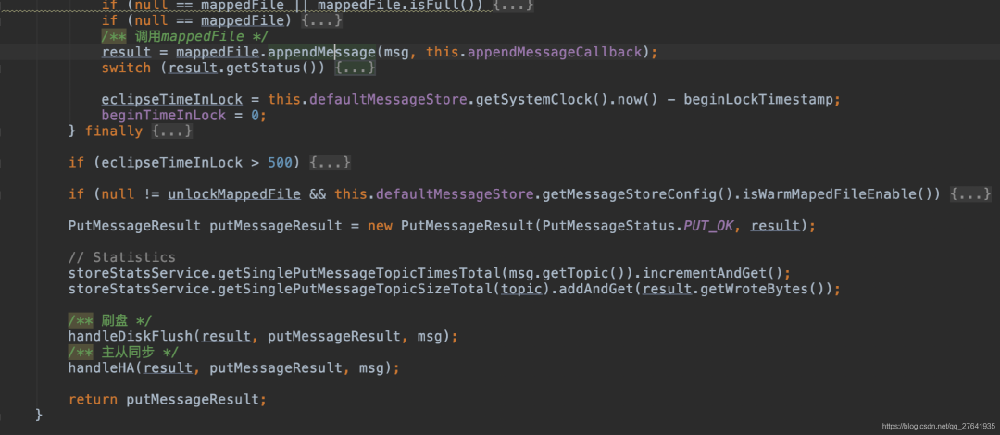

# RocketMQ底层原理和源码解析

## **1. RocketMQ的发展历史**

​    在2007年的时候，淘宝实施了“五彩石”项目，“五彩石”用于将交易系统从单机变成分布式，也是在这个过程中产生了阿里巴巴第一代消息引擎——Notify。在2010年的时候，阿里巴巴B2B部门基于ActiveMQ的5.1版本也开发了自己的一款消息引擎，称为Napoli，这款消息引擎在B2B里面广泛地被使用，不仅仅是在交易领域，在很多的后台异步解耦等方面也得到了广泛的应用。在2011年的时候，业界出现了现在被很多大数据领域所推崇的Kafka消息引擎，阿里在研究了Kafka的整体机制和架构设计之后，基于Kafka的设计使用Java进行了完全重写并推出了MetaQ 1.0版本，主要是用于解决顺序消息和海量堆积的问题。而在2012年，阿里对于MetaQ进行了架构重组升级，开发出了MetaQ 2.0，这时就发现MetaQ原本基于Kafka的架构在阿里巴巴如此庞大的体系下很难进行水平扩展，所以在2012年的时候就开发了RocketMQ 3.0版本。很多人会问到RocketMQ 3.0和MetaQ 3.0的区别，其实这两者是等价的版本，只不过阿里内部使用的称为MetaQ 3.0，外部开源称之为RocketMQ 3.0。在2015年，又基于RocketMQ开发了阿里云上的Aliware MQ和Notify 3.0。在2016年的时候，阿里巴巴将RocketMQ的内核引擎捐赠给了Apache基金会。

​    以上就是RocketMQ的整体发展历史，其实在阿里巴巴内部围绕着RocketMQ内核打造了三款产品，分别是MetaQ、Notify和Aliware MQ。这三者分别采用了不同的模型，MetaQ主要使用了拉模型，解决了顺序消息和海量堆积问题；Notify主要使用了推模型，解决了事务消息；而云产品Aliware MQ则是提供了商业化的版本。如图：

下图是RocketMQ在历年双11的消息流转体量：

单位：十亿

## **2. RocketMQ的原理和架构**

RocketMQ消息队列的整体部署架构如下图所示：

**RocketMQ消息队列集群中的几个角色：**

- NameServer：

  命名发现服务，更新和路由发现broker；

  其在RocketMQ中起着中转承接的作用，是一个无状态的服务，多个NameServer之间不通信。

- Broker-Master：

  broker 消息主机服务器。

- Broker-Slave：

  broker 消息从机服务器。

- Producer：

  消息生产者。

- Consumer：

  消息消费者。

**RocketMQ集群的一部分通信如下：**

- Broker启动后需要完成一次将自己注册至NameServer的操作；

  随后每隔30s时间定期向NameServer上报Topic路由信息；

- 消息生产者Producer作为客户端发送消息时候，需要根据Msg的Topic从本地缓存的TopicPublishInfoTable获取路由信息。

  如果没有则更新路由信息会从 NameServer上重新拉取；

- 消息生产者Producer根据所获取的路由信息选择一个队列（MessageQueue）进行消息发送；

  Broker作为消息的接收者接收消息并落盘存储。

从上面可以看出在消息生产者，在Broker和NameServer间都会发生通信（这里只说了MQ的部分通信），因此如何设计一个良好的网络通信模块在MQ中至关重要，它将决定RocketMQ集群整体的消息传输能力与最终性能。

rocketmq-remoting 模块是 RocketMQ消息队列中负责网络通信的模块，它几乎被其他所有需要网络通信的模块（诸如rocketmq-client、rocketmq-broker、rocketmq-namesrv）所依赖和引用。

为了实现客户端与服务器之间高效的数据请求与接收，RocketMQ消息队列自定义了通信协议并在Netty的基础之上扩展了通信模块。

鉴于RocketMQ通信模块的底层源码是Netty实现的，在阅读RocketMQ的源码之前，建议读者先对Netty的多线程模型、JAVA NIO模型均有一定的了解，以便快速理解RocketMQ源码。

## **1. 源码目录结构介绍**

本文使用的RocketMQ版本是4.4.0, 依赖的netty版本是4.0.42.Final.请参考：Netty基本原理

RocketMQ的代码结构图如下：

RocketMQ源码主要分为以下几个package：

**rocketmq-broker：**mq的核心，它能接收producer和consumer的请求，并调用store层服务对消息进行处理。HA服务的基本单元，支持同步双写，异步双写等模式。

**rocketmq-client：**mq客户端实现，目前官方仅仅开源了java版本的mq客户端，c++，go客户端有社区开源贡献。

**rocketmq-common：**一些模块间通用的功能类，比如一些配置文件、常量。

**rocketmq-example：**官方提供的例子，对典型的功能比如order message，push consumer，pull consumer的用法进行了示范。

**rocketmq-filter：**消息过滤服务，相当于在broker和consumer中间加入了一个filter代理。

**rocketmq-namesrv：**命名服务，更新和路由发现 broker服务。

**rocketmq-remoting：**基于netty的底层通信实现，所有服务间的交互都基于此模块。

**rocketmq-srvutil：**解析命令行的工具类ServerUtil。

**rocketmq-store：**存储层实现，同时包括了索引服务，高可用HA服务实现。

**rocketmq-tools：**mq集群管理工具，提供了消息查询等功能。

RocketMQ 的逻辑部署结构：

RocketMQ主要的功能集中在rocketmq-broker、rocketmq-remoting、rocketmq-store 三个模块中，所以我们接下来主要分析这三个模块的源码。

先主要讲解rocketmq 启动时，都做了什么。

## **2. RocketMQ 服务启动**

启动类：org.apache.rocketmq.broker.BrokerController

这个类是服务启动时执行，初始化了发送消息、消费消息、清理过期请求等各种线程池和监听事件。

了解了mq服务启动的过程，接下来，我们按照一条消息从客户端发出，最终到服务端的存储层并如何落盘，这一条调用链来分析源码，了解一条消息是怎么处理的。

## **3. Client**

通常为了不影响业务层性能，都是使用异步发送，所以接下来，我们分析消息异步发送的接口代码。

消息由客户端MQProducer发出

sendKernelImpl方法调用了MQClientAPIImpl类的sendMessage()。如下图：

sendMessage() 通过判断发送类型，最终调用了MQClientAPIImpl类的sendMessageAsync()。如下图：

可看出，该方法调用了通信层RemotingClient接口（实现类是NettyRemotingClient）的invokeAsync方法。

## **4. Remoting通信层**

Remoting模块类结构图：

消息从Client调入通信层的NettyRemotingClient:

NettyRemotingAbstract类的invokeAsyncImpl():

写入通道后，就等待Netty的Selector轮询出来，调用后续broker处理任务。

## **5. Broke**

发送的消息到达broker,调用 org.apache.rocketmq.broker.processor.SendMessageProcessor 类的processRequest()方法,processRequest()调用sendMessag(),如下图：

下图是sendMessag()方法：

该方法调用了MessageStore接口的putMessage()方法，而MessageStore的实现类是DefaultMessageStore，该类是位于存储层store，在后续的存储层会讲解。

## **6. Store存储层**

存储层时rocketmq的重中之重，也是决定mq性能的主要之处，这里我们将详细分析。

### **(1) 存储层整体结构和源码**

业务层都是通过DefaultMessageStore类做为操作入口。

DefaultMessageStore.putMessage()方法：

可以看出，前面的都是一些验证，后边最终调用了CommitLog的putMessage()方法。

CommitLog.putMessage():

RocketMQ下主要有6类文件，分别是三类大文件：Index文件，consumequeue文件，commitlog文件。三类小文件:checkpoint文件，config目录下的配置文件.和abort。

而对于三类大文件，使用的就是NIO的MappedByteBuffer类来提高读写性能。这个类是文件内存映射的相关类，支持随机读和顺序写。在RocketMQ中，被封装成了MappedFile类。

RocketMQ对于每类大文件，在存储时候分割成了多个固定大小的文件，每个文件名为前面所有的文件大小加1（也就是偏移量）。从而实现对整个大文件的串联拼接。接下来就需要看看MappedFIle这个封装类了。

MappedFile.appendMessagesInner():

这里可以看到，调用了AppendMessageCallback.doAppend()方法，而AppendMessageCallback是个接口，它的实现类DefaultAppendMessageCallback就在CommitLog类中，是个内部类。

DefaultAppendMessageCallback..doAppend():

方法前面是内存写入位置和偏移量的计算，以及一些消息数据的封装准备。后边最终调用byteBuffer.put()方法写入内存，并计算了耗时，将消息写入的内存的位置信息、写入耗时封装为AppendMessageResult对象返回。

到这里，消息写入内存就算完成了，之后就是通过判断配置文件的主从同步类型和刷盘类型，进行刷盘和HA主从同步。

### **(2) 刷盘**

刷盘类型：

刷盘方式有三种：

其中CommitRealTimeService是老一些版本中没有的，它为开启内存字节缓存的刷盘服务。

CommitRealTimeService和FlushRealTimeService都继承了FlushCommitLogService。

这三个类都在CommitLog类中，是内部类。

**FlushRealTimeService**

使用配置参数：

flushCommitLogTimed=false // 刷新策略(默认是实时刷盘)

flushIntervalCommitLog=500 // 刷盘时间间隔(默认500ms）

flushCommitLogLeastPages=4 // 每次刷盘至少需要多少个page(默认是4个)

flushCommitLogThoroughInterval = 1000 * 10 // 彻底刷盘间隔时间（默认10s）

FlushRealTimeService的run方法：

大致逻辑：

- 如果 当前时间 >（最后一次刷盘时间 + 彻底刷盘间隔时间（10s）），则将最新一次刷盘时间更新为当前时间
- 如果是实时刷盘，每隔一定时间间隔，该线程休眠500毫秒

如果不是实时刷盘，则调用waitForRunning，即每隔500毫秒或该刷盘服务线程调用了wakeup（）方法之后结束阻塞。最后调用 CommitLog.this.mappedFileQueue.flush(flushPhysicQueueLeastPages)进行刷盘。

继续深入MappedFileQueue.flush()方法:

可以看到这里调用了mappedFile.flush(flushLeastPages)：

这里最终调用了NIO 的MappedByteBuffer.force();通过使用MappedByteBuffer,提高大文件磁盘读写性能。

**CommitRealTimeService**

包含提交和异步刷盘逻辑，专门为开启内存字节缓冲区的刷盘服务。transientStorePoolEnable=true 时使用这种方式。

使用配置参数：

commitIntervalCommitLog = 200 // 提交到FileChannel的时间间隔，默认0.2s

commitCommitLogLeastPages=4 //每次提交到File至少需要多少个page(默认是4个)

commitCommitLogThoroughInterval = 200 //提交完成间隔时间（默认0.2s）

代码逻辑与FlushRealTimeService基本一样，这里就不贴出来了。

消息追加时，先直接写入堆内内存writeBuffer，然后定时commit到堆外内存FileChannel，再定时flush。

**总结：**

1、同步刷盘

每次发送消息，消息都直接存储在FileChannel中，使用的是(MapFile的MappdByteBuffer),然后直接调用force()方法刷写到磁盘，等到force刷盘成功后，再返回给调用方，（GroupCommitRequest.waitForFlush）就是其同步调用的实现。

2、异步刷盘

分为两种情况，是否开启堆内存缓存池，具体配置参数：

> MessageStoreConfig.transientStorePoolEnable
>
> transientStorePoolEnable=true

先写入内存字节缓冲区(writeBuffer) ----> 从内存字节缓冲区(write buffer)提交(commit)到文件通道(fileChannel) ----> 文件通道(fileChannel)定时flush到磁盘

transientStorePoolEnable=false（默认）

写入映射文件字节缓冲区(mappedByteBuffer) ----> 映射文件字节缓冲区(mappedByteBuffer)定时flush

### **(3) 主从同步HA**

有两种类型：

> 同步双写 SYNC_MASTER
>
> 异步复制 ASYNC_MASTER

如果是SYNC_MASTER模式，消息发送者将消息刷写到磁盘后，需要继续等待新数据被传输到从服务器，从服务器数据的复制是在另外一个线程HAConnection中去拉取，所以消息发送者在这里需要等待数据传输的结果，GroupTransferService就是实现该功能。而ASYNC_MASTER模式，消息在master写入成功，即会返回成功，无需等待slave。

所以，异步复制性能高于同步双写，业务没有主从强一致要求的话，推荐使用ASYNC_MASTER模式。

以下是异步复制的源码：

## 7. RocketMQ 事务消息

在RocketMQ中生产者有三种角色NormalProducer(普通)、OrderProducer(顺序)、TransactionProducer(事务)，我们这里用TransactionProducer(事务)来解决分布式事务问题。

说到分布式事务，就会谈到经典的”账户转账”问题：2个账户，分布处于2个不同的DB，或者说2个不同的系统里面，A要扣钱，B要加钱，如何保证原子性？

一般的思路都是通过消息中间件来实现“最终一致性”：A系统扣钱，然后发条消息给中间件，B系统接收此消息，进行加钱。

但这里面有个问题：A是先update DB，后发送消息呢？还是先发送消息，后update DB？

假设先update DB成功，发送消息网络失败，重发又失败，怎么办？ 

假设先发送消息成功，update DB失败。消息已经发出去了，又不能撤回，怎么办？

所以，这里下个结论：只要发送消息和update DB这2个操作不是原子的，无论谁先谁后，都是有问题的。

那这个问题怎么解决呢？？

为了能解决该问题，同时又不和业务耦合，RocketMQ提出了“事务消息”的概念。

**rocketmq实现分布式事务：**

通过消息的异步事务，可以保证本地事务和消息发送同时执行成功或失败，从而保证了数据的最终一致性。

- 发送prepare消息，该消息对Consumer不可见

- 执行本地事务

- 若本地事务执行成功，则向MQ提交消息确认发送指令；

  若本地事务执行失败，则向MQ发送取消指令

- 若MQ长时间未收到确认发送或取消发送的指令，则向业务系统询问（回查）本地事务状态，并做补偿处理

具体来说，就是把消息的发送分成了2个阶段：Prepare阶段和确认阶段。

流程图如下：

源码位于broker.transaction下：

注意：3.2.6之后的版本事务回查接口被删除了，阿里不对外开源了，事务回查接口需要使用者自己编写。

