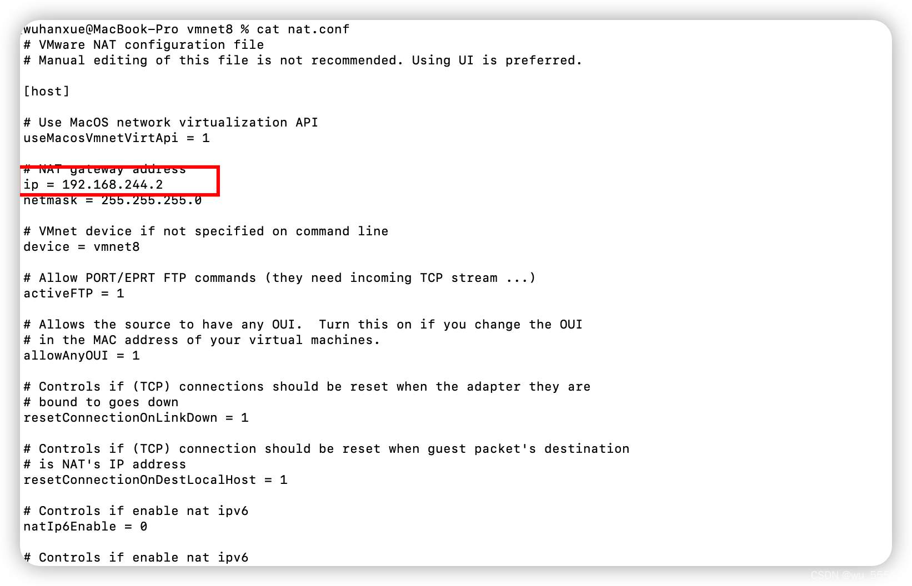

# 解决mac m1环境下centos虚拟机无法连接网络

# 问题

mac上安装完虚拟机后无法连接网络。无法下载软件，同时也无法ping通`www.baidu.com`

# 思路与解决

首先我是用[VMware安装](https://so.csdn.net/so/search?q=VMware安装&spm=1001.2101.3001.7020)的centos7虚拟机。宿主机环境是mac m1。虚拟机采用的是NAT模式，已经设置了静态IP。可以ping通宿主机	

## 1. 未开启DNS

因为我ping不同baidu，所以我首先怀疑是不是因为我关闭了DNS导致的，于是尝试直接ping ip

```shell
ping 114.114.114.114
```

发现还是ping不通，那么也不是DNS的问题

## 2. 未开启网卡

这里的ens160是你的网卡名称，不同的环境网卡名称可能不同，要根据你自己的网卡名称进行修改

通过查看`/etc/sysconfig/network-scripts`路径下的`ifcfg-ensxxx`可以知道

```shell
vim /etc/sysconfig/network-scripts/ifcfg-ens160
```

将网卡选项打开

```shell
ONBOOT=yes
```

[重启网卡](https://so.csdn.net/so/search?q=重启网卡&spm=1001.2101.3001.7020)

```shell
service network restart
```

但这里发现网卡是打开的所以也不是这个问题

## 3. 检查网关配置

还有一个可能的原因是因为虚拟机中网关设置的不对导致无法连接网络

1、于是检查网关地址，到本机上执行如下指令

```shell
cat /Library/Preferences/VMware Fusion/vmnet8/nat.conf
```

这里的这个ip就是网关，可以看到我这里是192.168.244.2



2、检查虚拟机中的网关设置

```shell
 vim /etc/sysconfig/network-scripts/ifcfg-ens160
```

检查发现其中的网关设置的ip是192.168.244.1，这明显不对，于是将其调整为上述查询到的ip

```shell
GATEWAY=192.168.244.1
DNS1=192.168.244.1
```

附上完整的修改后的网卡配置文件，供大家参考

```shell
TYPE=Ethernet
PROXY_METHOD=none
BROWSER_ONLY=no
BOOTPROTO=static #dhcp
DEFROUTE=yes
IPV4_FAILURE_FATAL=yes # no
IPV6INIT=yes
IPV6_AUTOCONF=yes
IPV6_DEFROUTE=yes
IPV6_FAILURE_FATAL=no
IPV6_ADDR_GEN_MODE=stable-privacy
IPV6_PRIVACY=no
NAME=ens160
UUID=c5581a60-f0fa-47a7-be3f-8c48592bec15
DEVICE=ens160
ONBOOT=yes
IPADDR=192.168.244.15
GATEWAY=192.168.244.2
NETMASK=255.255.255.0
DNS1=192.168.244.2
DNS2=114.114.114.114

```

3、重启网卡服务

```shell
service network restart
```

4、再次执行ping指令，测试网络连接

```shell
ping www.baidu.com
```

成功！问题解决


